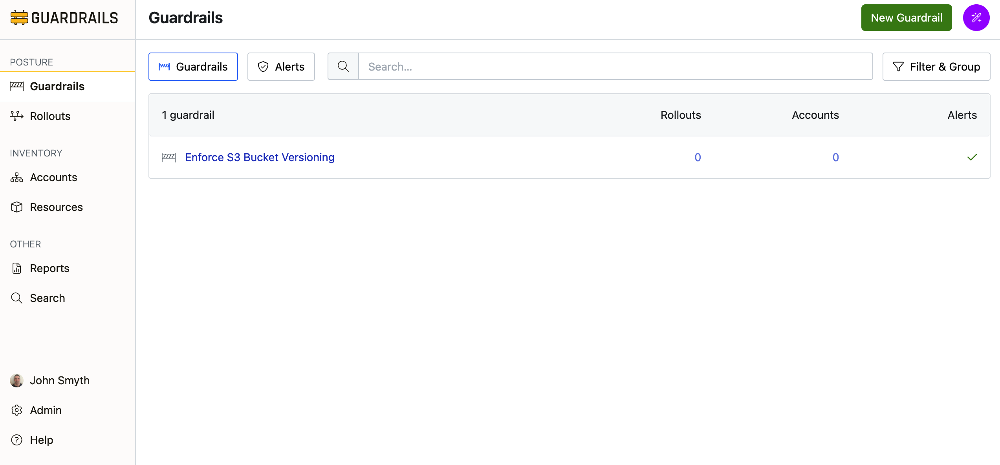
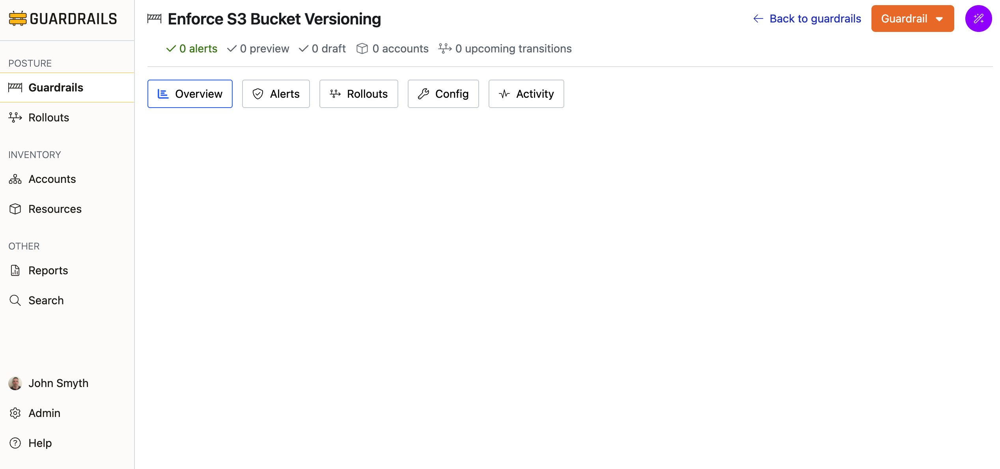
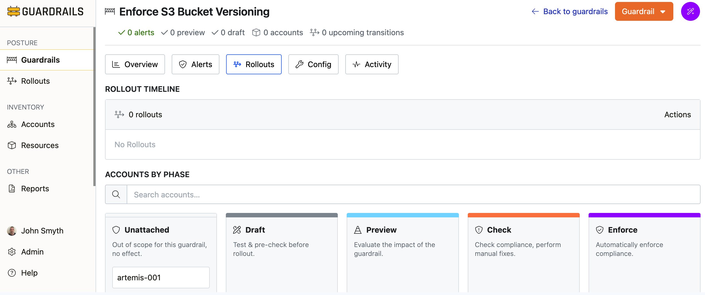

# Attach a Guardrail

In this guide you'll learn how to attach a guardrail to an AWS Account.  In previous guides, you imported an AWS account and created a guardrail.  Now we will apply that guardrail to your account and manually move it through the phases.

**Prerequisites**:   

- Completion of the previous guides in this series.  
- Access to the Guardrails console with administrative privileges.

## Step 1: Go to the Guardrails page

Click the **Guardrails** link from the sidebar to view your guardrails.  

Click the "Enforce S3 Bucket Versioning" guardrail that you created in the previous guide.

## Step 2: View the rollouts page for the guardrail

Go to the **Rollouts** page for the guardrail. Note that the guardrail is not associated with any rollouts, and it is currently **Unattached** to your account.  

At the top of the page you will see the alert counts.  They will all be `0`, since the guardrail has not been attached.

## Step 3: View the rollouts page for the guardrail

Go to the **Rollouts** page for the guardrail. Note that the guardrail is not associated with any rollouts, and it is currently **Unattached** to your account.  

At the top of the page you will see the alert counts.  They will all be `0`, since the guardrail has not been attached.

## Step 4: Attach the guardrail in 'Draft' phase

A guardrail can be attached to accounts manually, or via a rollout.  In this guide, we will attach the guardrail and promote through the phases manually.  While it is possible to attach the guardrail in any phase, its is generally recommended to start in the **Draft** phase. The draft phase allows the cloud team to preview the control with no impact or visibility to the account teams.  This gives you an opportunity to preview and assess the potential impact of a guardrail in a safe, isolated manner.  When in draft phase, alrms will only be visible to the cloud team, and no enforcement ations will run.

To attach the guardrail in draft, simply drag and drop it to the **Draft** column in the kanban board. 

## Step 5: View the alarms

Once the guardrail has been attached to the account, the guardrails controls will begin to run against resources in the account.  

## Step 6: Move the guardrail to 'Preview' phase

## Step 7: Move the guardrail to 'Check' phase

## Step 8: Move the guardrail to 'Check' phase

## Step 9: View the alarms

## Step 9: Review

In this guide you created a guardrail that enforces AWS S3 bucket versioning. This guardrail can now be applied to accounts to ensure compliance with your organization's data protection policies.

## Next Steps

- [Create a rollout](/guardrails/docs/artemis/getting-started/getting-started-aws/rollout-guardrail) to deploy this guardrail to your organization.

## Troubleshooting

If you run into issues following this guide, jump in the `#guardrails` channel in the [Turbot Community Slack](https://turbot.com/community/join), or [open a support ticket](https://support.turbot.com/hc/en-us/requests/new).

## Progress tracker
- [x] Import an AWS Account
- [x] Observe AWS Resource Activity
- [x] **Create a Guardrail**
- [ ] Attach a Guardrail
- [ ] Mute a Control
- [ ] Create a Calculated Exception to a Guardrails Policy
- [ ] Send an Alert to Email
- [ ] Apply a Quick Action
- [ ] Deploy a Guardrail with a Rollout

## Next Steps

- Monitor compliance through the **Alerts** and **Activity** tabs
- Create exceptions for specific resources when needed
- Set up notifications for policy violations