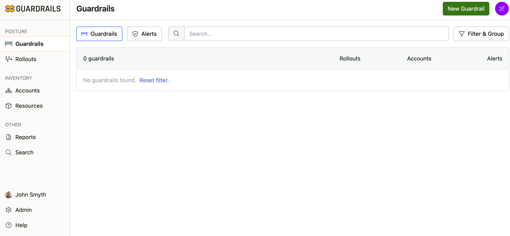

# Create a Guardrail

In this guide you'll learn how to create a custom guardrail to enforce AWS S3 bucket versioning policies across your accounts.

This guide demonstrates how to build governance controls that can be applied organization-wide.

**Prerequisites**:   

- Completion of the previous guides in this series.  
- Access to the Guardrails console with administrative privileges.
- `aws-s3` mod installed.
- Understanding of AWS S3 bucket versioning requirements.

## Step 1: Navigate to the Guardrails dashboard

From the main Guardrails dashboard, you can see your existing guardrails and their current status. Click the green **New Guardrail** button in the top right corner.

## Step 2: Enter guardrail details

In the **Create Guardrail** dialog, provide a descriptive name and optional description for your guardrail:

- **Name**: Enter "Enforce S3 Bucket Versioning" 
- **Description**: Enter "Ensure that versioning is enabled for all AWS S3 Buckets"

You also need to specify which control types this guardrail will manage. Start typing "AWS S3 Bucket Versioning" in the search field. You'll see a dropdown with available options. Select **AWS > S3 > Bucket > Versioning** from the dropdown.

## Step 3: Configure advanced settings (Optional)

If desired, click on **Advanced** to expand additional configuration options. Here you can set:

- **Targets**: Select which resource types this guardrail can target
- **AKAs**: Add alternative unique aliases for the guardrail

## Step 4: Create the guardrail

Once you've configured all the necessary settings, click the green **Create** button to create your guardrail.

## Step 5: Review the guardrail configuration

After creation, you'll be taken to the guardrail's **Config*** page to configure the policy settings.

## Step 6: Configure the versioning policy

Click the **Versioning** policy from the lsit of polices.  You'll see that there's "No setting" initially, with a **Create one** link available.

## Step 7: Create a policy setting

Click **Create one** to create a new policy setting for the guardrail. This will open the **Create 'Enforce S3 Bucket Versioning' Guardrail Setting** dialog where you can configure the policy setting.

Select **Enforce: Enabled** to actively enforce S3 bucket versioning. 

Leave the precedence set to the default "Required" setting.  

You may optionally add a **note** to the setting.  

By default, settings do no expire, however you may optionally add an **Expiration**.

## Step 8: Save the policy setting

Click the green **Create** button to save your guardrail policy setting. Your guardrail is now ready to be attached to one or more accounts to enforce S3 bucket versioning policies across your organization.

## Step 9: Review

In this guide you created a guardrail that enforces AWS S3 bucket versioning. This guardrail can now be applied to accounts to ensure compliance with your organization's data protection policies.

## Next Steps

- [Attach](/guardrails/docs/artemis/getting-started/getting-started-aws/attach-guardrail) this guardrail to specific accounts.
- [Create a rollout](/guardrails/docs/artemis/getting-started/getting-started-aws/rollout-guardrail) to deploy this guardrail to your organization.

## Troubleshooting

If you run into issues following this guide, jump in the `#guardrails` channel in the [Turbot Community Slack](https://turbot.com/community/join), or [open a support ticket](https://support.turbot.com/hc/en-us/requests/new).

## Progress tracker
- [x] Import an AWS Account
- [x] Observe AWS Resource Activity
- [x] **Create a Guardrail**
- [ ] Attach a Guardrail
- [ ] Mute a Control
- [ ] Create a Calculated Exception to a Guardrails Policy
- [ ] Send an Alert to Email
- [ ] Apply a Quick Action
- [ ] Deploy a Guardrail with a Rollout
