# Import an Account

In this guide, you will deploy the Guardrails IAM access role to your AWS account using a CloudFormation template and then connect that account to Guardrails.

This is the first guide in the *Getting started with AWS* series.

## Prerequisites

- Access to the Turbot Guardrails console with admin privilege.

- An AWS Account to import into Guardrails.

> [!NOTE]
> While Guardrails does not need admin access to your AWS account, you will need elevated access to create the cross account roles necessary to import the account in readonly mode.

## Step 1: Launch the Import Account wizard

Login to your Guardrails console and go to the **Accounts** screen.  Click the green **Import Account** at the top right of the page.

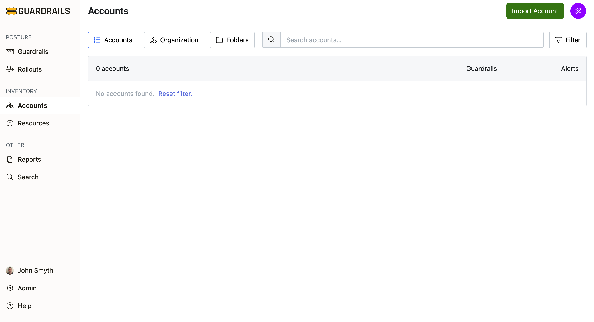

## Step 2: Select the AWS integration

Guardrails will present you with a list of integrations.  Click **AWS**

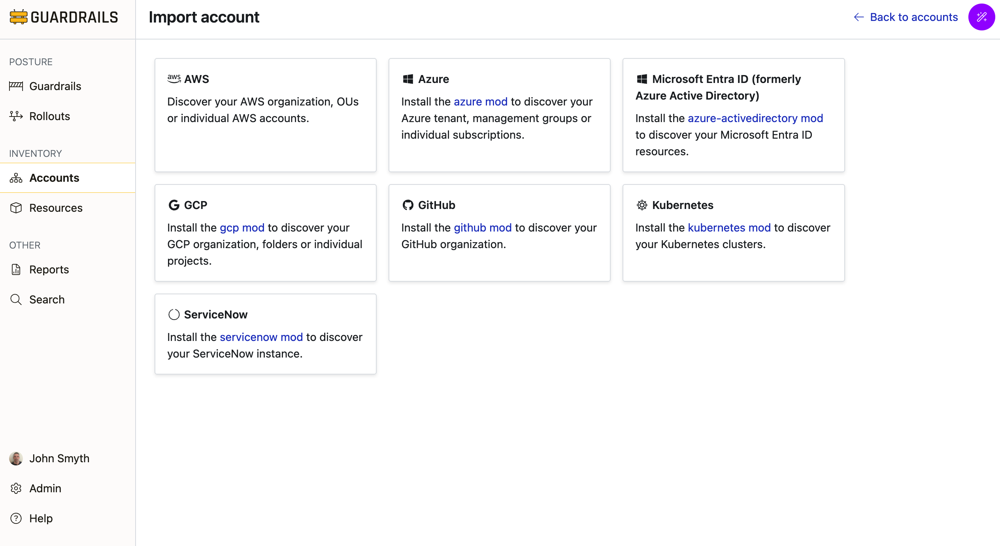

## Step 3: Select the integration type

You can import a single account, or import all the accounts in your organization.  In this guide, we will import a single account. Select **AWS Account**.

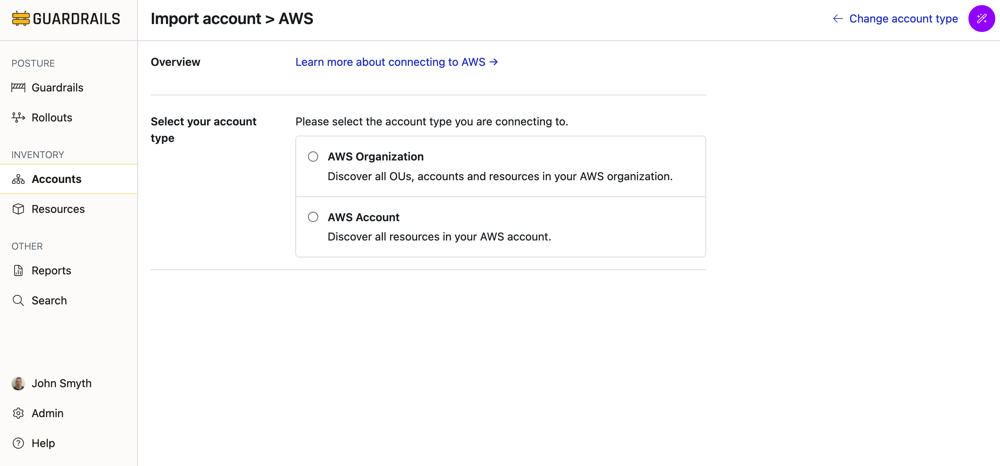

## Step 4: Enter the required information
Enter the required information.

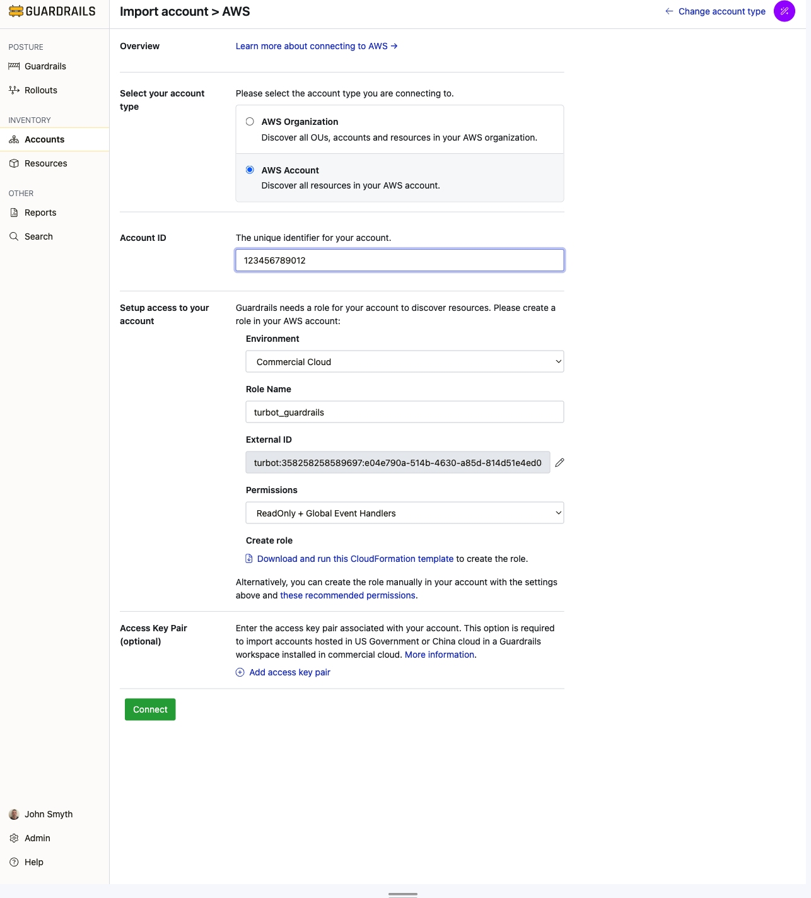

- Enter the **Account ID** of the account that you wish to import.
- Select the **Environment** (partition) in which the account resides: **Commercial Cloud**, **US Government** (GovCloud), or **China Cloud**
- Choose a **Role Name** or keep the default
- A unique **External ID** is generated for you. You can change this if you want, but you must adhere to the [Guardrails  External ID Protection Format](/guardrails/docs/faq/general-faq#what-is-guardrails-aws-iam-role-external-id-protection).  It is recommended to use the default unless you have a specific reason not to.
- Select the **Permissions** to grant to Guardrails. If you are planning to complete all the guides in this Quick Start series, select **Full Remediation**.

## Step 5: Download the CloudFormation template

Guardrails needs a cross account IAM role that grants permission to discover [resources](/guardrails/docs/artemis/inventory/resources) in your account and to monitor changes via event handlers. The CloudFormation template downloaded in this step  will create that role and assign the required permissions and trust policy, using the information that you provided in the previous step.

Click the link to **Download and run this CloudFormation template**. 

> [!IMPORTANT]
> Leave this browser tab open while we do the next steps in a different tab. Closing and reopening this page will cause a new random ExternalID to be generated.

## Step 6: Create the stack

Open a new tab and login to your AWS account. Navigate to the CloudFormation service and create a stack with new resources.

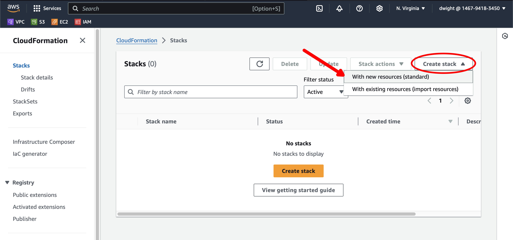

## Step 7: Upload the template

On the **Create Stack** page, select **Upload a template file** and then click the **Choose file** button.

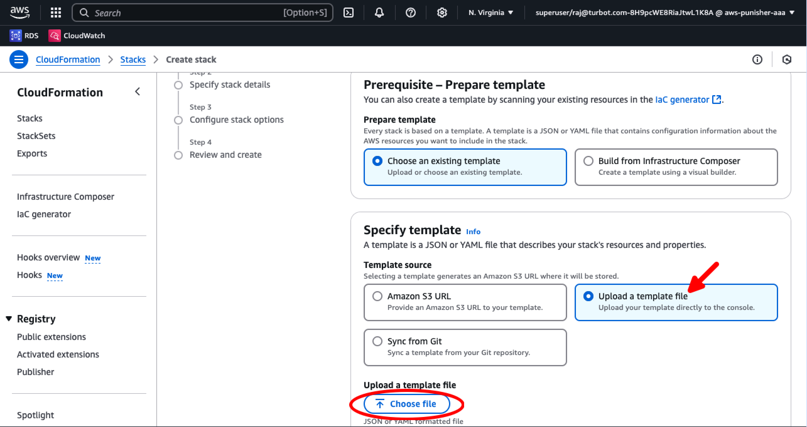

Use the file dialog to find and upload the file you downloaded in step 2, then select the **Next** button.

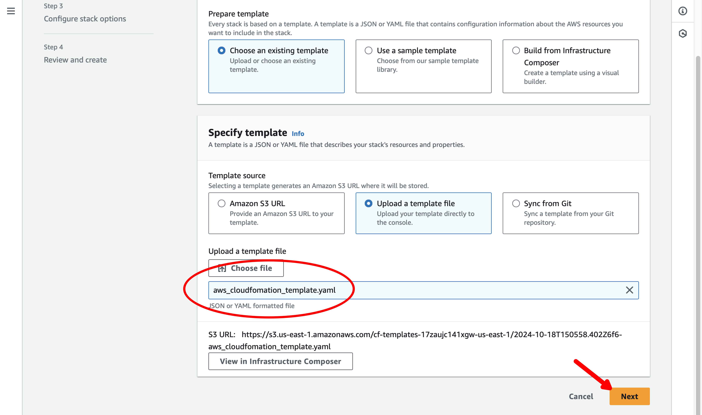

## Step 8: Launch the stack

In the Stack Name field, enter `guardrails-import` and then scroll down the page.

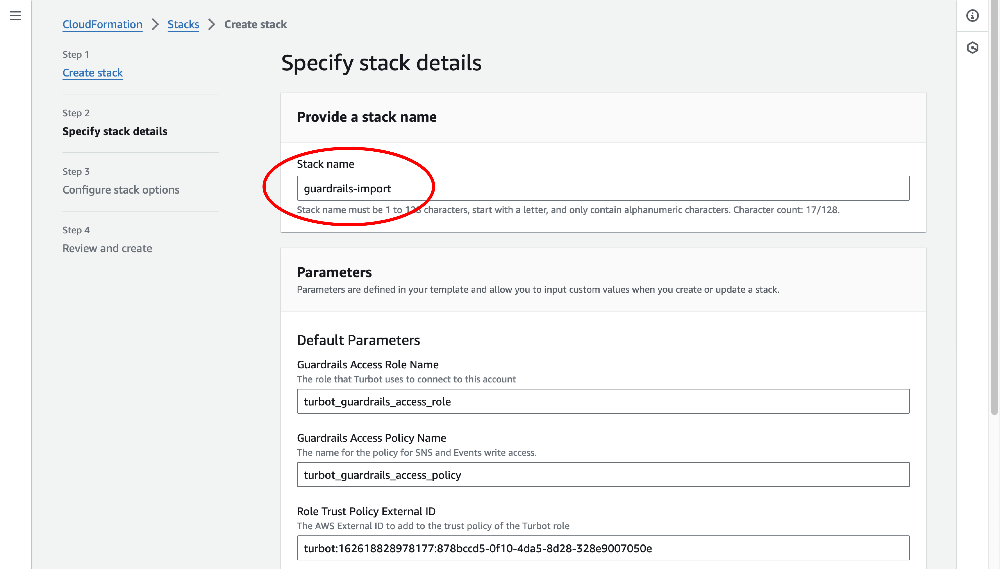

Review the rest of the default values (no changes should be needed), and then select the **Next** button at the bottom of the page:

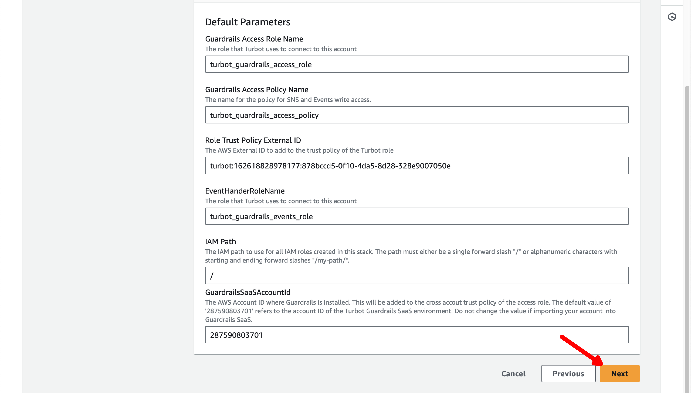

On the next page of the stack wizard, scroll to the bottom, enable the acknowlegement checkbox and then the **Next** button.

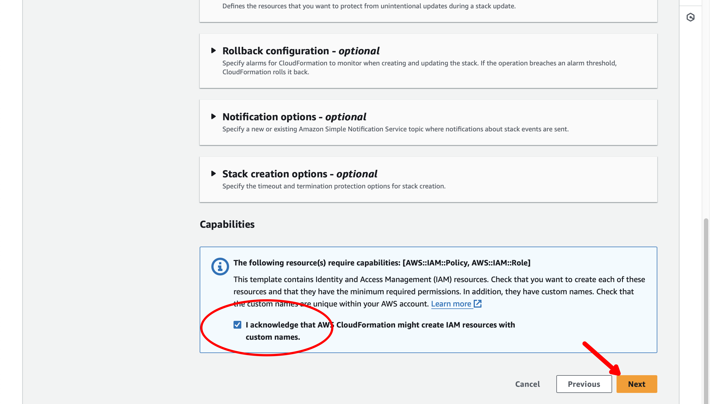

On the final page of the wizard, scroll to the bottom of the page and select the **Submit** button.

## Step 9: Verify the stack

Wait for the stack to complete and for the status of the stack to change to **CREATE_COMPLETE**.

## Step 10: Connect the account

Now that the role has been created, click the **Connect** button on the Guardrails account import page to connect to the account and begin importing resources.

## Step 11: View Account Overview

You will be redirected to the Account Overview page for the account that you have connected.

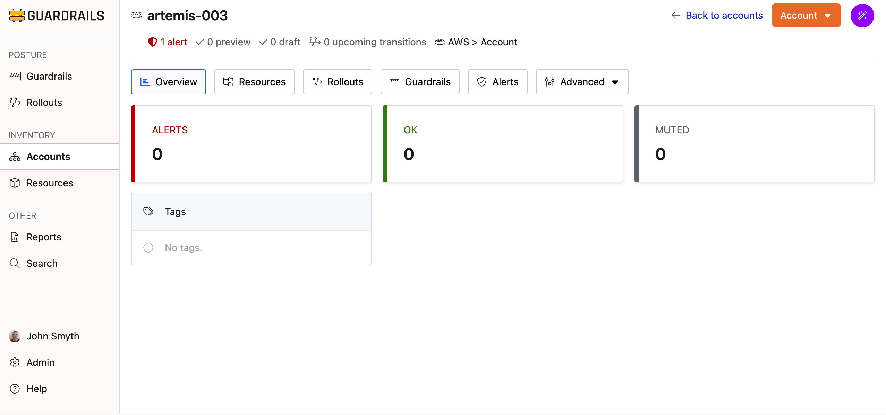

## Step 11: Verify

Click the **Resources** tab for the account.  Resources should begin to appear as Guardrails discover the resources in your account and adds them to the CMDB.

## Step 12: Review

In this guide you've learned how to connect an AWS account and import its resources into Guardrails.

## Next Steps

In the [next guide](/guardrails/docs/artemis/getting-started/getting-started-aws/observe-aws-activity) we’ll see how Guardrails monitors cloud events and reacts to resource changes.

## Troubleshooting

If you run into issues following this guide, jump in the `#guardrails` channel in the [Turbot Community Slack](https://turbot.com/community/join), or [open a support ticket](https://support.turbot.com/hc/en-us/requests/new).

## Progress tracker
- [x] **Import an AWS Account**
- [ ] Observe AWS Resource Activity
- [ ] Create a Guardrail
- [ ] Attach a Guardrail
- [ ] Mute a Control
- [ ] Create a Calculated Exception to a Guardrails Policy
- [ ] Send an Alert to Email
- [ ] Apply a Quick Action
- [ ] Deploy a Guardrail with a Rollout
