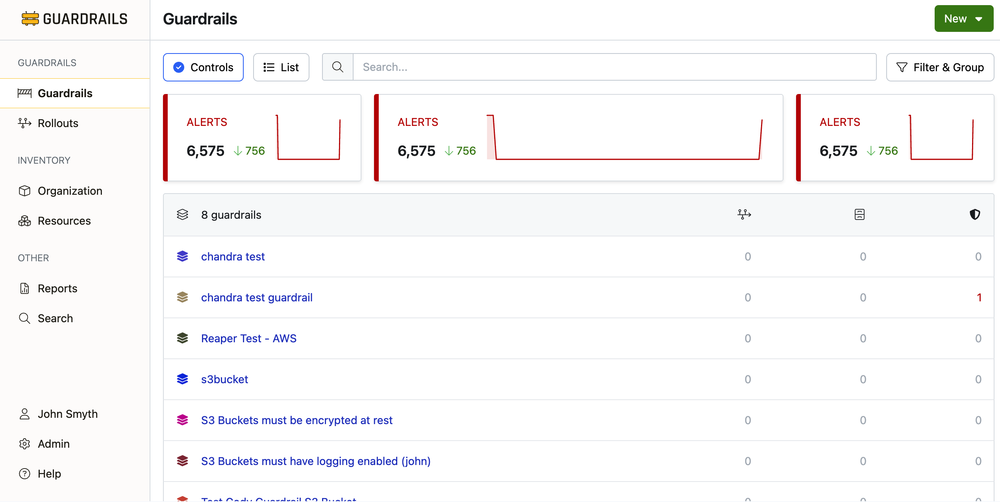
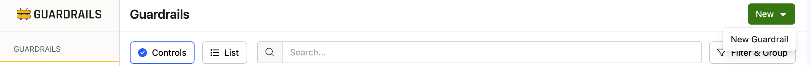
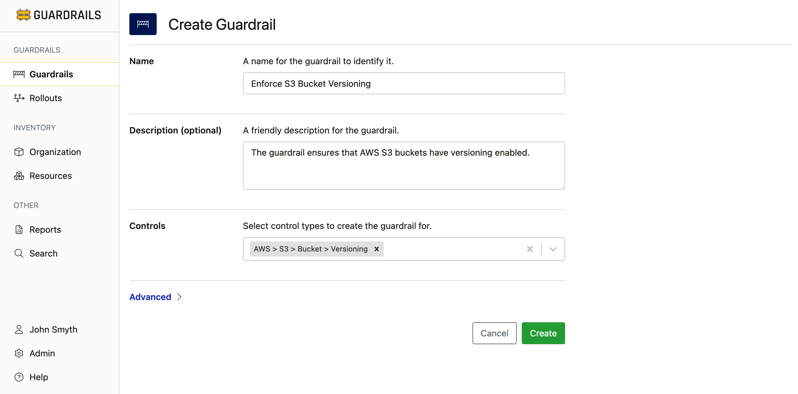
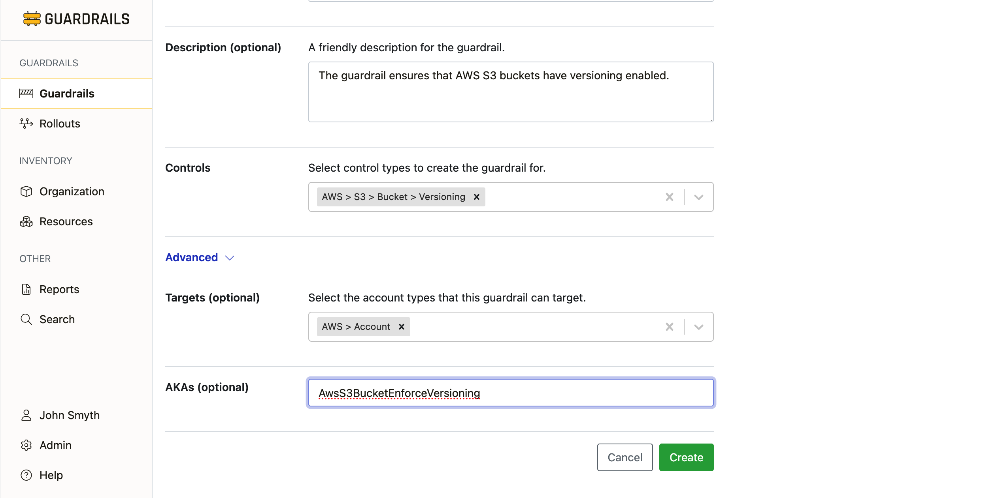
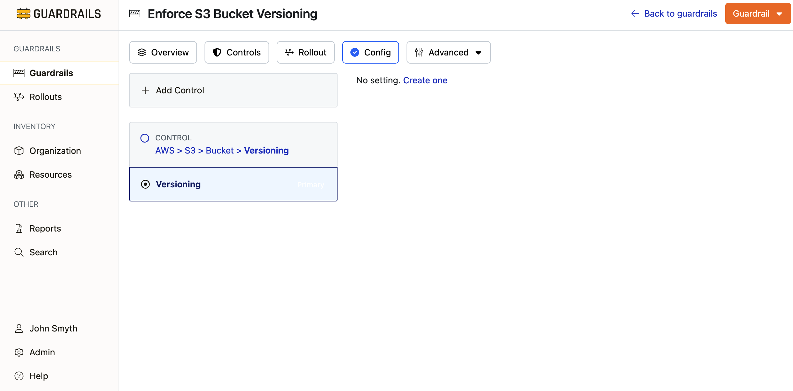
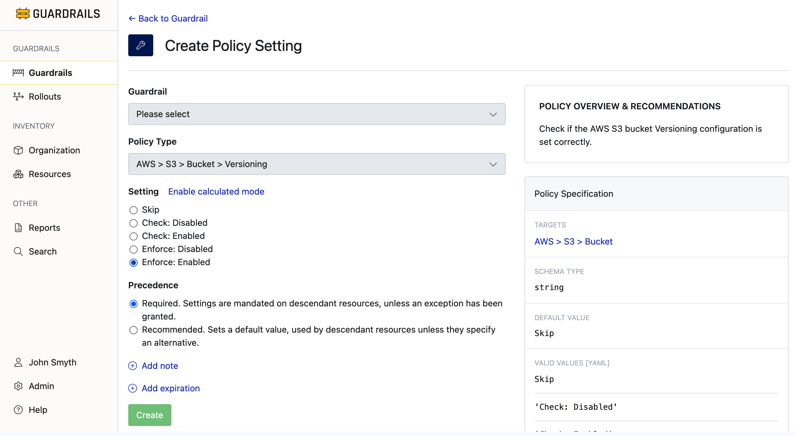

# Create a Guardrail

In this guide, you will create a [Guardrail](artemis/guardrails) to accomplish a policy objective.


## Prerequisites

- Access to the Turbot Guardrails console with `Turbot/Admin` privilege.

- One or [mods](managing/mods) installed

## Step 1: Navigate to the Guardrails page

From the left-hand navigation bar, select **Guardrails**.



## Step 2: Open the **New Guardrail** page

Click the **New ▼** action button at the top right and select **New Guardrail** to open the **Create Guardrail** screen.




## Step 3: Enter the guardrail details

On the the **Create Guardrail** page, enter a name for your guardrail, and optionally a short description.  

Each guardrail must include one or more [controls](artemis/guardrails/controls) to accomplish your objectives. Select one or more control types that guardrail will implement.  You can type to search, and then select the control type you with to add.



## Step 4: Optionally enter advanced configuration

Optionally, click **Advanced** to set the advanced options.  

You can restrict the account types to which the guardrail applies by choosing **Targets**, and set a unique [AKA](reference/glossary#aka-also-known-as) for your guardrail




## Step 5: Review and create the guardrail
Review your options, and click the **Create** button at the bottom of the screen to create your new guardrail.

## Step 6: Create the policy settings
After the guardrail has been created, you will be redirected to the **Config** page for your guardrail so that you can set the [policy settings](artemis/guardrails/policies) to your desired values.  

To set a policy, select it from the list.  Since you have just created the guardrail, the policy wil not yet have a setting.  Click **create one** to enter the setting.



## Step 7: Enter the policy settings

On the **Enter the Policy Settings** page, enter the desired value for your setting
.

<!--
what about?
  - changing the guardrail
  - changing the policy type
  - precedence
  - note
  - expiration  
  - calculated mode
  - Terraform


3. Select the
   **[Policy Type](concepts/policies/types-categories#policy-types)**. For
   example, `AWS > EC2 > Instance > Approved`.

6. Select the
   **[Precedence](concepts/policies/hierarchy#precedence-rules-required-vs-recommended)**
   for this setting. Default setting is `Required`.
   

7. If desired, click **Add note**. Often this is used to designate change
   control identifiers such as change order ticket numbers.

8. If desired, click **Add expiration** to set an expiration date. The policy
   will expire after the defined time elapses.


## Policy Settings with Terraform

<div className="alert alert-info font-weight-bold">
  &raquo; New to Terraform? Get started with <a href="7-minute-labs/terraform">Terraform in 7 minutes &rarr;</a>
</div>

You can manage policy settings with Terraform using the
[turbot_policy_setting](https://www.terraform.io/docs/providers/turbot/r/policy_setting.html)
resource.

```hcl
# Setting value to "Enforce: Enabled" to enable versioning for buckets
# AWS > S3 > Bucket > Versioning
resource "turbot_policy_setting" "s3_bucket_versioning" {
  resource   =  turbot_folder.id
  type       = "tmod:@turbot/aws-s3#/policy/types/bucketVersioning"
  value      = "Enforce: Enabled"
}
```

-->


## Step 8: Review

In this guide you've learned how to create a [Guardrail](artemis/guardrails) to accomplish a policy objective.


## Next Steps

You guardrail has been created, but it is not yet in effect.  You must attach it to your accounts.  You can [attach it directly](), but its generally recommended to [deploy guardrails with a rollout]().

## Troubleshooting

If you run into issues following this guide, jump in the `#guardrails` channel in the [Turbot Community Slack](https://turbot.com/community/join), or [open a support ticket](https://support.turbot.com/hc/en-us/requests/new).

