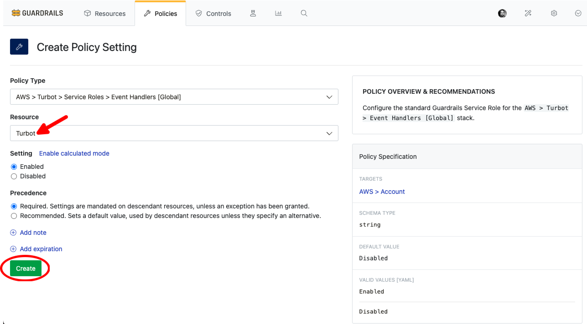
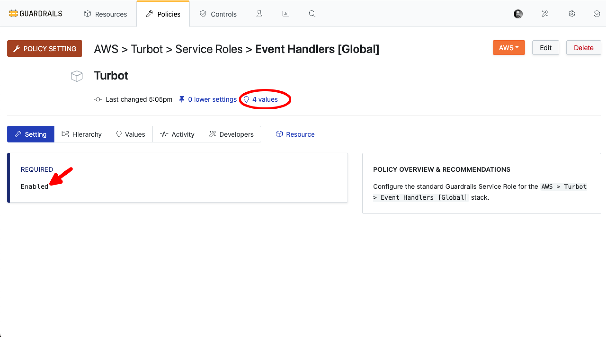

# Setup Global Event Handler(GEH)

In this guide, you will:
- Update a mod in the Guardrails workspace using the Guardrails UI.
- Monitor and troubleshoot the GEH update process.

Guardrails is designed to enable organizations to selectively install policies, controls, and guardrails tailored to specific services. The Global [Event Handler](/guardrails/docs/reference/glossary#event-handler) simplifies cloud management by providing a unified framework for responding to and managing events, ensuring proactive governance and security across cloud environments.

## Prerequisites

- **Turbot/Owner** permissions at the Turbot resource level.
- Familiarity with Guardrails console.
- EventBridge IAM role required in GEH secondary regions, which helps to pass events to the primary region.

## Step 1: Login Guardrail Console

Log into the Guardrails console.

## Step 2: Enable Service Role

IAM role is required for Global Event handler. This can be created manually by customer or can be done by AWS Turbot Service Role

Check if all the related controls are in `OK` state

## Step 3: Enable Global Event Handler Control

Validate that the setting is applied successfully

## Step 4: Enable Global Event Handler Control

## Step 2: Navigate to Mods

Choose **Admin** from the top right corner.

Select the **Mods** tab.

## Step 3: Find Mod

From the **Mods** page, search the mod to be updated. The availability of an update is typically indicated by the `UPDATE AVAILABLE` Status.

## Step 4: Update Mod

Select the mod and choose **Update**.

Select the version to update, with the latest version recommended. choose **Update Mod**.

## Step 5: Review

- [ ] The Updated mod appears in the list with the latest version and indicated by the `LATEST` Status.

- [ ] Select the mod and verify that the health is in an **OK** state, indicating the mod is healthy.

## Next Steps

Please see the following resources to learn more about Turbot Guardrails Enterprise:

- Learn more about [Turbot Guardrails Enterprise - Architecture](/guardrails/docs/enterprise/architecture).
- Learn about [Installing a Mod](/guardrails/docs/guides/hosting-guardrails/installation/install-mod#install-mod).

## Troubleshooting

| Issue                                      | Description                                                                                                                                                                                                 | Guide                                |
|----------------------------------------------|-------------------------------------------------------------------------------------------------------------------------------------------------------------------------------------------------------------------|-----------------------------------------------------|
| Mod Dependency               | If the mod installation fails due the dependent/parent mod not installed.                                           | [Troubleshoot Mod Peer Dependency Error](/guardrails/docs/guides/hosting-guardrails/troubleshooting/peer-mod-dependency-error#peer-mod-dependency-error)                            |
| Further Assistance                       | If you continue to encounter issues, please open a ticket with us and attach the relevant information to assist you more efficiently.                                                 | [Open Support Ticket](https://support.turbot.com)   |