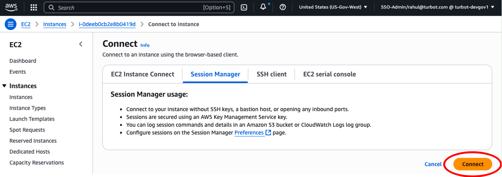
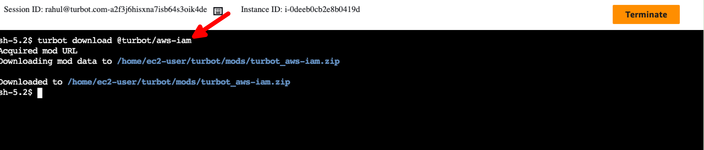
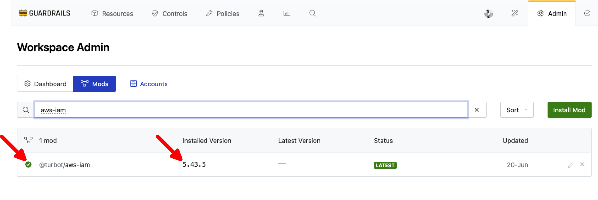

# Install a Mod using Guardrails CLI

In this guide, you will:
- Install a mod in a Guardrails workspace using the CLI.
- Validate successful installation using the Guardrails UI.

Guardrails supports installing [Mods](/guardrails/docs/reference/glossary#mod) via [Guardrails CLI](https://turbot.com/guardrails/docs/reference/cli) for various scenarios where command-line installation is preferred or required, including Government Cloud environments (e.g., AWS GovCloud) where UI-based interactions may be limited, automated deployment workflows and CI/CD pipelines, scripted installation processes for consistent deployments or restricted environments where direct web access is limited, and bulk mod installations across multiple workspaces.

> [!IMPORTANT]
> This CLI-based approach is particularly important for AWS GovCloud environments, where direct access to Turbot's mod registry is restricted because the registry is hosted in commercial AWS accounts.

## Prerequisites

- [Turbot CLI installed and configured](https://turbot.com/guardrails/docs/reference/cli/installation) with appropriate credentials
- Valid **Turbot/Owner** permissions in the target Guardrails [workspace](https://turbot.com/guardrails/docs/reference/glossary#workspace)
- **Mod registry access**: Registration at [guardrails.turbot.com](https://guardrails.turbot.com) with approved mod download permissions
- Network access to download mods from **guardrails.turbot.com**
- One of the following access methods:
  - Access to a bastion host in your GovCloud environment, or
  - Direct network access from your local environment to the hosted workspace

> [!NOTE]
> **Mod Download Permissions**: Even with a guardrails.turbot.com account, you may not have permissions to download mods. If you encounter permission errors during mod download, contact [Turbot Support](https://support.turbot.com) to request access to allow to download mods.

## Step 1: Access Your Environment

> [!NOTE]
> If a bastion host is not available in your environment, you can create one using this guide: [Turbot Bastion Host](https://github.com/turbot/guardrails-samples/tree/main/enterprise_installation/turbot_bastion_host#turbot-bastion-host)

### For GovCloud Environments

Log into the AWS account associated with your GovCloud production environment and connect to the main bastion host.



### For Commercial Cloud Environments

Ensure you have CLI access to your target environment with the [Turbot CLI](/guardrails/docs/reference/cli) properly configured.

## Step 2: Choose Download Location

Navigate to your desired directory for downloading the mod package, for example: `cd /turbot/mods`

## Step 3: Download Mod

Download the desired mod package using this Guardrails CLI command. This fetches the specified mod from the Guardrails registry, e.g., @turbot/aws-iam.

```
turbot download @turbot/aws-iam
```



## Step 4: Install Mod to Workspace

Upload and install the downloaded mod into your target workspace by executing the command below with the appropriate CLI profile.

```
turbot up --zip-file turbot_aws-iam --profile <profile-name>
```


## Step 5: Review Installation

- [ ] Verify successful installation by checking the Guardrails UI after approximately 20 minutes. Ensure the mod appears under **Admin > Mods**, the version matches the one uploaded (e.g., 5.43.x), and the mod status displays a green checkmark.



## Next Steps

Please see the following resources to learn more about Turbot Guardrails Enterprise:

- Learn more about [Turbot Guardrails Enterprise - Architecture](/guardrails/docs/enterprise/architecture).
- Learn about [Updating Mod](/guardrails/docs/enterprise/updating-stacks/mod-update).

## Troubleshooting

| Issue                                      | Description                                                                                                                                                                                                 | Guide                                |
|----------------------------------------------|-------------------------------------------------------------------------------------------------------------------------------------------------------------------------------------------------------------------|-----------------------------------------------------|
| Login Authentication Error | If you receive `Failed to login to guardrails mod registry: Incorrect username or password` error, verify your credentials by logging into [guardrails.turbot.com](https://guardrails.turbot.com/). If you've forgotten your password, use the password reset option. |  |
| Mod Download Permissions | If you receive `Failed to download mod: You do not have the necessary permissions to download @turbot/<mod-name> from guardrails.turbot.com` error, you need to request mod access through Turbot Support. | [Open Support Ticket](https://support.turbot.com) |
| Mod Dependency               | If the mod installation fails due the dependent/parent mod not installed.                                           | [Troubleshoot Mod Peer Dependency Error](/guardrails/docs/guides/hosting-guardrails/troubleshooting/peer-mod-dependency-error#peer-mod-dependency-error)                            |
| Further Assistance                       | If you continue to encounter issues, please open a ticket with us and attach the relevant information to assist you more efficiently.                                                 | [Open Support Ticket](https://support.turbot.com)   |