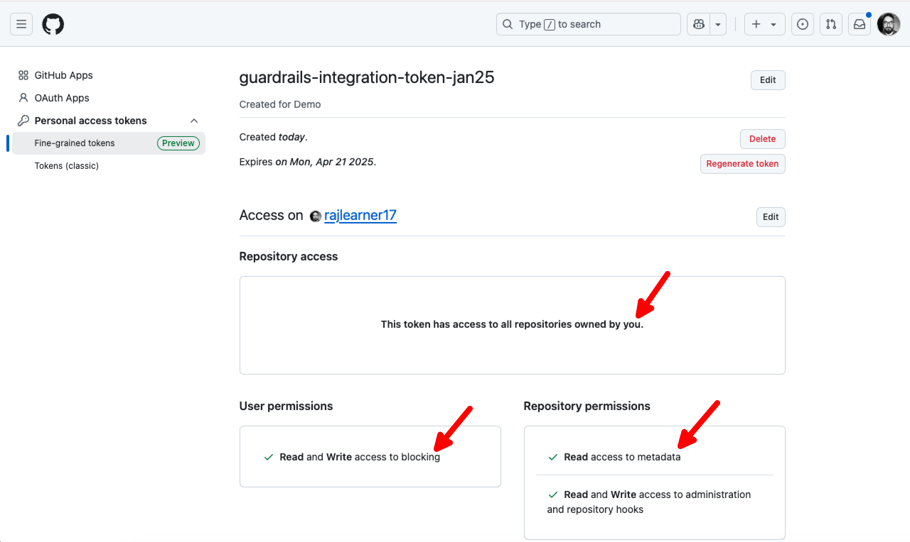

# Importing GitHub Organization

In this guide, you will:

- Learn how to import an entire GitHub organization into Turbot Guardrails. This process allows Guardrails to discover and manage resources across your organization in real-time.
- Monitor and troubleshoot the process.

Importing a [GitHub Organization](https://docs.github.com/en/organizations/collaborating-with-groups-in-organizations/about-organizations) into Guardrails involves these key steps:

- Configuring a GitHub with appropriate permissions at the Organization level.
- Importing the Organization via the Guardrails Console.

## Prerequisites

- Turbot Enterprise (TE) version `>=v5.48.x`, with the [GitHub mod](https://hub.guardrails.turbot.com/mods/github/mods) installed.
- Access to [GitHub](https://github.com/) and familiarity with its interface.
- Access to the Guardrails console with *Turbot/Owner* or *Turbot/Admin* permissions at the Turbot resource level.

## Step 1: Set Personal Access Token Policy for Your Organization

Setup the a personal access token policy for your organization prior to importing the organization into Guardrails. Refer steps provided in the GitHub [documentation](https://docs.github.com/en/organizations/managing-programmatic-access-to-your-organization/setting-a-personal-access-token-policy-for-your-organization).

Choose `Allow access via fine-grained personal access tokens`.

## Step 2: Create Personal Access Token

Turbot Guardrails supports both [Fine-grained](https://docs.github.com/en/authentication/keeping-your-account-and-data-secure/managing-your-personal-access-tokens#fine-grained-personal-access-tokens) or [Classic](https://docs.github.com/en/authentication/keeping-your-account-and-data-secure/managing-your-personal-access-tokens#personal-access-tokens-classic) GitHub token. This token is available in the GitHub portal under Developer settings and provide secure access to your resources.

Follow the GitHub provided steps in [Creating a fine-grained personal access token](https://docs.github.com/en/authentication/keeping-your-account-and-data-secure/managing-your-personal-access-tokens#creating-a-fine-grained-personal-access-token)

Copy the personal access token.

> [!IMPORTANT]
> Make sure to copy your personal access token during the creation step as you will not be able to see this again.

## Step 3: Grant Permissions

Once you create a fine-grained token, initially it does not have any associated permission.

### Required Permissions

To ensure full functionality of the GitHub integration, we recommend granting the following permissions:

| **Permission**                       | **Access Level**    | **Description**                                                                                       |
|--------------------------------------|---------------------|-------------------------------------------------------------------------------------------------------|
| Organization Administration          | Read and write      | Allows Guardrails to manage settings and configurations at the organization level.                   |
| Organization Webhooks                | Read and write      | Allows Guardrails to manage webhooks for capturing real-time events at the organization level.        |
| Repository Metadata                  | Read-only           | Provides Guardrails with visibility into repository metadata without modifying its content.           |
| Repository Administration            | Read and write      | Grants Guardrails the ability to manage repository settings, including access controls and policies.  |
| Organization Blocking Users          | Read and write      | Enables Guardrails to block and unblock users within the organization.                               |

Select **Edit**, which allows to make edit in `Permissions` section.

Grant the [required permissions](#required-permissions) by selecting **All repositories** under `Repository access` and configuring the appropriate options in both **Repository permissions** and **Organization permissions** sections.

## Step 4: Validate Personal Access Token for Organization

Navigate to your GitHub organization URL e.g. `https://github.com/organizations/adapt-cloud-security` and select **Settings**.

Navigate to **Personal access tokens** in left side panel, select **Active tokens**.

It should display you the token created in the above step, select the token to check the required permissions are associated.

## Step 5: Log in to Guardrails Console

Log into the Guardrails console with provided local credentials or by using any SAML based login.

## Step 6: Import Organization into Guardrails

Login to your Guardrails workspace console and select the **CONNECT** card.

Select **GitHub** card from the `Connect` panel.

Choose the folder where you want to import the organization. Typically this would be done at the `Turbot` root level of your hierarchy, however it can reside in a [Folder](/guardrails/docs/concepts/resources/hierarchy#folders) based on your use-case.

Get the Organization URL from GitHub **Overview** section. Copy the URL and past it in `Organization URL` text box.

Provide `Personal Access Token` and Select **Connect**.

## Step 7: Review

- [ ] Check that the controls are executed by navigating to **Controls** tab and select GitHub. This should display the default controls for `Organization` and `Repository` in `OK` state.

## Next Steps

Please see the following resources to learn more about Turbot Guardrails:

- Learn more about [GitHub Event Handlers](/guardrails/docs/guides/github/real-time-events).
- Explore the GitHub supported use cases in Guardrails with [Policy Packs](https://hub.guardrails.turbot.com/policy-packs?providers=github).

## Troubleshooting

| **Issue**                | **Description**                                                                                                                      | **Guide**                                                                                                                                |
|--------------------------|--------------------------------------------------------------------------------------------------------------------------------------|------------------------------------------------------------------------------------------------------------------------------------------|
| Controls in Error    | Controls may enter various states, including errors, which can impact their functionality.                                           | [Learn More About Control States](/guardrails/docs/concepts/controls#control-state)                                                     |
| Message: `Bad Credentials`  | Guardrails GitHub controls may generate errors with a `Bad credentials` message, often caused by invalid or expired tokens.                                | [Token Expiration and Revocation](https://docs.github.com/en/authentication/keeping-your-account-and-data-secure/token-expiration-and-revocation) |
| Message: `forbids access via a personal access token with fine-grained permissions`  | Guardrails GitHub controls may generate errors with a `forbids access` error, often caused, in case the used personal token does not have any required permissions.                                | Check the required permissions at [Importing GitHub Organization Required Permissions](#required-permissions) & more details at [Permissions required for fine-grained personal access tokens](https://docs.github.com/en/rest/authentication/permissions-required-for-fine-grained-personal-access-tokens?apiVersion=2022-11-28) |
| Message: `Resource not accessible by personal access token .. list-users-blocked-by-an-organization`  | Guardrails GitHub controls may generate errors with a `forbids accessResource not accessible by personal access token`                            | Check the required permissions at [Importing GitHub Organization Required Permissions](#required-permissions) & more details at [Permissions required for fine-grained personal access tokens](https://docs.github.com/en/rest/authentication/permissions-required-for-fine-grained-personal-access-tokens?apiVersion=2022-11-28) |
| Further Assistance   | If issues persist, please open a ticket with us and attach relevant details for more efficient troubleshooting.                      | [Open Support Ticket](https://support.turbot.com)                                                                                       |
