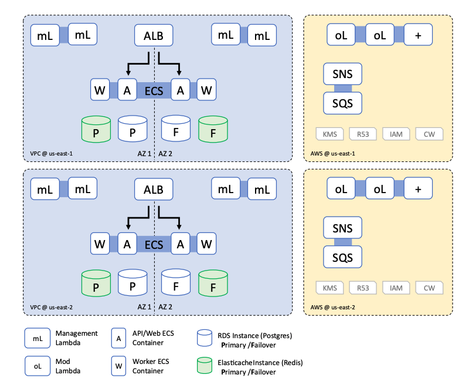

# **Disaster Recovery - Gold Plus Architecture**

## **1. Introduction**
### **1.1 Purpose**
This document defines the Disaster Recovery (DR) plan for the **Turbot Guardrails** application using the **Gold Plus** architecture. The goal is to minimize downtime and data loss in case of a disaster by leveraging multi-region and multi-availability zone (AZ) deployment.

### **1.2 Scope**
This DR plan applies to all production workloads deployed using the **Gold Plus** architecture, ensuring high availability and rapid recovery.

### **1.3 Audience**
Guardrails Administrators: Administrators should have experience in AWS cloud infrastructure management and the Guardrails installation process. Prior experience with database recovery & restoration processes is very helpful.

## **2. Disaster Recovery Objectives**
| **Objective** | **Definition** |
|--------------|--------------|
| **Recovery Time Objective (RTO)** | 2 Hours |
| **Recovery Point Objective (RPO)** | 1 Hour |
| **Availability** | 99.9% |
| **Use Case** | Production deployments with a need for rapid DR |

## **3. Gold Plus Deployment Architecture**
### **3.1 Overview**
The **Gold Plus** architecture ensures resilience against regional outages by deploying a **standby environment in a second AWS region**. The primary and standby environments follow these principles:
- **Cross-region RDS snapshots** for database recovery.
- **Multi-AZ deployment** for compute and storage layers.
- **DNS failover** to route traffic to the standby region in case of an outage.
- **Event queuing** to retain and process messages post-recovery.

### **3.2 Architecture Diagram**

## **4. Disaster Scenarios and Recovery Plan**
### **4.1 Cloud Region Outage**
**Mitigation Steps:**
1. Trigger DNS failover to redirect traffic to the standby region.
2. Restore the database from cross-region RDS snapshots.
3. Activate the standby **ECS compute cluster**.
4. Resume processing of events from **SNS/SQS queues**.

### **4.2 Database Corruption or Data Loss**
**Mitigation Steps:**
1. Restore database from the latest **cross-region RDS snapshot**.
2. Validate database integrity before bringing services online.
3. Sync data to ensure consistency.

### **4.3 Application Configuration Issues**
**Mitigation Steps:**
1. Use **version-controlled infrastructure (Terraform/IaC)** for rollback.
2. Restore the latest working configuration from backups.
3. Deploy and validate application functionality.

## **5. Failover and Recovery Procedures**
### **5.1 Backup & Restore Strategy**
| Component | Backup Frequency | Retention Period | Restore Method |
|-----------|-----------------|------------------|----------------|
| **RDS Database** | Hourly snapshots | 7 days | Cross-region restore |
| **S3 Data** | Versioning enabled | Indefinite | Object recovery |
| **ECS Cluster Configurations** | Daily backups | 30 days | Redeployment |

### **5.2 Failover Execution Plan**
- **Automated Failover Mechanism**: Route 53 DNS failover.
- **Manual Recovery Steps**:
  1. Validate infrastructure readiness in the standby region.
  2. Update DNS records and API Gateway endpoints.
  3. Scale ECS and Lambda resources as needed.

## **6. Roles & Responsibilities**
| Role | Responsibilities |
|------|----------------|
| **Cloud Ops Team** | Monitor infrastructure and trigger failover |
| **Database Admins** | Restore and validate RDS instances |
| **Security Team** | Assess DR impact and compliance adherence |
| **Application Owners** | Validate application after recovery |

## **7. Communication & Escalation Plan**
- **Notification Channels**: Slack, Email, PagerDuty
- **Incident Escalation Matrix**: Defined contacts and priority levels
- **Post-Recovery Review**: Incident report and improvements

## **8. Testing & Continuous Improvement**
- Conduct **quarterly DR drills**.
- Evaluate **RTO/RPO metrics**.
- Update DR plan with **infrastructure changes**.

## **9. Conclusion**
The **Gold Plus** DR architecture ensures resilience against **region-wide outages** while maintaining rapid recovery and minimal data loss. Regular testing and updates will improve effectiveness over time.

### **Appendices**
- **Appendix A**: Detailed Runbook for Failover
- **Appendix B**: AWS RDS Cross-Region Replication Guide
- **Appendix C**: Compliance and Regulatory Considerations

---
**Note:** Ensure this document remains up-to-date with architecture and policy changes.

