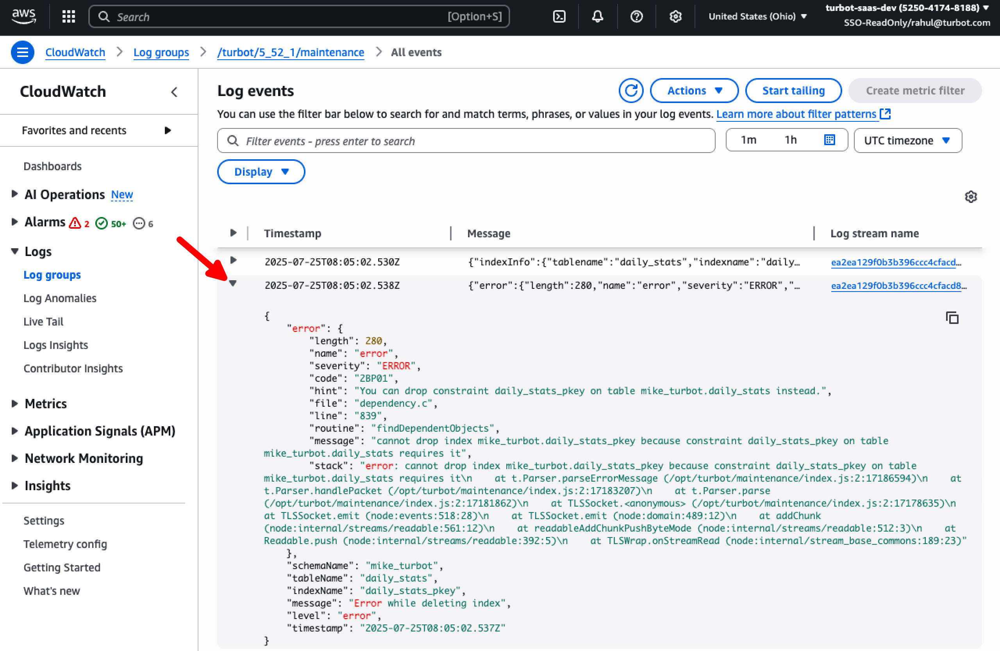

# Monitor Maintenance Container

In this guide, you will:
- Use AWS CloudWatch to monitor the maintenance container logs.
- Verify ECS task status and deployments.

Guardrails operates its core services within secure, private [ECS clusters](/guardrails/docs/guides/hosting-guardrails/FAQ#how-does-turbot-guardrails-use-aws-elastic-container-service-ecs) that are never exposed to the public internet. These clusters run several container types essential to the platform — API containers handle inbound traffic from the load balancer, events containers process real-time cloud events, and Terraform factory containers dynamically generate templates for short-lived tasks. Regularly monitoring the maintenance container is crucial, as it helps validate the health and functioning of these background services, ensuring that the system remains stable, responsive, and capable of processing workloads effectively.

## Prerequisites

- Access to the Guardrails AWS account with [Administrator Privileges](/guardrails/docs/enterprise/FAQ/admin-permissions).
- Familiarity with AWS Console, CloudWatch.

## Step 1: Access AWS Console

Open the AWS Console and navigate to the CloudWatch service in the region where Guardrails is deployed.

## Step 2: Select Log Group

Choose **Log Groups** from the left navigation menu.

## Step 3: Select Maintenance Log Group

From the list of log groups, choose the maintenance log group, typically named in the format `/turbot/<te_version_number>/maintenance`.

> [!NOTE]
> If multiple TE versions are installed, make sure to select the log group corresponding to the latest installed version.

Choose `Search Log Group` from the top right. 

## Step 4: Review Logs for Errors

Check the CloudWatch logs for any errors that may have occurred during the monitoring period. The logs provide visibility into container activity and help identify potential issues.

> [!NOTE]
> The maintenance container is expected to run without errors. However, if any errors are observed in the logs, please report them to [Guardrails Support](https://support.turbot.com) for further investigation.

## Next Steps

Please see the following resources to learn more about Turbot Guardrails Enterprise:

- Learn how to [Diagnose Control Errors](https://turbot.com/guardrails/docs/guides/hosting-guardrails/monitoring/diagnose-control-error).
- Learn how to [Investigate an Event Flood](https://turbot.com/guardrails/docs/guides/hosting-guardrails/monitoring/investigate-event-flood).

## Troubleshooting

| Issue                                      | Description                                                                                                                                                                                                 | Guide                                |
|----------------------------------------------|-------------------------------------------------------------------------------------------------------------------------------------------------------------------------------------------------------------------|-----------------------------------------------------|
| Further Assistance                       | If you continue to encounter issues, please open a ticket with us and attach the relevant information to assist you more efficiently.                                                 | [Open Support Ticket](https://support.turbot.com)   |