# Perform Blue-Green Deployment

In this guide, you will:

- Trigger a Blue-Green deployment for [TEF](https://turbot.com/guardrails/docs/reference/glossary#turbot-guardrails-enterprise-foundation-tef), [TED](https://turbot.com/guardrails/docs/reference/glossary#turbot-guardrails-enterprise-database-ted), or [TE](https://turbot.com/guardrails/docs/reference/glossary#turbot-guardrails-enterprise-te) using AWS Service Catalog.
- Learn how to keep your cloud infrastructure updated with minimal downtime and risk.

Toggling the **Deployment Trigger** parameter in a Turbot Guardrails stack (Blue ↔ Green) forces CloudFormation to re-read and recalculate parameters without requiring a full version upgrade. This is particularly useful when changes — such as updates to SSM parameter overridese. g., IAM role ARNs are not automatically detected by CloudFormation and need to be refreshed.

> [!NOTE]
> The procedure for triggering a blue-green deployment is consistent across **TEF**, **TED**, and **TE**. This guide uses the **TEF** stack as an example for illustration.

## Prerequisites

- Access to the Guardrails AWS account with [Administrator Privileges](/guardrails/docs/enterprise/FAQ/admin-permissions).
- Familiarity with AWS Console, Service Catalog, and CloudFormation services.

## Step 1: Access AWS Console

Open the AWS Console and navigate to the Service Catalog service in the region where TEF is deployed.

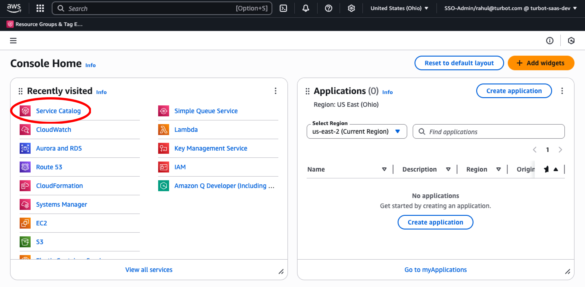

## Step 2: Navigate Provisioned Products

Choose **Provisioned Products** from the left navigation menu.

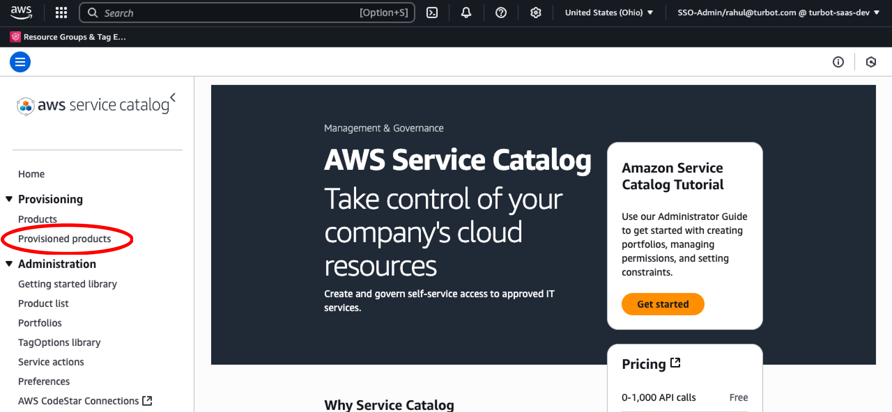

## Step 3: View Provisioned Products

Change the **Access Filter** in AWS Service Catalog from **User** to **Account** to view all provisioned products across the account.

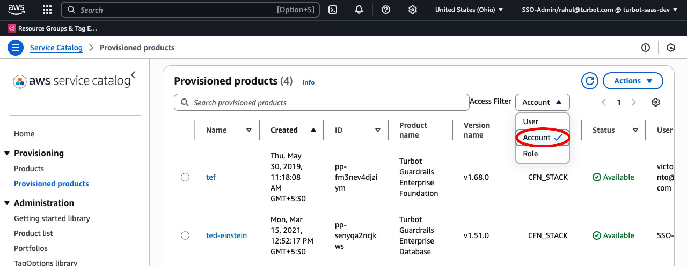

## Step 4: Update Provisioned Product

Select the TEF provisioned product from the list.

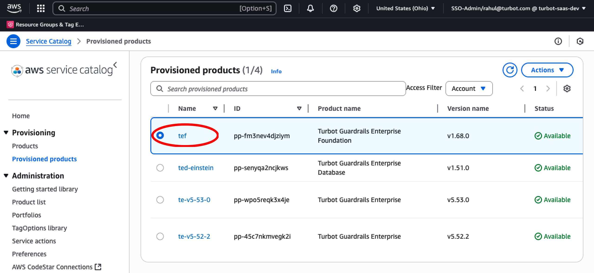

From the **Actions** menu, select **Update**.

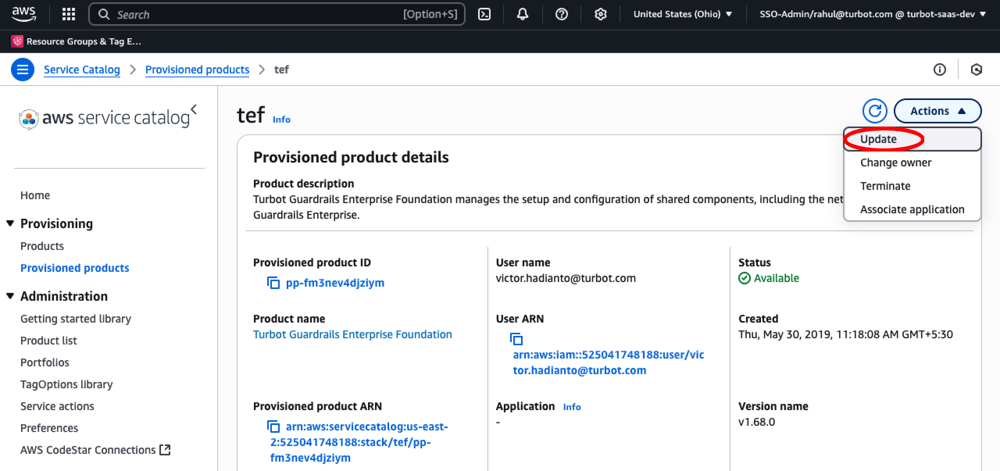

## Step 5: Update Deployment Trigger Parameter

Under `Advanced – Deployment`, locate the `Parameter Deployment Trigger` and switch its value between `Blue` and `Green`, depending on the current state.

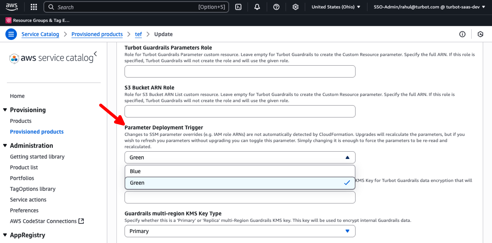

## Step 6: Apply Update

Select **Update** at the bottom of the screen to apply the changes.

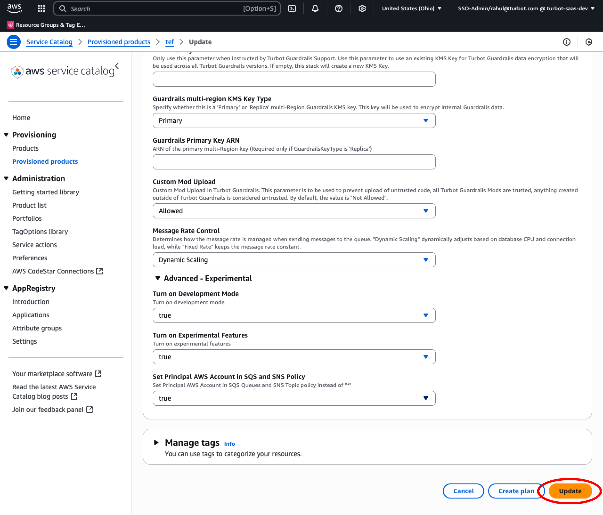

## Step 7: Monitor Update

You have successfully updated the deployment trigger, which begins the update of nested CloudFormation stacks.

- [ ] The TEF provisioned product `Status` changes to `Under Change`.

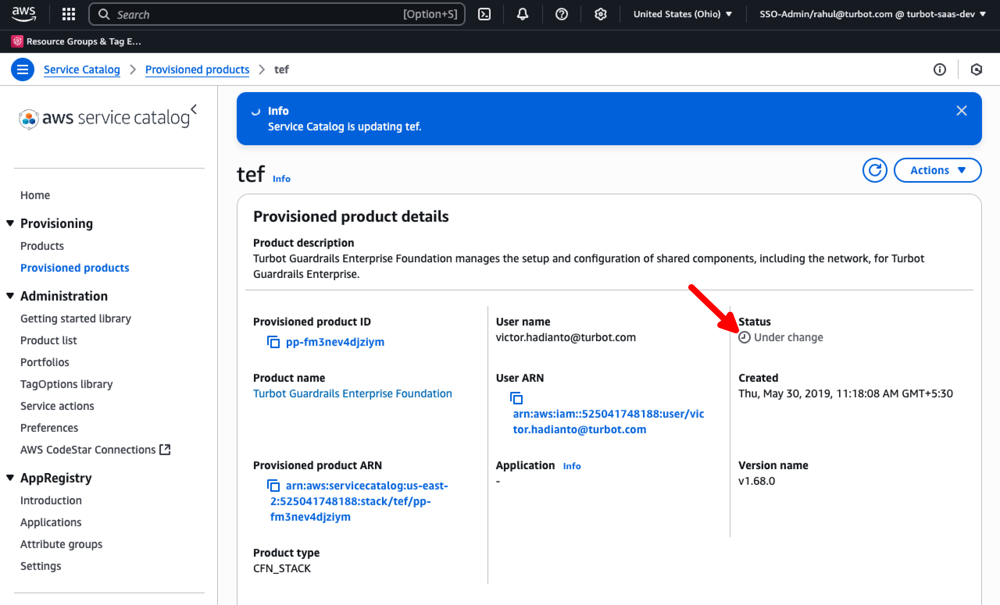

- [ ] Select the TEF Provisioned Product, click the `Outputs` tab, and use the `CloudFormationStackARN` link to navigate to CloudFormation and monitor the update progress.

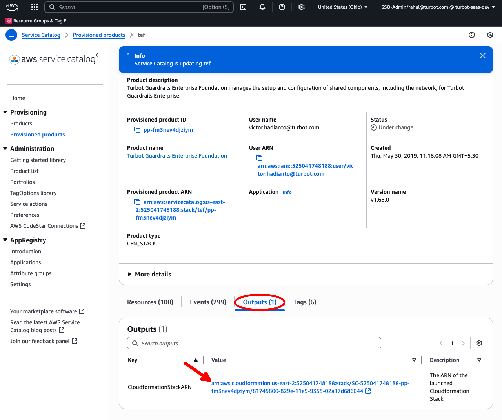

- [ ] The TEF stack shows `UPDATE_IN_PROGRESS` status and track changes under the Events tab.

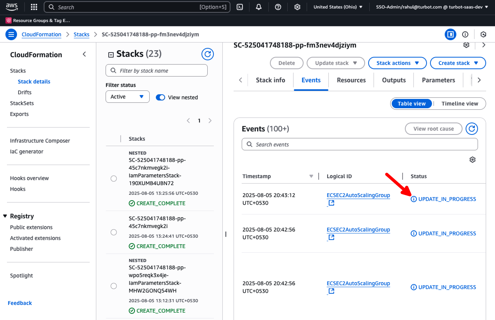

## Step 8: Review Final Status

- [ ] Ensure the CloudFormation stack status shows `UPDATE_COMPLETE`.

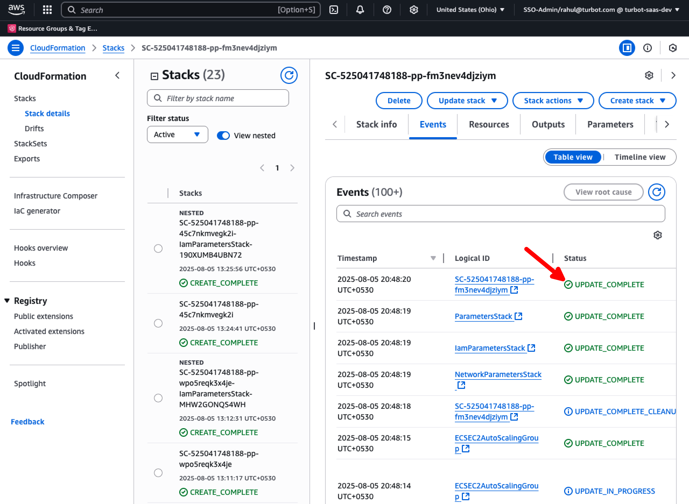

- [ ] Ensure the TEF Provisioned Product status shows `Available`.

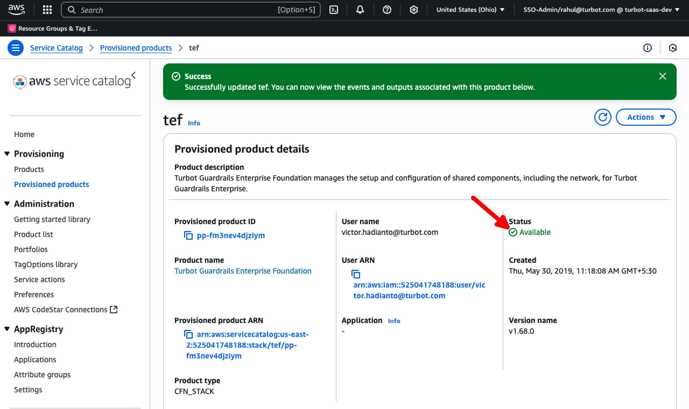

## Next Steps

Please see the following resources to learn more about Turbot Guardrails Enterprise:

- Learn more about [Turbot Guardrails Enterprise - Architecture](/guardrails/docs/enterprise/architecture)

## Troubleshooting

| Issue | Description | Guide |
|-------|-------------|-------|
| Permission Issues | The current logged-in user lacks permission to modify, update, or create resources in the stack, or IAM roles/SCPs are preventing built-in roles from accessing required configuration settings. | [Troubleshoot Permission Issues](guides/hosting-guardrails/installation/pre-installation/admin-permissions) |
| Further Assistance | If issues persist, open a support ticket with relevant information. | [Open Support Ticket](https://support.turbot.com) |
