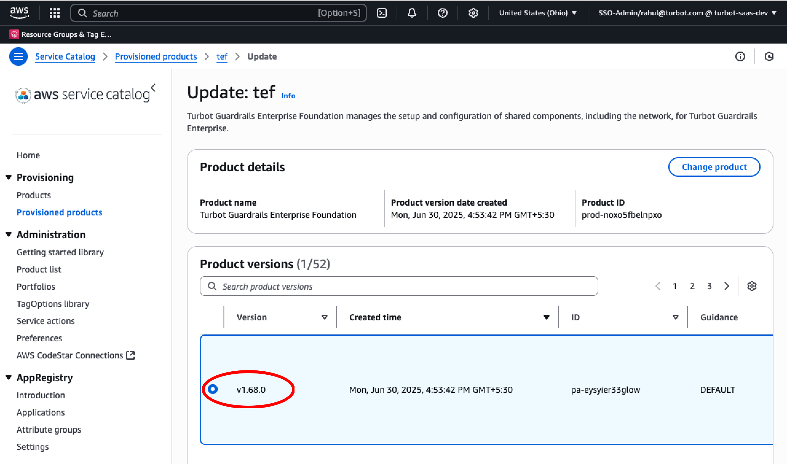
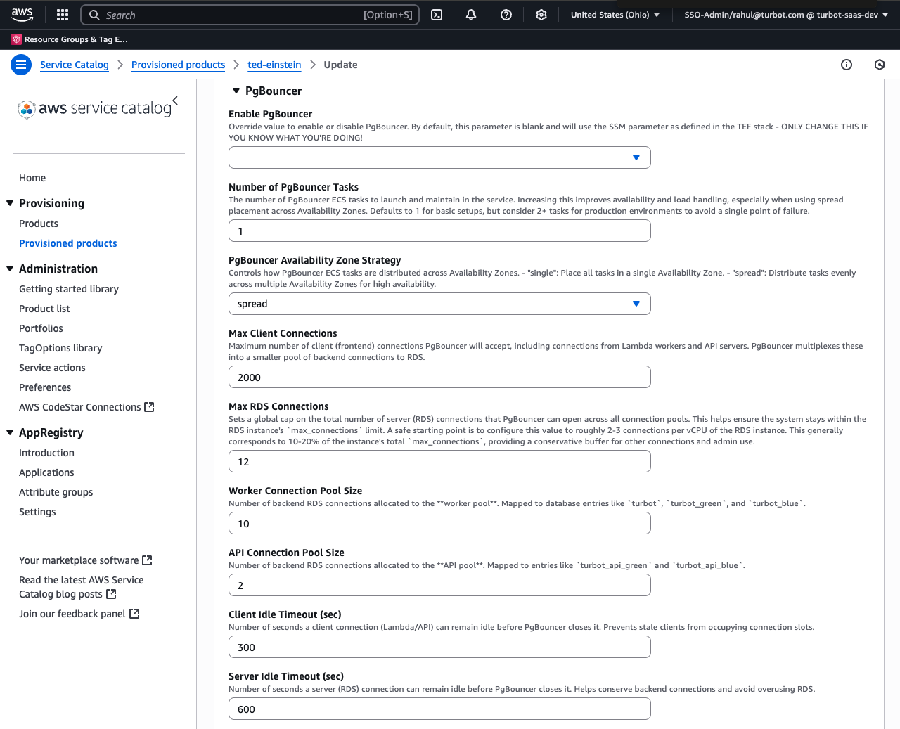
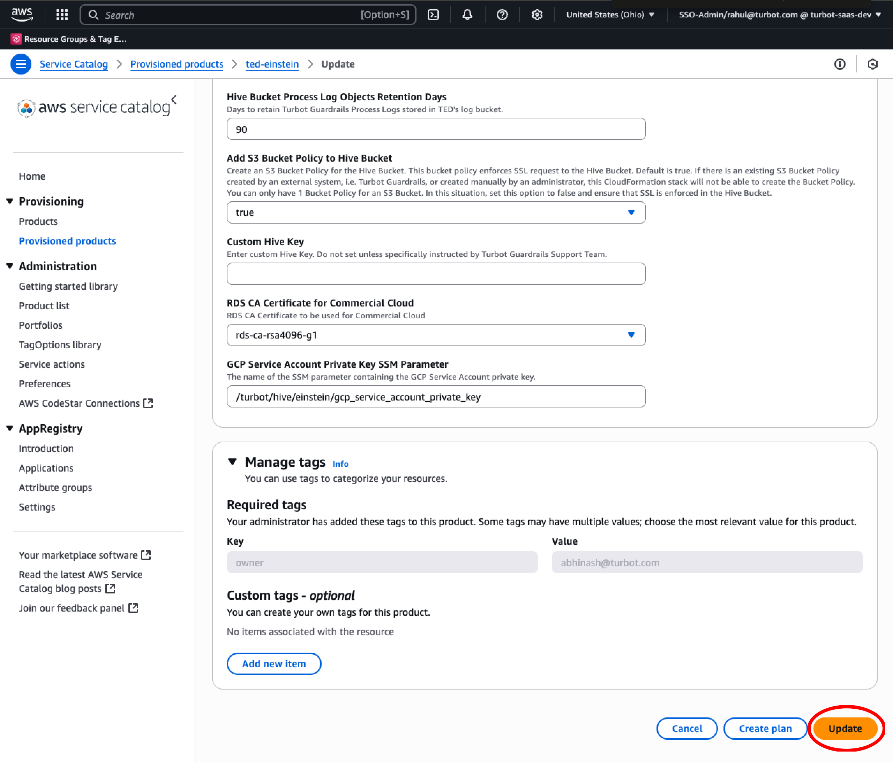

# Enable PgBouncer Connection Pooling

In this guide, you will:
- Use AWS Service Catalog to enable PgBouncer in an existing environment.
- Monitor and troubleshoot the process.

[PgBouncer](https://www.pgbouncer.org/) is a lightweight connection-pooler that sits between Turbot Guardrails services and the [Hive](https://turbot.com/guardrails/docs/reference/glossary#hive) PostgreSQL database. By multiplexing thousands of client connections into a much smaller pool of backend connections, PgBouncer dramatically reduces the number of active sessions on Hive, lowering memory consumption and protecting the database from connection storms.

## Prerequisites

- Access to the Guardrails AWS account with [Administrator Privileges](/guardrails/docs/enterprise/FAQ/admin-permissions).
- TEF version 1.68.0 or later
- TED version 1.50.0 or later
- TE version 5.52.0 or later
- Familiarity with AWS Console, Service Catalog and CloudFormation services.

## Step 1: Update TEF

To begin the upgrade process, you will first need to locate and access the TEF provisioned product in AWS Service Catalog and initiate an update.

Follow the same initial steps outlined in the [Updating TEF](/guardrails/docs/guides/hosting-guardrails/updating-stacks/update-tef) guide to:
- Access AWS Service Catalog
- Select the TEF provisioned product
- Initiate the update action

Once you've reached the version selection step in Service Catalog, return here to continue with the pgbouncer update process.

### Select Version

Select the desired TEF version under **Product Versions**.



### Update PgBouncer Parameter

Set **Enable PgBouncer** to **true** in the `Advanced – PgBouncer` section to turn on connection pooling for your Collective.


After verifying any changes to existing parameters, select **Update** at the bottom of the screen.


## Step 2: Update TED

Similar to TEF, locate and access the TED provisioned product in AWS Service Catalog and initiate an update.

Follow the same initial steps outlined in the [Updating TED](/guardrails/docs/runbooks/enterprise-install/update-ted) guide to:
- Access AWS Service Catalog
- Select the TED provisioned product
- Initiate the update action

Once you've reached the version selection step in Service Catalog, continue with the pgbouncer update steps:

### Select Version

Select the desired TED version under **Product Versions**.


### Update Parameters

TED provides a comprehensive set of settings, but when first enabling PgBouncer, you can safely leave all values at their defaults.

You can revisit these parameters if you need to scale PgBouncer beyond the baseline. To understand or review the available settings, see the [Configuration & Tuning](#configuration--tuning) section below.



> [!NOTE] It is recommended to set the **PgBouncerLogStats** parameter to **enabled** in TED to verify and view PgBouncer activation logs.


After verifying any changes to existing parameters, select **Update** at the bottom of the screen.



## Install or Update TE

PgBouncer support requires **Turbot Guardrails Enterprise (TE) 5.52.0** or later.  Use the existing [Install TE](guides/hosting-guardrails/installation/install-te) guide to install a new TE product and upgrade the workspaces. PgBouncer will activate automatically if `Enable PgBouncer` was set to `true` during the TEF update. No additional parameters need changing at the workspace level.

## Verify PgBouncer Activation

The most reliable way to verify that PgBouncer is active is by checking its statistics output from the ECS logs.

> [!NOTE] To view PgBouncer logs, ensure the TED parameter **PgBouncerLogStats** is set to **enabled**.

### Step 1: Navigate to ECS Service Task

Navigate to your ECS service `<prefix>_<hive>_pgbouncer` (for example: `turbot_newton_pgbouncer` if using default names) and Select the running task.


### Step 2: View Logs

Select the **Logs** tab to view the stats displayed under `Message`. PgBouncer is confirmed to be running and actively processing database traffic based on the presence of these stats.

The `STATS` lines appear every 5 minutes with metrics like:
   ```
   stats: 9 xacts/s, 8 queries/s, 8 client parts/s, 8 server parts/s, 8 kB/s/s, in 277 B/s, out 1000 B/s, xact 54224 us, query 47520 us, wait 126 us
   ```
   These stats show:
   - Active client and server connections
   - Query throughput
   - Transaction latency
   - Network traffic


## Configuration & Tuning

### Sizing Guidelines

1. **Database Connections** – a good starting point is **2–3 connections per vCPU** on the Hive instance.
   * r6g.large (2 vCPU) → 4–6 connections
   * r6g.2xlarge (8 vCPU) → 16–24 connections
   This usually represents 10–20% of the instance's Postgres `max_connections`, leaving plenty of headroom for maintenance users and bursts.

2. **Client Connections** – the default **2000** is sufficient for most Collectives. If you need more:
   * Add more PgBouncer tasks by increasing the desired task count
   * Adjust container resources (CPU and memory allocation)

3. **High Availability** – enable zone spreading and set at least 2 desired tasks so a single AZ outage doesn't break connectivity.

### Connection Settings

- **Maximum Client Connections** (`PgBouncerMaxClientConnections`) – raise beyond 2000 only if you have many concurrent workers
- **Maximum Database Connections** (`PgBouncerMaxDbConnections`) – adjust when you upscale your RDS instance
- **Worker Pool Size** (`PgBouncerConnectionPoolSize`) – size of the worker connection pool (default: 10)
- **API Pool Size** (`PgBouncerApiConnectionPoolSize`) – size of the API connection pool (default: 2)

### Resource Settings

- **Task Count** (`PgBouncerDesiredCount`) – number of PgBouncer tasks to run (≥ 2 recommended for HA)
- **CPU Units** (`PgBouncerCpuAllocation`) – CPU units per task (default: 512 = 0.5 vCPU)
- **Memory** (`PgBouncerMemoryAllocation`) – memory per task (default: 128 MiB)

### Monitoring Settings

- **Statistics Logging** (`PgBouncerLogStats`) – enables aggregated stats every 5 minutes showing active clients, connections, and performance metrics
- **Connection Logging** (`PgBouncerLogConnections`, `PgBouncerLogDisconnections`) – enables logging of individual connections/disconnections (useful for troubleshooting)

## Next Steps

Please see the following resources to learn more about Turbot Guardrails Enterprise:

- Learn more about [Turbot Guardrails Enterprise - Architecture](/guardrails/docs/enterprise/architecture).
- Learn about [TED Installation](/guardrails/docs/enterprise/installation/ted-installation)

## Troubleshooting

| Issue                                      | Description                                                                                                                                                                                                 | Guide                                |
|----------------------------------------------|-------------------------------------------------------------------------------------------------------------------------------------------------------------------------------------------------------------------|-----------------------------------------------------|
| Permission Issues                        | If the current logged-in user lacks permission to modify, update, or create resources in the stack, or if IAM roles or SCPs have changed, preventing built-in roles from accessing needed configuration settings.   | [Troubleshoot Permission Issues](/guardrails/docs/enterprise/FAQ/admin-permissions#aws-permissions-for-turbot-guardrails-administrators)             |
| Stack Rollback Failure Due to Database State                   | If the CloudFormation stack attempts to roll back but fails because the database is in a state (e.g., Upgrading, Backing Up) that prevents a successful rollback.                                                  | [Troubleshoot Rollback Failures](guides/hosting-guardrails/troubleshooting/database-instance-not-in-available-state)                  |
| Service Catalog Sync Issue               | If the Service Catalog Provisioned product, CloudFormation Stack, or the physical RDS instance becomes out of sync, causing issues with updates or resource management.                                              | [Troubleshoot Sync Issues](guides/hosting-guardrails/troubleshooting/service-catalog-out-of-sync)                            |
| Further Assistance                       | If you continue to encounter issues, please open a ticket with us and attach the relevant information to assist you more efficiently.                                                 | [Open Support Ticket](https://support.turbot.com)   |