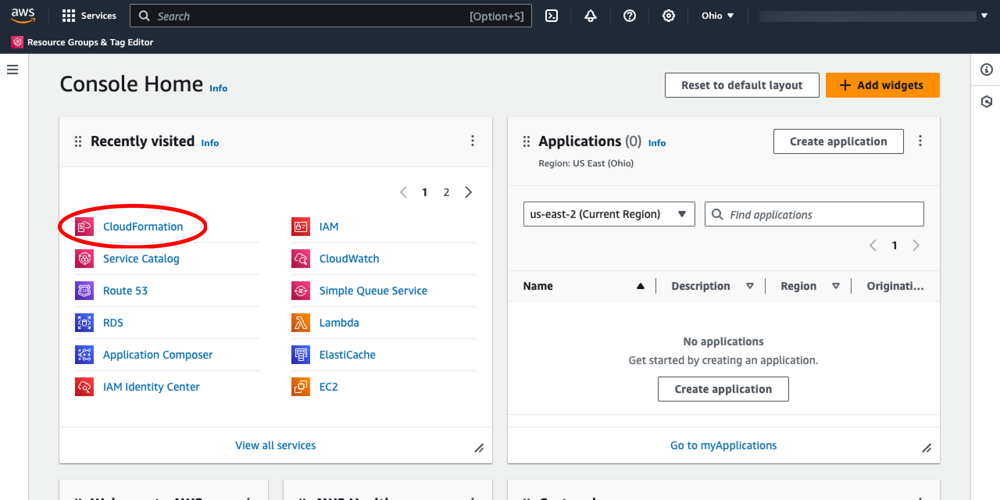
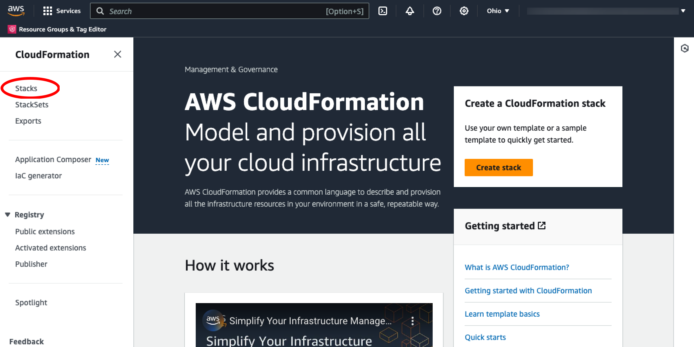
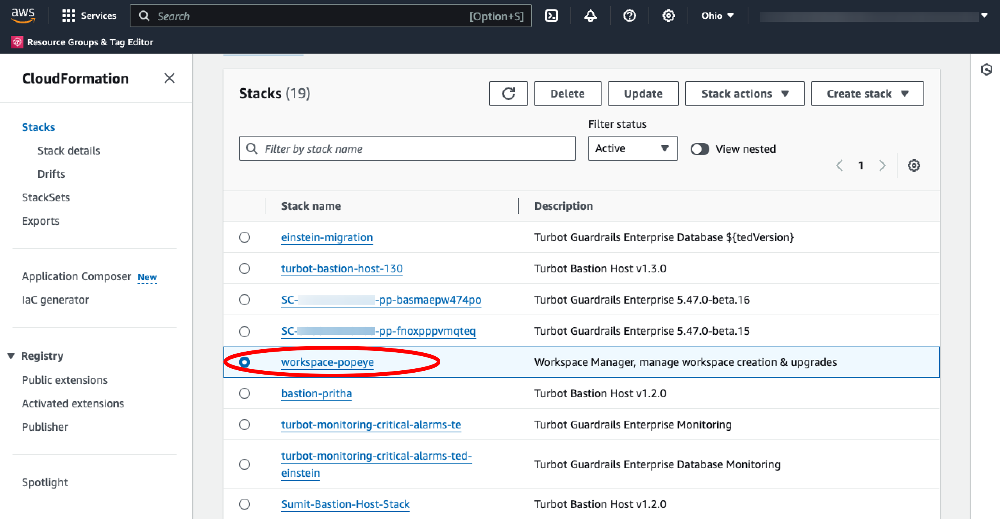
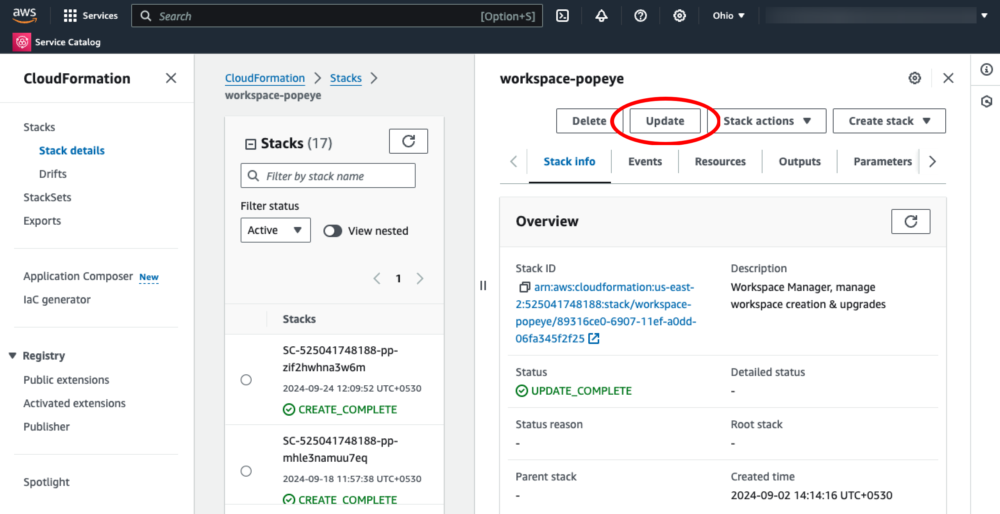
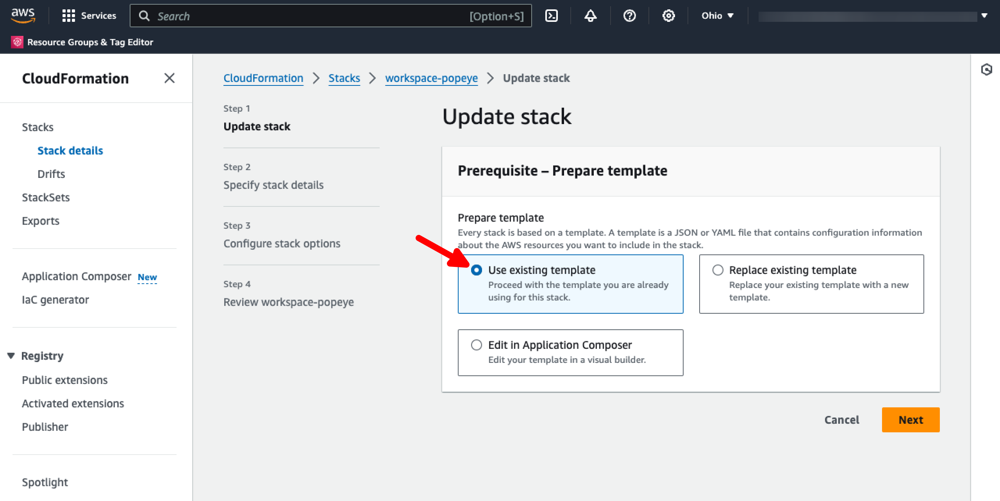
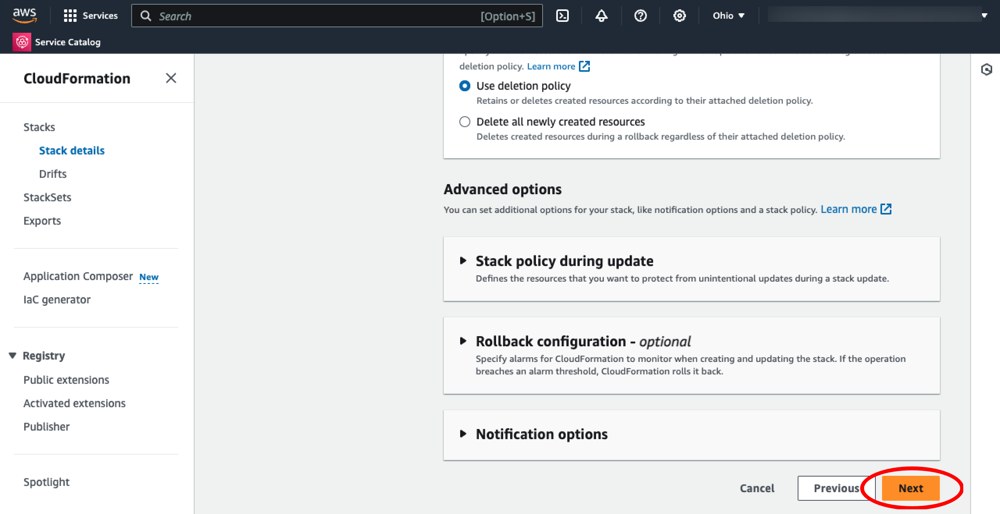
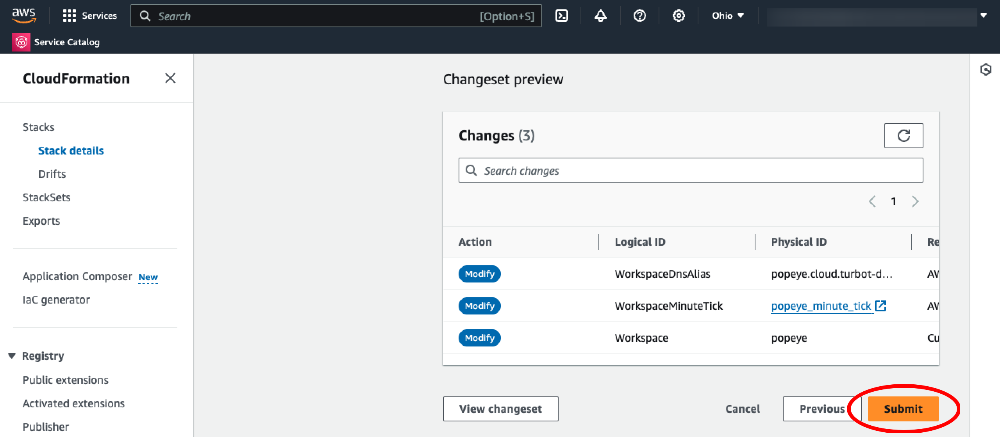
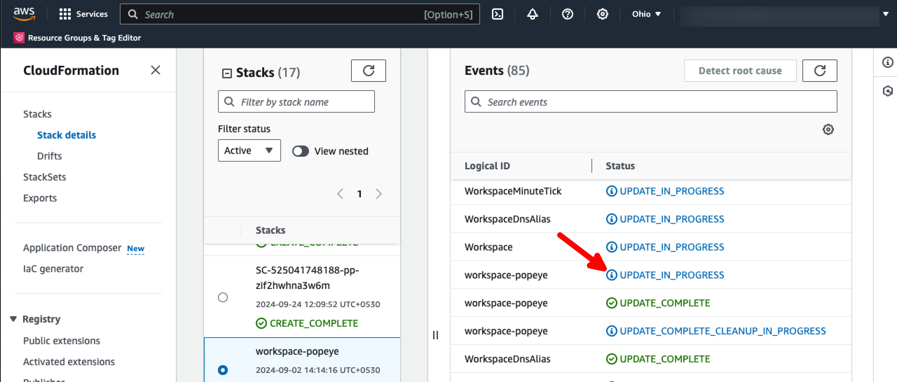
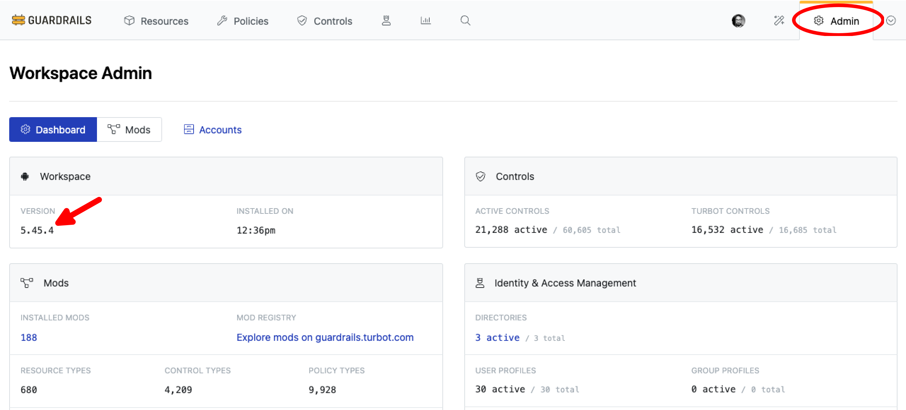

# Update Workspace TE Version

In this guide, you will:
- Update a Guardrails workspace to a new TE version using AWS CloudFormation.

A Guardrails [Workspace](/guardrails/docs/reference/glossary#workspace) is updated to a new version by referencing a newly installed [TE](/guardrails/docs/reference/glossary#turbot-guardrails-enterprise-te) product within the workspace stack. This ensures the workspace benefits from the latest TE features and improvements.

## Prerequisites

- Access to the Guardrails AWS account with [Administrator Privileges](/guardrails/docs/enterprise/FAQ/admin-permissions).
- Desired TE version(s) installed.
- Familiarity with AWS Console and CloudFormation service.

## Step 1: Access AWS Console

Open the AWS Console and navigate to the CloudFormation service in the region where your workspace is deployed.

## Step 2: Select Stack

From the left navigation menu choose **Stacks**.

Search for the stack named **workspace**.

Select **Update**

## Step 3: Update Stack

Choose **Use existing template** and select **Next**.

Modify the version to match the new TE version number used in the TE stack (e.g., 5.45.4), then select **Next**.

## Step 4: Specify TE Version

Scroll down to **Advanced options**, leave the entire section as default and select **Next**

## Step 5: Submit Changes

In **Configure stack options**, review changes under **Changeset Preview** and select **Submit**.

## Step 6: Monitor Update

You have initiated the update of a new TE version in the Guardrails workspace. This triggers an update of several nested CloudFormation stacks.

- [ ] The workspace CloudFormation stack status should change to `UPDATE_IN_PROGRESS` indicating the update process is in progress.

## Step 7: Review

- [ ] The workspace CloudFormation stack status should change to `UPDATE_COMPLETE` indicating the update completed successfully.

- [ ] Updated TE version should reflect in Guardrails `Workspace Admin` panel.

## Next Steps

Please see the following resources to learn more about Turbot Guardrails Enterprise:

- Learn more about [TE architecture](/guardrails/docs/enterprise/architecture).
- Learn about [Installing TE](/guardrails/docs/enterprise/installation/te-installation).

## Troubleshooting

| Issue                                      | Description                                                                                                                                                                                                 | Guide                                |
|----------------------------------------------|-------------------------------------------------------------------------------------------------------------------------------------------------------------------------------------------------------------------|-----------------------------------------------------|
|Displays Incorrect TE Version                        | `Workspace Admin` in your workspace section does not display updated TE version after workspace is updated successfully.   | Clear your browser cache and log back into the workspace.             |
| Permission Issues                        | If the current logged-in user lacks permission to modify, update, or create resources in the stack, or if IAM roles or SCPs have changed, preventing built-in roles from accessing needed configuration settings.   | [Troubleshoot Permission Issues](guides/hosting-guardrails/installation/pre-installation/admin-permissions)             |
| Further Assistance                       | If you continue to encounter issues, please open a ticket with us and attach the relevant information to assist you more efficiently.                                                 | [Open Support Ticket](https://support.turbot.com)   |
