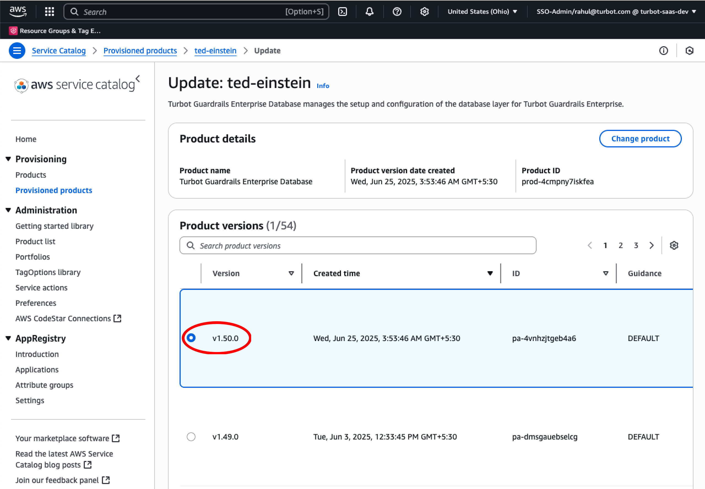
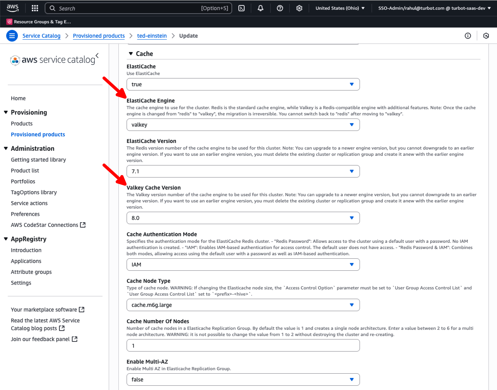
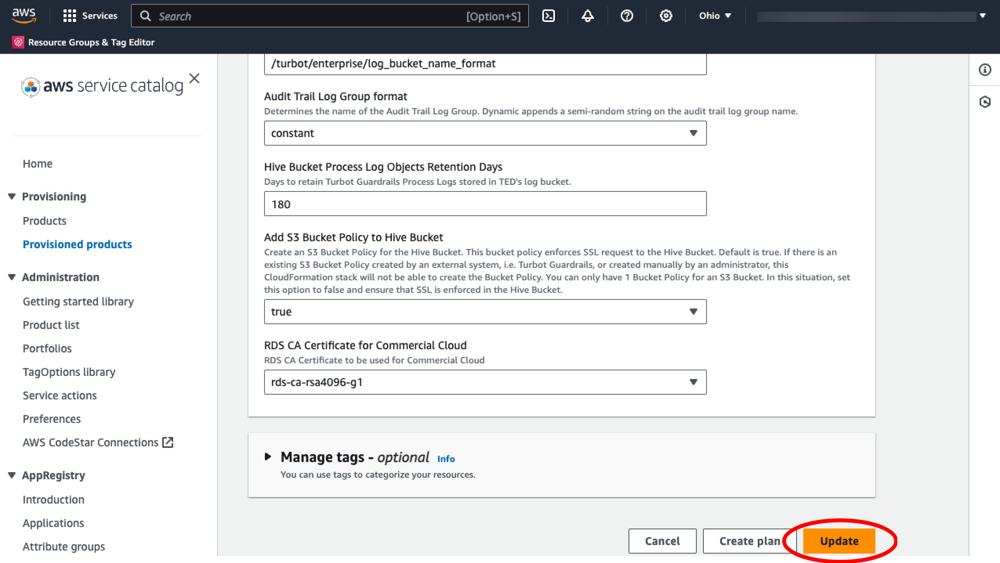
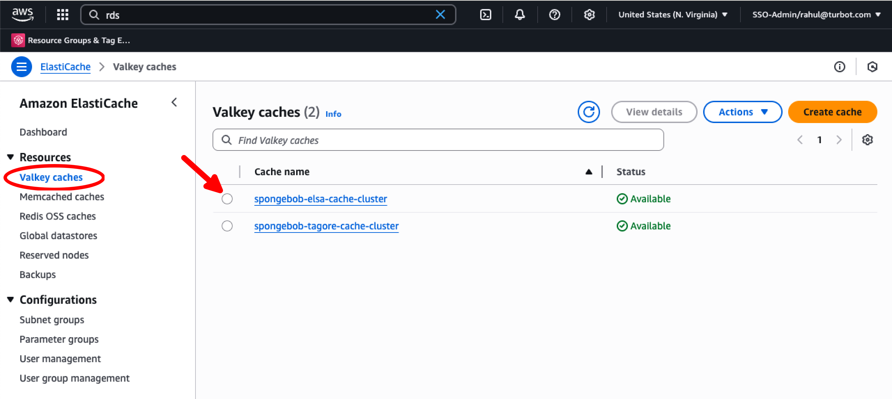

# Upgrading Redis OSS to Valkey Cache

<!-- # Migrating ElastiCache for Valkey - Refer https://aws.amazon.com/elasticache/what-is-valkey/
https://docs.aws.amazon.com/AmazonElastiCache/latest/dg/VersionManagement.HowTo.html
-->

In this guide, you will:

- Use the Turbot Enterprise Database provisioned product in Service Catalog to migrate from Redis to Valkey.
- Monitor and troubleshoot the [Valkey](https://aws.amazon.com/elasticache/what-is-valkey/) upgrade process.

[Turbot Guardrails Enterprise Database (TED)](/guardrails/docs/reference/glossary#turbot-guardrails-enterprise-database-ted) is an AWS Service Catalog product that automates the provisioning and management of the underlying database and caching infrastructure required for enterprise deployments of Turbot Guardrails.

As part of its infrastructure, TED versions prior to v1.50 use Redis as the caching engine. This guide shows how to update a TED deployment using Redis to one using Valkey.

The migration process described here will seamlessly provision new Valkey cache clusters and decommission the existing Redis instances, ensuring minimal disruption to your Guardrails environment.

Learn more about the difference between [Valkey and Redis OSS](https://aws.amazon.com/elasticache/what-is-valkey/).

## Prerequisites

- Access to the Guardrails AWS account with [Administrator Privileges](/guardrails/docs/enterprise/FAQ/admin-permissions).
- Familiarity with AWS Console, Service Catalog, and CloudFormation services.
- TED version 1.50.x or higher.

### Pause Events

[Pause the events](/guardrails/docs/guides/hosting-guardrails/troubleshooting/pause-events#pause-event-processing) to avoid any lost events. During this time, the respective workspace will still be available in `readonly` mode.

>[!CAUTION]
> AWS only supports migrating from Redis to Valkey within ElastiCache. There is no supported migration path from Valkey back to Redis.
>
> Additionally, AWS has announced that support for Redis in ElastiCache will be deprecated in the future. For more details, see the [official AWS announcement](https://aws.amazon.com/about-aws/whats-new/2024/05/amazon-elasticache-valkey/).

To begin the upgrade process, you will first need to locate and access the TED provisioned product in AWS Service Catalog and initiate an update.

Follow the same initial steps outlined in the [Updating TED](/guardrails/docs/runbooks/enterprise-install/update-ted) guide to:
- Access AWS Service Catalog
- Select the TED provisioned product
- Initiate the update action

Once you've reached the version selection step in Service Catalog, return here to continue with the Valkey upgrade process.

## Step 1: Select TED Version

Select the desired TED version under **Product Versions**.

> [!NOTE]
> Valkey is only available in TED version 1.50.x or higher.

## Step 2: Update Parameters

Under **cache**, choose `Valkey` as the ElastiCache Engine. Then select the desired version from the `Valkey Cache Version` dropdown.

## Step 3: Update TED

After verifying all parameters, scroll down and select **Update**. This initiates an update of several nested CloudFormation stacks.

## Step 4: Monitor the Update

Monitor the stack update in progress from the CloudFormation console.

## Step 5: Verify Valkey Cache Deployment

* [ ] The newly created Valkey caches can be found under `Valkey caches` in the AWS ElastiCache dashboard.

## Next Steps

Please see the following resources to learn more about Turbot Guardrails Enterprise:

* [Turbot Guardrails Enterprise - Architecture](/guardrails/docs/enterprise/architecture).
* [TED Installation](/guardrails/docs/enterprise/installation/ted-installation).

## Troubleshooting

| Issue                                        | Description                                                                                                                                                                       | Guide                                                                                                                                    |
| -------------------------------------------- | --------------------------------------------------------------------------------------------------------------------------------------------------------------------------------- | ---------------------------------------------------------------------------------------------------------------------------------------- |
| Permission Issues                            | The current logged-in user lacks permission to modify, update, or create resources in the stack, or IAM roles/SCPs prevent built-in roles from accessing required configurations. | [Troubleshoot Permission Issues](/guardrails/docs/enterprise/FAQ/admin-permissions#aws-permissions-for-turbot-guardrails-administrators) |
| Stack Rollback Failure Due to Database State | CloudFormation stack fails to roll back because the database is in a state (e.g., Upgrading, Backing Up) that prevents rollback.                                                  | [Troubleshoot Rollback Failures](guides/hosting-guardrails/troubleshooting/database-instance-not-in-available-state)                     |
| Service Catalog Sync Issue                   | Service Catalog product, CloudFormation Stack, or physical RDS instance is out of sync, leading to update or resource management issues.                                          | [Troubleshoot Sync Issues](guides/hosting-guardrails/troubleshooting/service-catalog-out-of-sync)                                        |
| Further Assistance                           | If issues persist, open a support ticket with relevant logs and screenshots.                                                                                                      | [Open Support Ticket](https://support.turbot.com)                                                                                        |
