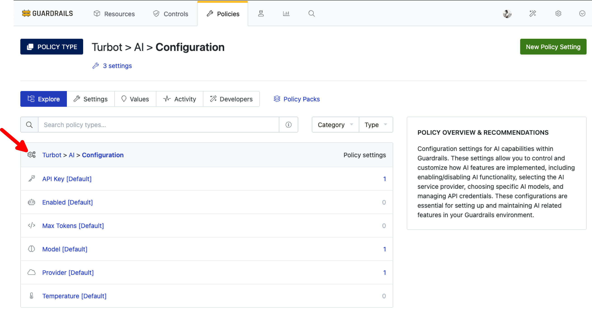
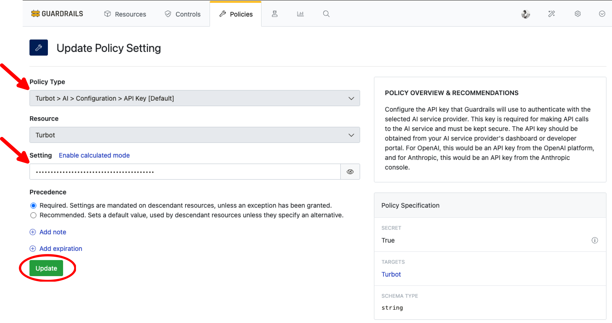
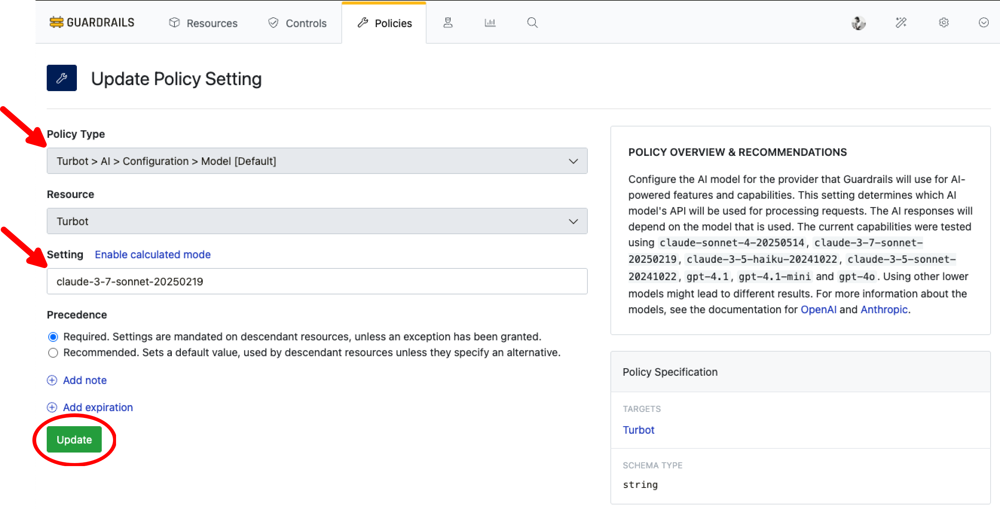
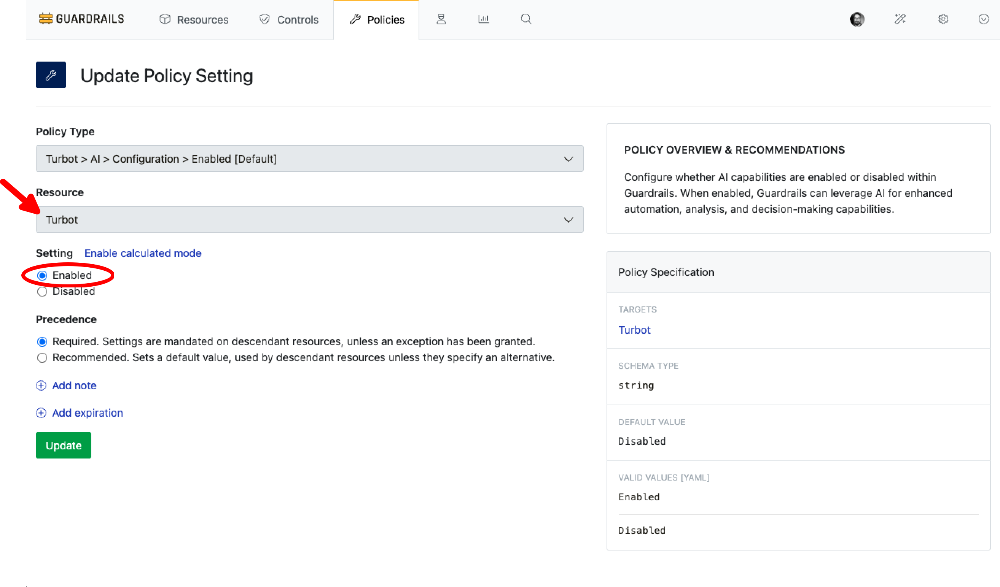
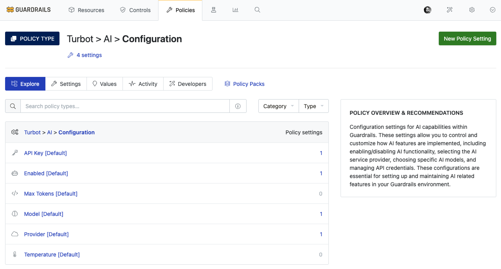

# Turbot AI Configuration

In this guide, you will learn how to:

- Configure various parameters in `Turbot > AI > Configuration` policy

This guide is the starting point for all AI-powered features, including `Intelligent Assessment Control`, `Intelligent Fixes` and `Policy Pack Summary`. Before using any AI capabilities in Guardrails, ensure you have completed the steps in this guide.

## Prerequisites

- *Turbot/Admin* permissions at the Turbot resource level.
- Familiarity with the [Guardrails console](https://turbot.com/guardrails/docs/getting-started/).
- Access credentials for the AI model.

## Step 1: Find Turbot > AI Policy

Log in to the Guardrails console using your local credentials or via a SAML-based login. From the **Policies** tab, navigate to *Turbot > AI* in the Guardrails console.

This section provides AI-related policies that allow Guardrails to govern the use of AI for various configurations and settings. Select **Configurations**.

## Step 2: Configure AI Provider

Select **Turbot > AI > Configuration > Provider [Default]** to configure the AI service provider.The default value is set to `openai`.

Here as an example `anthropic` is selected.

## Step 3: Configure API Key

Select **Turbot > AI > Configuration > API Key [Default]** policy under `Turbot > AI > Configuration` main policy.

Enter the API key based on choosen provider in Step 3, that Guardrails will use to authenticate with your AI service provider.

> [!IMPORTANT]
> - The API key is a sensitive credential used for authentication with your chosen AI service provider. Ensure it is stored and handled securely.
> - For OpenAI:
>   - Obtain the API key from the [OpenAI platform](https://platform.openai.com/api-keys)
>   - The key should start with "sk-"
> - For Anthropic:
>   - Get the API key from the [Anthropic console](https://console.anthropic.com/settings/keys)
>   - The key should start with "sk-ant-"
> - Store the API key securely and rotate it periodically according to your organization's security policies
> - Never share or expose the API key in logs, code repositories, or public forums

## Step 4: Configure AI Model

Select **Turbot > AI > Configuration > Model [Default]** policy under `Turbot > AI > Configuration` main policy.

Choose which model to use with the selected AI provider for processing requests.

// MAKE CHANGES BELOW

> [!NOTE]
> Supported and tested models include:
> - [OpenAI models](https://platform.openai.com/docs/pricing#latest-models): `gpt-4.1`, `gpt-4.1-mini`, `gpt-4o`
> - [Anthropic models](https://docs.anthropic.com/en/docs/about-claude/models/overview#model-names): `claude-3-sonnet-20240229`, `claude-3-haiku-20240307`, `claude-3-opus-20240229`
>
> For optimal results:
> - Use the latest model versions when possible
> - Higher-tier models (like GPT-4 series and Claude-3 series) provide more accurate and detailed assessments
> - Lower-tier models may produce less consistent or detailed results
> - Model availability may vary based on your AI provider subscription

## Step 5: Configure Max Tokens

Select **Turbot > AI > Configuration > Max Tokens [Default]** under `Turbot > AI > Configuration` main policy. The default value is set at `1000` as per best practice.

> [!TIP]
> - Configure the maximum number of tokens to use for the AI API calls. This setting controls the length of the AI's response by limiting the number of tokens (words, subwords, or characters) that can be generated.
> - A higher value allows for longer, more detailed responses but may increase API costs and response time.
> - A lower value produces more concise responses.
> - The default value of 1000 tokens provides a good balance for most use cases, but you can adjust this based on your specific needs and the complexity of the tasks you want the AI to perform.

You can adjust this based on your specific needs and the complexity of the tasks you want the AI to perform.

## Step 6: Configure Temperature

The policy **Turbot > AI > Configuration > Temperature [Default]** allows you to configure the temperature parameter for AI API calls. Temperature controls the randomness or creativity of the AI's responses.

A lower value (closer to 0) makes responses more focused, deterministic, and consistent, while a higher value (closer to 1) makes responses more diverse and creative. The default value of 0.2 provides a good balance between consistency and creativity, suitable for most business and technical use cases.

The default value is set to `0.2`. You may choose to update it based on your need.

## Step 7: Enable Configuration

**Turbot > AI > Configuration > Enabled [Default]** under `Turbot > AI > Configuration`  policy plays important role, if you wish to apply configurations to all the features under `Turbot > AI`. You may choose to continue with default value `Disabled` and enable it in respective features separatly.

To enable it, select **New Policy Settings**, select **Resource** as `Turbot` and choose `Enabled`

## Review

- [ ] Validate that all the required settings are in place.

## Next Steps

After completing this configuration, continue with follwoing guides to leverage AI features in Guardrails:

- [Intelligent Assessment](/guardrails/docs/guides/using-guardrails/ai/intelligent-assessment)
- [Intelligent Fixes](/guardrails/docs/guides/using-guardrails/ai/intelligent-fixes/)
- [Policy Pack Summary](/guardrails/docs/guides/using-guardrails/ai/policy-pack-summary/)

## Troubleshooting

| Issue                  | Description                                                                                                                   | Guide                                      |
|------------------------|-------------------------------------------------------------------------------------------------------------------------------|--------------------------------------------|
| Further Assistance     | If issues persist, please open a support ticket and attach relevant information to help us assist you more efficiently.       | [Open Support Ticket](https://support.turbot.com) |