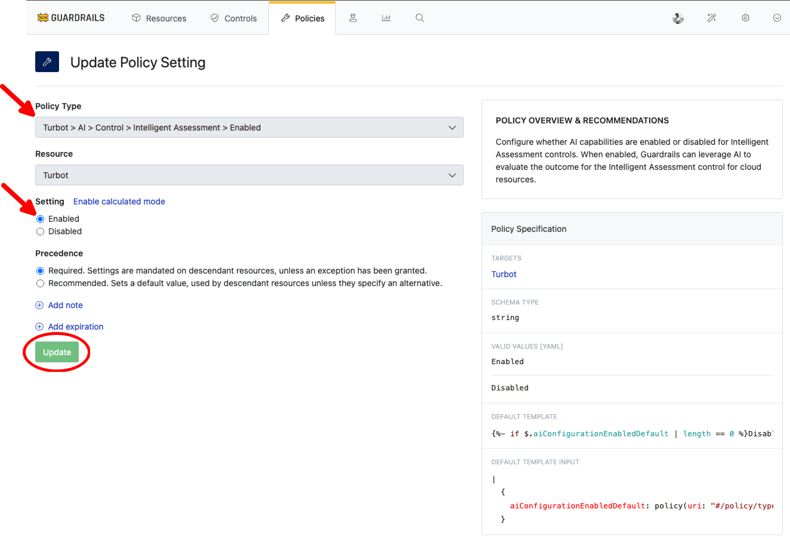
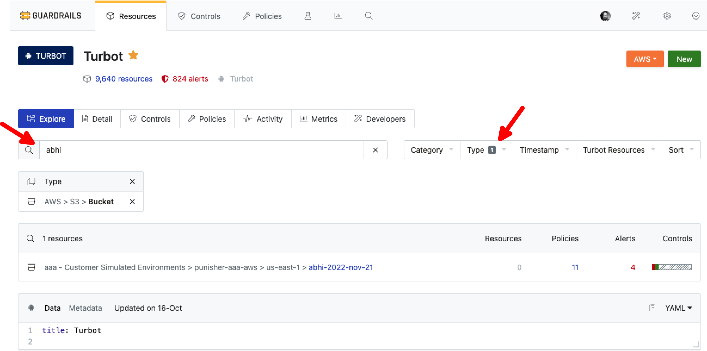
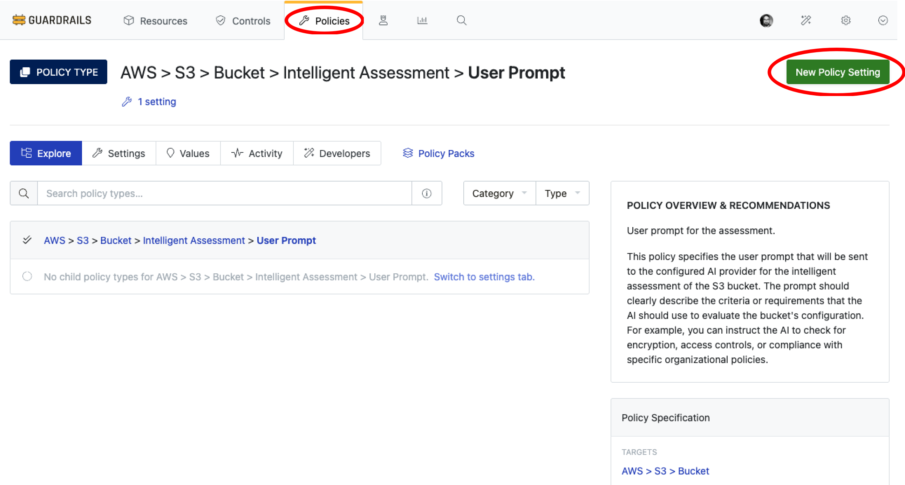
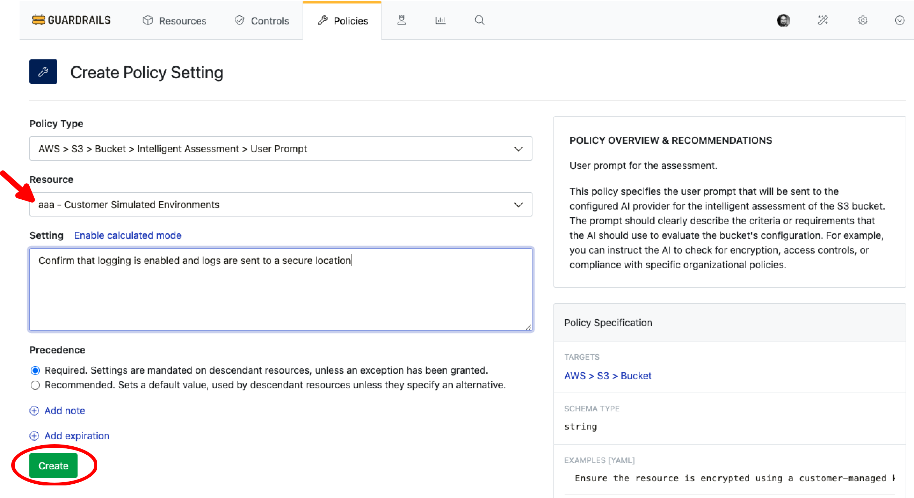
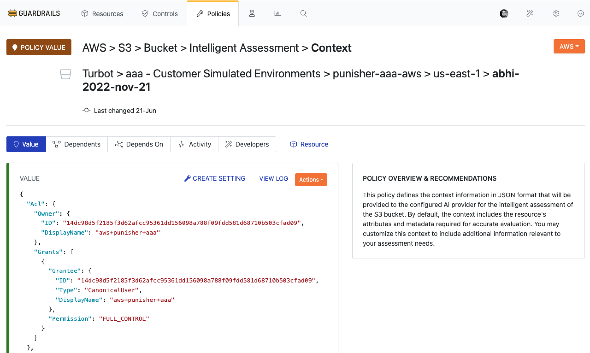
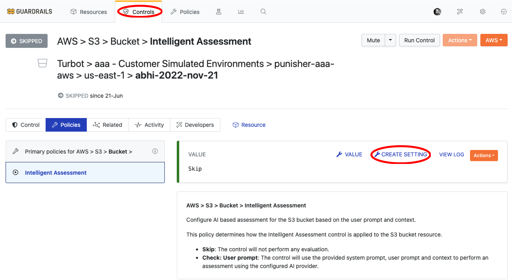
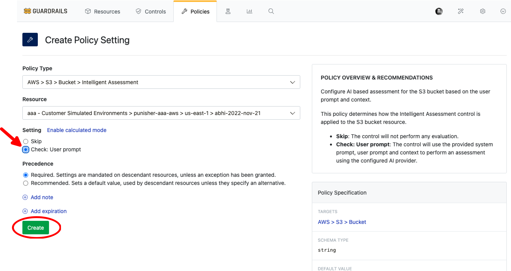
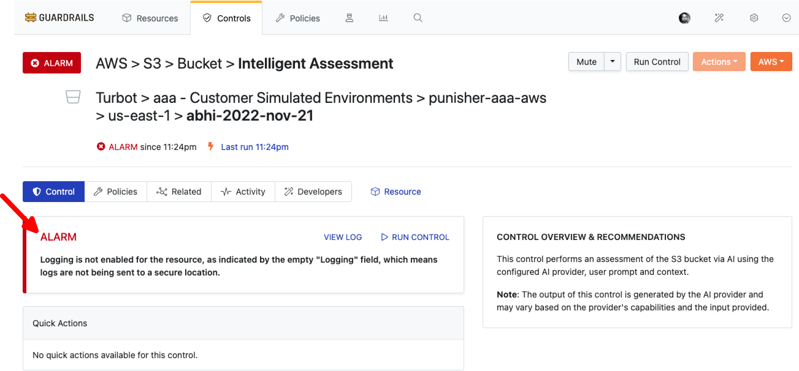

# Enable Intelligent Assessment

In this guide, you will learn how to:

- Set up custom user prompts and context for resource evaluation.
- Enable Intelligent Assessment for a specific S3 bucket control as an example.

The [Intelligent Assessment](/guardrails/docs/concepts/guardrails/intelligent-assessment) [control](/guardrails/docs/reference/glossary#control) introduces an AI-powered way to define and evaluate governance policies in Turbot Guardrails. Instead of crafting complex calculated policies, you can describe the check you want in plain natural language, and let Guardrails interpret and evaluate it.

## Prerequisites

- *Turbot/Admin* permissions at the Turbot resource level.
- Familiarity with the [Guardrails console](https://turbot.com/guardrails/docs/getting-started/).
- Ensure that [Turbot > AI > Configuration](/guardrails/docs/guides/using-guardrails/ai/ai-configuration) is set up.

## Step 1: Enable Intelligent Assessment Control

Log in to the Guardrails console using your local credentials or via a SAML-based login.

Enable the following policy at the Turbot level: **Turbot > AI > Control > Intelligent Assessment > Enabled**. This enables AI capabilities for Intelligent Assessment controls.

> [!NOTE]
> - The default value is `Disabled`. You can enable it based on your requirements.
> - If enabled at the Turbot level in [Turbot AI Configuration > Step 7](/guardrails/docs/guides/using-guardrails/ai/ai-configuration#step-7-enable-configuration), the Intelligent Assessment control becomes available for use.

For this guide, the `Turbot > AI > Control > Intelligent Assessment > Enabled` policy is set to `Enabled`.



## Step 2: Find Targeted S3 Bucket

Navigate to the **Resources** tab and search for the S3 bucket you want to assess. You can filter by:

- Resource type: `AWS > S3 > Bucket`
- Bucket name in the search bar



Select the bucket to view its details and controls. This will be the target resource for setting up `Intelligent Assessment`.

> [!TIP]
> You can also find the required bucket using **Reports** > **AWS S3 Buckets**.

## Step 3: Add User Prompt

While in `AWS > S3 > Bucket`, select the **Policies** tab and choose the `AWS > S3 > Bucket > Intelligent Assessment > User Prompt` policy.

Select **New Policy Setting** to add a new prompt.



Here you can define the prompt that will be sent to the AI provider for resource assessment. Ensure your instructions are clear and specific.



> [!NOTE]
> You can set this policy at the resource, account, or folder level.
> For more information, see [Guardrails Policy Hierarchy](/guardrails/docs/concepts/policies/hierarchy).

**Example Prompt:**
```
- Confirm that logging is enabled and logs are sent to a secure location.
- Check if versioning is enabled and multi-factor delete is configured when the bucket has a tag "Environment":"Non-Compliant Tag". If it doesn't have the tag, only check if versioning is enabled.
- Ensure that the S3 bucket is not publicly accessible and all access is restricted to specific IAM roles or users.
- Verify that server-side encryption is enabled using AWS KMS for all objects in the bucket.
- Check if the bucket policy denies unencrypted uploads and enforces HTTPS-only access.
- Confirm that lifecycle rules are configured to transition objects to Glacier storage after 30 days and delete them after 365 days.
- Ensure that the bucket has a policy to block all public ACLs and public bucket policies.
- Validate that only specific IP address ranges (e.g., 10.0.0.0/8) are allowed to access the bucket.
- Check if object lock is enabled for regulatory compliance and retention.
- Confirm that the bucket has a tag \"Owner\" with a valid email address.
- Ensure that cross-region replication is enabled to a backup bucket in another AWS region.
- Verify that access logging is enabled and logs are sent to a dedicated logging bucket with restricted access.
```
## Step 4: Set up Context

The sub-policy `AWS > S3 > Bucket > Intelligent Assessment > Context` defines the context information in JSON format that will be provided to the configured AI provider for the intelligent assessment of the S3 bucket.

By default, the context includes the resource's attributes and metadata required for accurate evaluation. In this example, we will use the `default context`.



> [!NOTE]
> You may customize this context to include additional information relevant to your assessment needs.

## Step 5: Set Primary Policy to Check Mode

Now that the user prompt is set with the default context, let's set up the primary policy `AWS > S3 > Bucket > Intelligent Assessment` for this S3 bucket.

To access the main policy, while in the `AWS > S3 > Bucket > Intelligent Assessment` **Controls**, select the **Policies** tab. If not set earlier, you may find `Intelligent Assessment` is set to `Skip`.



Select **CREATE SETTING** and set the option to `Check: User prompt`. This policy activates Intelligent Assessment for the S3 bucket based on your user prompt and context.

> [!NOTE]
> You can set this policy at the resource, account, or folder level.
> For more information, see [Guardrails Policy Hierarchy](/guardrails/docs/concepts/policies/hierarchy).



## Step 6: Check Control Status

The control will assess the S3 bucket using the configured user prompt and evaluate the control.



> [!NOTE]
> The output is generated by the AI provider and may vary based on the model's capabilities and input details.

## Next Steps

To explore more Guardrails features:

- [Intelligent Fixes](/guardrails/docs/guides/using-guardrails/ai/enable-intelligent-fixes)
- [Policy Pack Summary](/guardrails/docs/guides/using-guardrails/ai/enable-policy-pack-summary)
- [Configure Guardrails MCP Server](/guardrails/docs/guides/using-guardrails/ai/install-mcp)
- [Developing guardrails for Guardrails](/guardrails/docs/guides/developers/)

## Troubleshooting

| Issue                  | Description                                                                                                                   | Guide                                      |
|------------------------|-------------------------------------------------------------------------------------------------------------------------------|--------------------------------------------|
| Further Assistance     | If issues persist, please open a support ticket and attach relevant information to help us assist you more efficiently.       | [Open Support Ticket](https://support.turbot.com) |