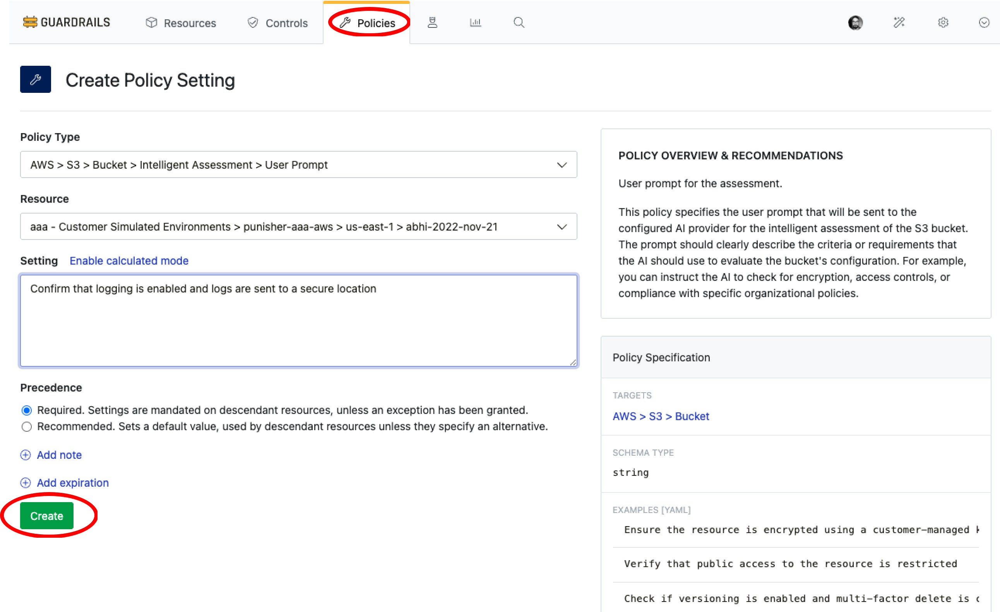

# Enable Intelligent Assessment

In this guide, you will learn how to:

- Set up custom user prompts and context for resource evaluation.
- Enable Intelligent Assessment for a specific S3 bucket control as an example.

With the [Intelligent Assessment](/guardrails/docs/concepts/guardrails/intelligent-assessment) [control](/guardrails/docs/reference/glossary#control), it introduces an AI-powered way to define and evaluate governance policies in Turbot Guardrails. Instead of crafting complex calculated policies, you can describe the check you want — in plain natural language — and let Guardrails interpret and check it.

## Prerequisites

- *Turbot/Admin* permissions at the Turbot resource level.
- Familiarity with the [Guardrails console](https://turbot.com/guardrails/docs/getting-started/).
- Ensure that [Turbot > AI > Configuration](/guardrails/docs/guides/using-guardrails/ai/ai-configuration) is set up.

## Step 1: Enable Intelligent Assessment Control

Log in to the Guardrails console using your local credentials or via a SAML-based login.

Enable the following policy at the Turbot level: **Turbot > AI > Control > Intelligent Assessment > Enabled**. This enables AI capabilities for Intelligent Assessment controls.

> [!NOTE]
> - The default value is `Disabled`. You can enable it based on your requirements.
> - In case enabled at the Turbot level in [Turbot AI Configuration > Step 7](/guardrails/docs/guides/using-guardrails/ai/ai-configuration#step-7-enable-configuration), Intelligent Assessment control becomes available for use.

For this guide, the `Turbot > AI > Control > Intelligent Assessment > Enabled` policy is set to `Enabled`.


## Step 2: Find Targeted S3 Bucket

Navigate to **Resources** tab and search for the S3 bucket you want to assess. You can filter by:

- Resource type: `AWS > S3 > Bucket`
- Bucket name in serach bar


Select the bucket to view its details and controls. This will be the target resource for setting up `Intelligent Assessment`.

> [!TIP]
> You can also find the required bucket using **Reports** > **AWS S3 Buckets**

## Step 3: Add User Prompt

While in` AWS > S3 > Bucket`, select **Policies** tab and choose `AWS > S3 > Bucket > Intelligent Assessment > User Prompt` policy.

Select **New Policy Setting** to add


Here you can define the prompt that will be sent to the AI provider for resource assessment. Ensure your instructions are clear and specific.




> [!NOTE]
> You can set this policy at the resource, account, or folder level.
> For more information, see [Guardrails Policy Hierarchy](/guardrails/docs/concepts/policies/hierarchy).

**Example Prompt:**
```
- Confirm that logging is enabled and logs are sent to a secure location.
- Check if versioning is enabled and multi-factor delete is configured when the bucket has a tag "Environment":"Non-Compliant Tag". If it doesn't have the tag, only check if versioning is enabled.
```
## Step 4: Set up Context

The sub-policy `AWS > S3 > Bucket > Intelligent Assessment > Context` defines the context information in JSON format that will be provided to the configured AI provider for the intelligent assessment of the S3 bucket.

By default, the context includes the resource's attributes and metadata required for accurate evaluation. We will use the *default context* in this example.


> [!NOTE]
> You may customize this context to include additional information relevant to your assessment needs.

## Step 5: Set Primary Policy to Check Mode

Now that the user prompt is set with the default context, let's set up the primary policy `AWS > S3 > Bucket > Intelligent Assessment` for this S3 bucket.

To access the main policy, while in the `AWS > S3 > Bucket > Intelligent Assessment` **Controls** , selet the **Policies** tab, if not set earlier, you may find `Intelligent Assessment` is set to `Skip`


Select **CREATE SETTING** and set the option to `Check: User prompt`. This policy activates intelligent assessments for the S3 bucket based on your user prompt and context.

> [!NOTE]
> You can set this policy at the resource, account, or folder level.
> For more information, see [Guardrails Policy Hierarchy](/guardrails/docs/concepts/policies/hierarchy).


## Step 6: Check Control Status

The control will assess the S3 bucket using configured user prompt and evaluate the control.


> [!NOTE]
> The output is generated by the AI provider and may vary based on the model's capabilities and input details.

## Next Steps

To explore more Guardrails features:

- [Intelligent Fixes](/guardrails/docs/guides/using-guardrails/ai/enable-intelligent-fixes) - Learn how to get AI-assisted remediation recommendations
- [Policy Pack Summary](/guardrails/docs/guides/using-guardrails/ai/enable-policy-pack-summary) - Explore AI-generated summaries of policy packs
- [Learn How to Configure Guardrails MCP Server](/guardrails/docs/guides/using-guardrails/ai/install-mcp)

## Troubleshooting

| Issue                  | Description                                                                                                                   | Guide                                      |
|------------------------|-------------------------------------------------------------------------------------------------------------------------------|--------------------------------------------|
| Further Assistance     | If issues persist, please open a support ticket and attach relevant information to help us assist you more efficiently.       | [Open Support Ticket](https://support.turbot.com) |