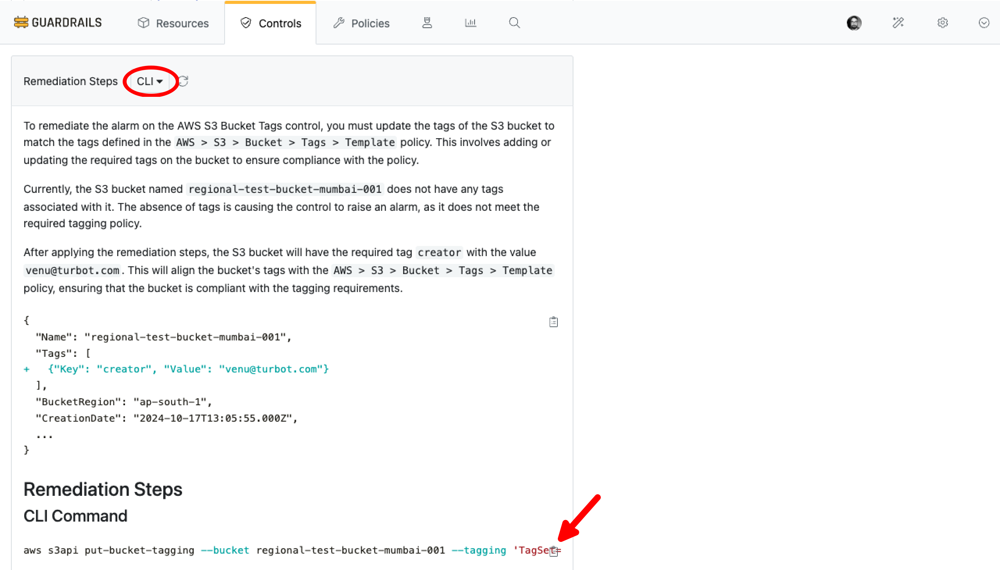

# Enable Intelligent Fixes

In this guide, you will learn how to:

- Get AI-generated remediation steps for non-compliant resources.
- Review and implement recommended fixes for security and compliance issues.
- Understand the context and impact of suggested remediation actions.

When a resource is found to be non-compliant, Intelligent Fixes analyzes:

- The current resource configuration.
- The AI then generates detailed, contextual remediation steps that:
  - Explain what needs to be changed.
  - Provide specific commands or actions to implement the fix in the form of scripts for remediation in CLI or Terraform.
  - Highlight potential risks or considerations.

## Prerequisites

- *Turbot/Admin* permissions at the Turbot resource level.
- Familiarity with the [Guardrails console](https://turbot.com/guardrails/docs/getting-started/).
- Ensure that [Turbot > AI > Configuration](/guardrails/docs/guides/using-guardrails/ai/ai-configuration) is set up.

## Step 1: Enable Intelligent Fixes

In the **Policies** tab, navigate to `Turbot > AI > Control > Intelligent Fixes` and select the **Enabled** option. Create a new setting by selecting **New Policy Setting**.

> [!NOTE]
> - The default value is `Disabled`. You can enable it based on your requirements.
> - If enabled at the Turbot level in [Turbot AI Configuration > Step 7](/guardrails/docs/guides/using-guardrails/ai/ai-configuration#step-7-enable-configuration), the Intelligent Assessment control becomes available for use.

For this guide, the `Turbot > AI > Control > Intelligent Fixes > Enabled` policy is set to `Enabled`.

## Step 2: Check Remediation

Navigate to any control in the `ALARM` state. The remediation steps will automatically begin to load, and you will see an initial message: "Generating remediation steps…".

For example, let's consider `AWS > S3 > Bucket > Tags`.

The AI will analyze the non-compliant resource and generate remediation steps in multiple options such as CLI, Terraform, and CloudFormation.

**Remediation in Terraform**

**Remediation in CLI**

You can select the *CLI* option from the **Remediation Steps** dropdown to view the required CLI commands.

> [!NOTE]
> The output is generated by the AI provider and may vary based on the model's capabilities and input details.

## Step 3: Check Quick Action

`Quick Actions` provide an option to perform one-time control enforcements directly within your cloud environment. When enabled for any control, these actions appear in the remediation panel alongside the detailed remediation steps.

Check [Quick Actions](/guardrails/docs/guides/using-guardrails/quick-actions#enabling-quick-actions) for more details on enabling it.

> [!NOTE]
> [Quick Actions](/guardrails/docs/guides/using-guardrails/quick-actions#enabling-quick-actions) are available for select controls and provide a fast, automated way to remediate common issues. Always review each action before applying it to ensure it aligns with your compliance requirements.

## Next Steps

To explore more Guardrails features:

- [Intelligent Assessment Control](/guardrails/docs/guides/using-guardrails/ai/enable-intelligent-assessment)
- [Policy Pack Summary](/guardrails/docs/guides/using-guardrails/ai/enable-policy-pack-summary)
- [Configure Guardrails MCP Server](/guardrails/docs/guides/using-guardrails/ai/install-mcp)

## Troubleshooting

| Issue                  | Description                                                                                                                   | Guide                                      |
|------------------------|-------------------------------------------------------------------------------------------------------------------------------|--------------------------------------------|
| Further Assistance     | If issues persist, please open a support ticket and attach relevant information to help us assist you more efficiently.       | [Open Support Ticket](https://support.turbot.com) |