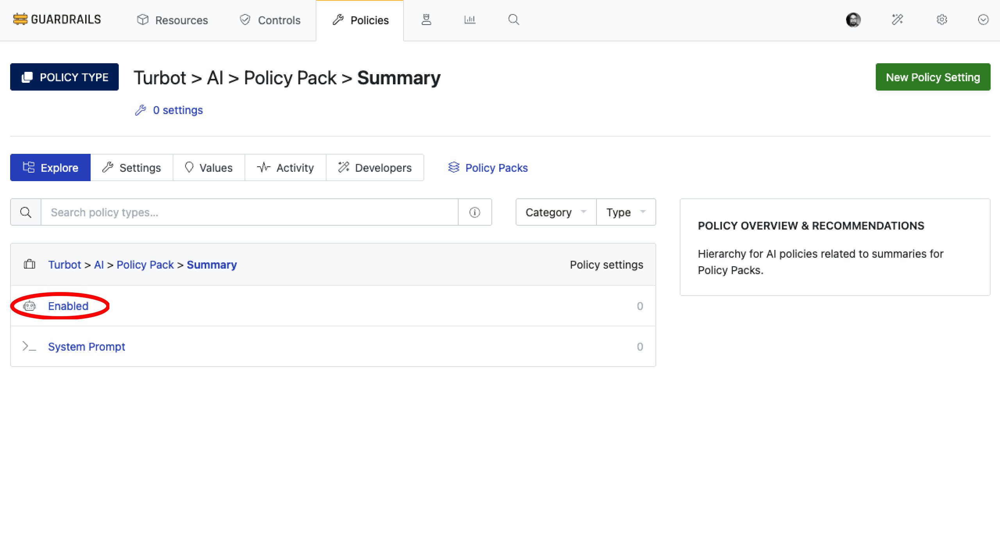
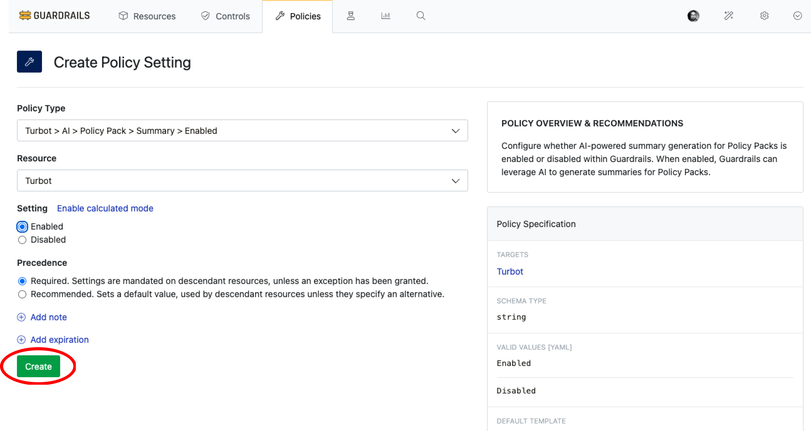
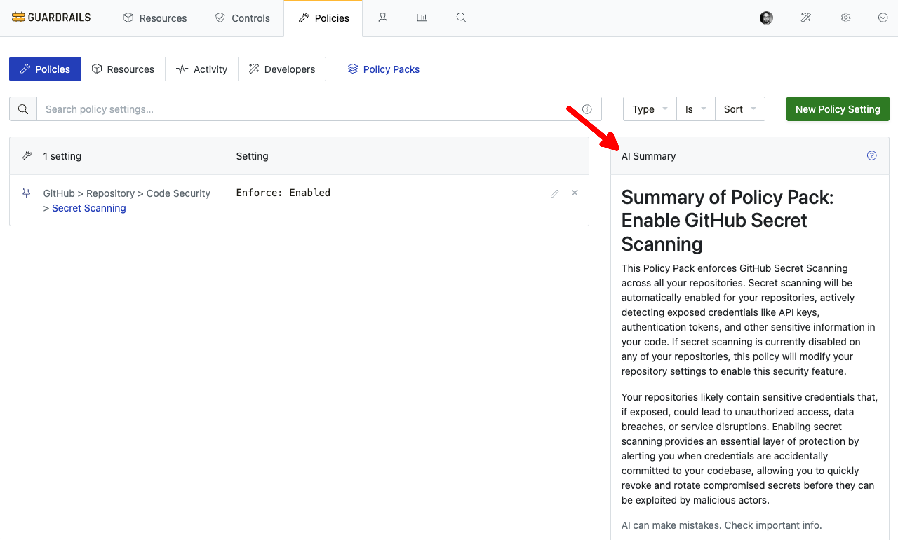

# Enable Policy Pack Summary

In this guide, you will learn how to:

- Enable and configure the Policy Pack Summary feature.
- View AI-generated summaries of policy pack configurations and purposes.

The AI-powered `Policy Pack Summary` feature provides contextual insights by analyzing policy pack configurations to generate meaningful summaries. These summaries help teams understand the intent and impact of policies, including key policy settings, dependencies, and their business context.

> [!TIP]
> Use the policy pack summary to:
> - Validate policy pack configurations.
> - Document your governance approach.
> - Understand how to use these summaries for better policy management and team collaboration.

## Prerequisites

- *Turbot/Admin* permissions at the Turbot resource level.
- Familiarity with the [Guardrails console](https://turbot.com/guardrails/docs/getting-started/).
- Ensure that [Turbot > AI > Configuration](/guardrails/docs/guides/using-guardrails/ai/ai-configuration) is set up.

## Step 1: Enable Policy Pack Summary

In the **Policies** tab, navigate to `Turbot > AI > Policy Pack` and select **Summary**.

Select **Enabled** and create a new setting by selecting **New Policy Setting**.

> [!NOTE]
> - The default value is `Disabled`. You can enable it based on your requirements.
> - If enabled at the Turbot level in [Turbot AI Configuration > Step 7](/guardrails/docs/guides/using-guardrails/ai/ai-configuration#step-7-enable-configuration), the Intelligent Assessment control becomes available for use.

For this guide, the `Turbot > AI > Policy Pack > Summary > Enabled` policy is set to `Enabled`.

## Step 2: Check Policy Pack Summary

To check the policy pack summary, navigate to the **Policy Packs** section of the **Policies** tab. Select any policy pack to view its summary.

> [!NOTE]
> The output is generated by the AI provider and may vary based on the model's capabilities and input details.

## Next Steps

To explore more Guardrails features:

- [Intelligent Assessment Control](/guardrails/docs/guides/using-guardrails/ai/enable-intelligent-assessment)
- [Intelligent Fixes](/guardrails/docs/guides/using-guardrails/ai/enable-intelligent-fixes)
- [Configure Guardrails MCP Server](/guardrails/docs/guides/using-guardrails/ai/install-mcp)
- [Developing guardrails for Guardrails](/guardrails/docs/developers/)

## Troubleshooting

| Issue                  | Description                                                                                                                   | Guide                                      |
|------------------------|-------------------------------------------------------------------------------------------------------------------------------|--------------------------------------------|
| Further Assistance     | If issues persist, please open a support ticket and attach relevant information to help us assist you more efficiently.       | [Open Support Ticket](https://support.turbot.com) |