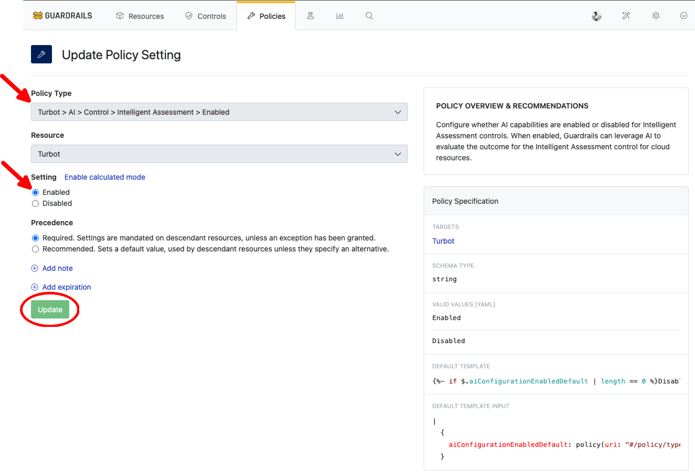
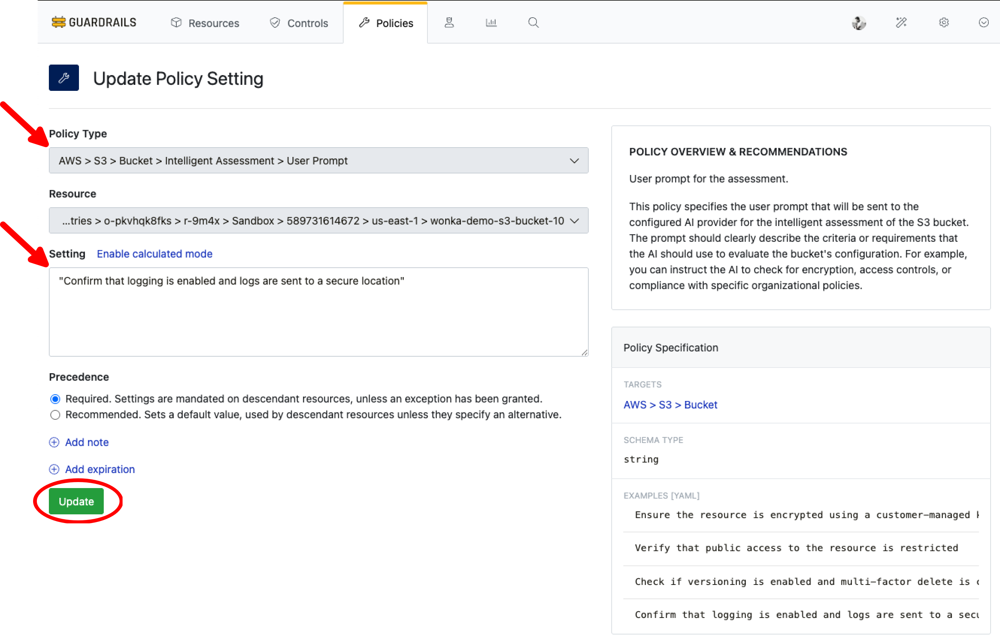
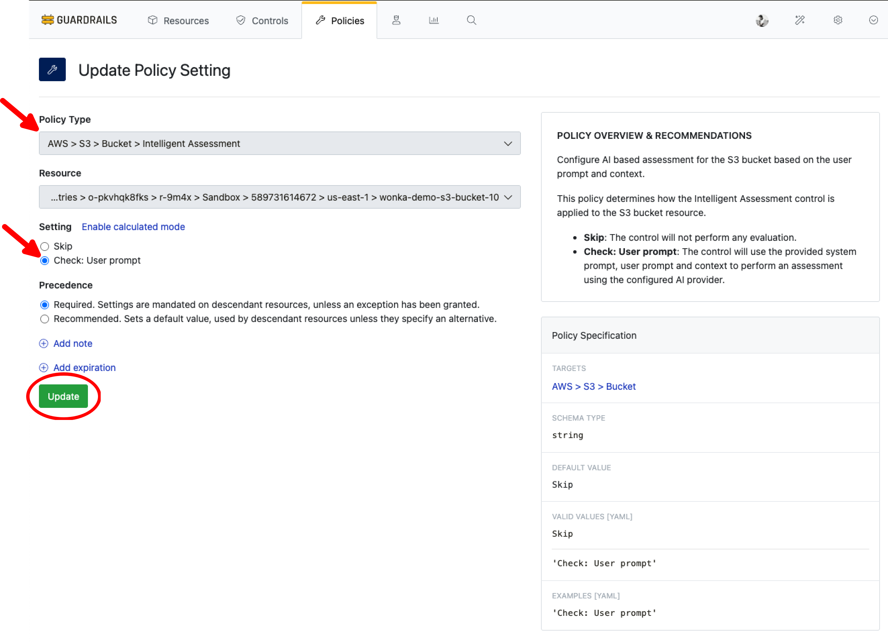

# Intelligent Assessment

In this guide, you will learn how to:

- Set up custom user prompts and context for resource evaluation
- Implement intelligent assessment for S3 bucket controls as an example

With the new Intelligent Assessment guardrail [control](/guardrails/docs/reference/glossary#control), Turbot Guardrails now provides an AI-powered approach to defining guardrails using natural language prompts. This allows you to define governance policies by simply describing what you want to check, opening up new possibilities for governance scenarios that benefit from freeform, custom logic.

## Prerequisites

- *Turbot/Admin* permissions at the Turbot resource level.
- Familiarity with the [Guardrails console](https://turbot.com/guardrails/docs/getting-started/).
- Ensure the [Turbot > AI > Configuration](/guardrails/docs/guides/using-guardrails/ai/ai-configuration) is established.

## Step 1: Enable Intelligent Assessment Control

Log in to the Guardrails console using your local credentials or via a SAML-based login.

Enable the following policy at the Turbot level: **Turbot > AI > Control > Intelligent Assessment > Enabled**. This enables AI capabilities for Intelligent Assessment controls.

> [!NOTE]
> - The default value is `Disabled`. You can enable it based on your requirements.
> - In case enabled at the Turbot level in [Turbot AI Configuration > Step 7](/guardrails/docs/guides/using-guardrails/ai/ai-configuration#step-7-enable-configuration), Intelligent Assessment control becomes available for use.

For this guide, the `Turbot > AI > Control > Intelligent Assessment > Enabled` policy is set to `Enabled`.

## Step 2: Add a User Prompt

Set your custom prompt under **AWS > S3 > Bucket > Intelligent Assessment > User Prompt**. This defines the prompt that will be sent to the AI provider for assessing the S3 bucket. The prompt should clearly outline what the AI should evaluate.

**Example Prompt:**

- `Confirm that logging is enabled and logs are sent to a secure location.`
- `Check if versioning is enabled and multi-factor delete is configured when the bucket has a tag "Environment":"Non-Compliant Tag". If it doesn't have the tag, only check if versioning is enabled.`

## Step 3: Set Primary Policy to Check Mode

Navigate to the AWS S3 Intelligent Assessment control in your Guardrails workspace. This control allows you to configure AI-powered assessment for S3 buckets.

To access the control:

1. Navigate to `AWS > S3 > Bucket > Intelligent Assessment` from **Controls** tab
2. Select any bucket you would like to evaluate

> [!NOTE]
> This example is demonstrated for a single S3 bucket. The policy can be set in higher level such as account or respective folders levels. Refer [Policy Hierarchy](/guardrails/docs/concepts/policies/hierarchy#policy-hierarchy).

In the **Policies** tab, select `Check: User prompt`. This policy activates intelligent assessments for the S3 bucket based on your user prompt and context.

## Step 4: Check Control Status

The control will assess the S3 bucket using configured user prompt and evaluate the control.

> [!NOTE]
> The output is generated by the AI provider and may vary based on the model's capabilities and input details.

## Next Steps

To explore more Guardrails features:

- [Intelligent Fixes](/guardrails/docs/guides/using-guardrails/ai/intelligent-fixes) - Learn how to get AI-assisted remediation recommendations
- [Policy Pack Summary](/guardrails/docs/guides/using-guardrails/ai/policy-pack-summary) - Explore AI-generated summaries of policy packs
- [Learn How to Configure Guardrails MCP Server](/guardrails/docs/guides/using-guardrails/ai/install-mcp)

## Troubleshooting

| Issue                  | Description                                                                                                                   | Guide                                      |
|------------------------|-------------------------------------------------------------------------------------------------------------------------------|--------------------------------------------|
| Further Assistance     | If issues persist, please open a support ticket and attach relevant information to help us assist you more efficiently.       | [Open Support Ticket](https://support.turbot.com) |