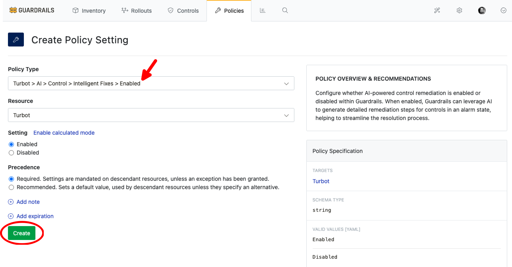
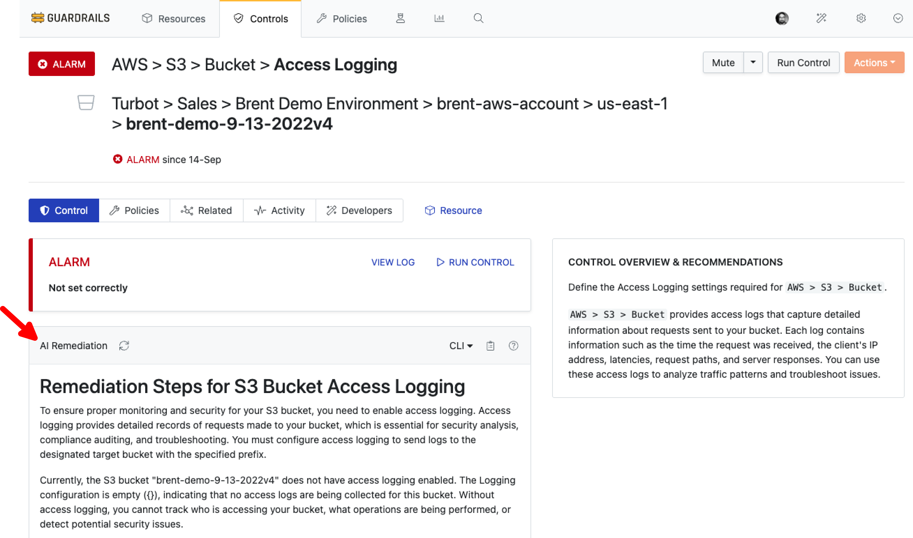

# Intelligent Fixes

In this guide, you will learn how to:

- Get AI-generated remediation steps for non-compliant resources
- Review and implement recommended fixes for security and compliance issues
- Understand the context and impact of suggested remediation actions

The Intelligent Fixes feature provides AI-powered remediation recommendations for non-compliant cloud resources.

When a resource is found to be non-compliant, Intelligent Fixes analyzes:

- The current resource configuration
- The AI then generates detailed, contextual remediation steps that:
  - Explain what needs to be changed
  - Provide specific commands or actions to implement the fix in form of scripts for remediation in CLI, Terraforma and CloudFormation
  - Highlight potential risks or considerations

## Prerequisites

- *Turbot/Admin* permissions at the Turbot resource level.
- Familiarity with the [Guardrails console](https://turbot.com/guardrails/docs/getting-started/).
- Ensure the [Turbot > AI > Configuration](/guardrails/docs/guides/using-guardrails/ai/ai-configuration) is established.

## Step 1: Configure AI Setup

Before using Intelligent Assessment control, ensure you have configured the required AI settings.

For detailed setup instructions, see the [AI Configuration Guide](/guardrails/docs/guides/using-guardrails/ai/ai-configuration).

## Step 2: Enable Intelligent Fixes

In **Policies** tab, navigate to `Turbot > AI > Control > Intelligent Fixes` and select **Enabled** option. Create new setting by selecting **New Policy Setting**

> [!NOTE]
> In case this is already `Enabled` at `Turbot > AI > Configuration > Enabled [Default]` then there is no need to enable it.

## Step 3: Check Intelligent Fixes in a Control

Navigate to any control in `ALARM` state and select **Generate**.

> [!NOTE]
> The output is generated by the AI provider and may vary based on the model's capabilities and input details.

## Next Steps

To explore more Guardrails features:

- [Learn How to Configure Guardrails MCP Server](/guardrails/docs/guides/using-guardrails/ai-tools)
- [Learn about Intelligent Assessment Control](/guardrails/docs/guides/using-guardrails/intelligent-assessment-control)
- [Learn about Policy Exceptions](/guides/configuring-guardrails/managing-policies#creating-an-exception)

## Troubleshooting

| Issue                  | Description                                                                                                                   | Guide                                      |
|------------------------|-------------------------------------------------------------------------------------------------------------------------------|--------------------------------------------|
| Further Assistance     | If issues persist, please open a support ticket and attach relevant information to help us assist you more efficiently.       | [Open Support Ticket](https://support.turbot.com) |