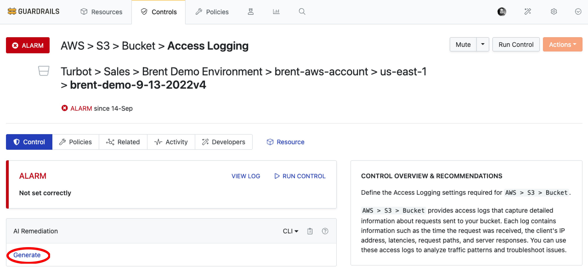

# Intelligent Fixes

In this guide, you will learn how to:

- Get AI-generated remediation steps for non-compliant resources
- Review and implement recommended fixes for security and compliance issues
- Understand the context and impact of suggested remediation actions

When a resource is found to be non-compliant, Intelligent Fixes analyzes:

- The current resource configuration
- The AI then generates detailed, contextual remediation steps that:
  - Explain what needs to be changed
  - Provide specific commands or actions to implement the fix in form of scripts for remediation in CLI, Terraform
  - Highlight potential risks or considerations

## Prerequisites

- *Turbot/Admin* permissions at the Turbot resource level.
- Familiarity with the [Guardrails console](https://turbot.com/guardrails/docs/getting-started/).
- Ensure the [Turbot > AI > Configuration](/guardrails/docs/guides/using-guardrails/ai/ai-configuration) is established.

## Step 1: Enable Intelligent Fixes

In **Policies** tab, navigate to `Turbot > AI > Control > Intelligent Fixes` and select **Enabled** option. Create new setting by selecting **New Policy Setting**

> [!NOTE]
> - The default value is `Disabled`. You can enable it based on your requirements.
> - In case enabled at the Turbot level in [Turbot AI Configuration > Step 7](/guardrails/docs/guides/using-guardrails/ai/ai-configuration#step-7-enable-configuration), Intelligent Assessment control becomes available for use.

For this guide, the `Turbot > AI > Control > Intelligent Fixes > Enabled` policy is set to `Enabled`.

## Step 2: Check Intelligent Fixes

Navigate to any control in `ALARM` state and select **Generate**.

The AI will analyze the non-compliant resource and generate remediation steps in multiple formats:

> [!NOTE]
> The output is generated by the AI provider and may vary based on the model's capabilities and input details.

## Next Steps

To explore more Guardrails features:

- [Learn about Intelligent Assessment Control](/guardrails/docs/guides/using-guardrails/ai/intelligent-assessment)
- [Learn about Policy Pack Summary](/guardrails/docs/guides/using-guardrails/ai/policy-pack-summary)
- [Learn How to Configure Guardrails MCP Server](/guardrails/docs/guides/using-guardrails/ai/install-mcp)

## Troubleshooting

| Issue                  | Description                                                                                                                   | Guide                                      |
|------------------------|-------------------------------------------------------------------------------------------------------------------------------|--------------------------------------------|
| Further Assistance     | If issues persist, please open a support ticket and attach relevant information to help us assist you more efficiently.       | [Open Support Ticket](https://support.turbot.com) |