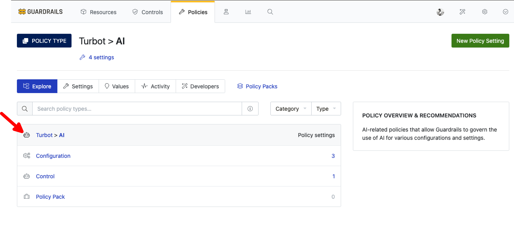
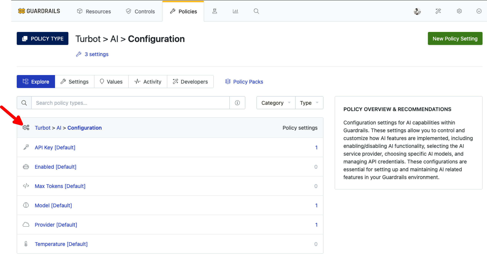
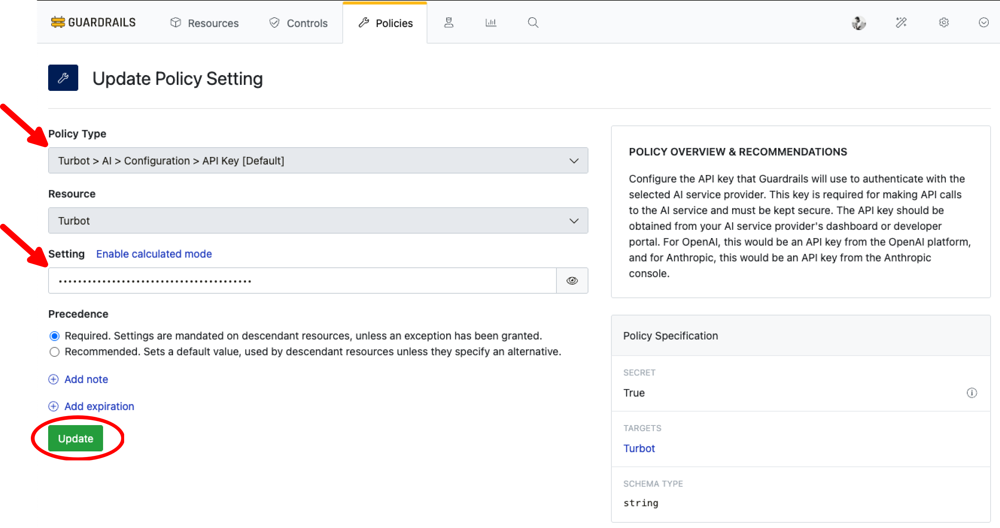
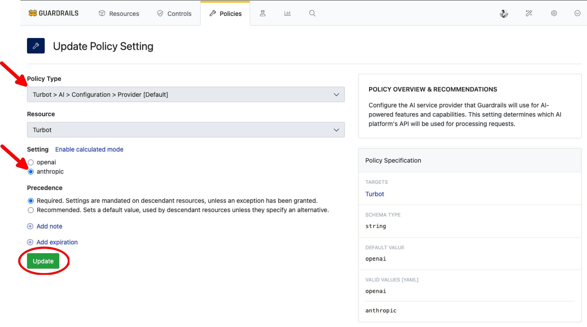
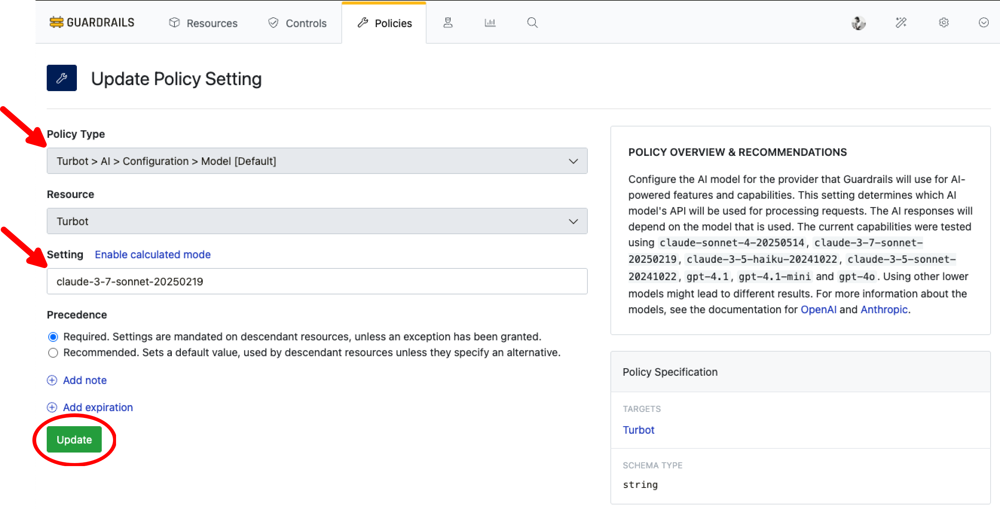

# Intelligent Fixes

In this guide, you will learn how to:
- Configure AI providers and API keys for intelligent assessment
- Set up custom prompts and context for resource evaluation
- Enable AI-powered analysis for your cloud resources
- Implement intelligent assessment for S3 bucket controls as an example
- Apply these concepts to other services supported by Guardrails

The Intelligent Assessment control feature provides AI-powered assessment capabilities for cloud resources. In this guide, we'll focus on using Intelligent Assessment control.

[Control](/guardrails/docs/reference/glossary#control) is an automated governance mechanism that continuously monitors cloud resources and enforces compliance policies to ensure they meet organizational security, operational, and regulatory requirements. The Intelligent Assessment feature enhances these Controls by:

- Leveraging AI to perform contextual analysis of resource configurations
- Adapting assessments based on your custom prompts and requirements

<!--For example, this guide demonstrate intelligent assessment is applied to a S3 bucket control.
 - Analyze bucket permissions and access policies
- Evaluate encryption settings
- Assess logging configurations
- Identify potential security vulnerabilities
- Recommend improvements -->

## Prerequisites

- *Turbot/Admin* permissions at the Turbot resource level.
- Familiarity with the [Guardrails console](https://turbot.com/guardrails/docs/getting-started/).
- Access credentials for the AI model.

## Step 1: Log in to the Guardrails Console

Log in to the Guardrails console using your local credentials or via a SAML-based login.

## Step 2: Navigate to the Turbot > AI Policy

From the Policies section, navigate to **Turbot > AI** in the Guardrails console.

This section provides AI-related policies that allow Guardrails to govern the use of AI for various configurations and settings.

## Step 3: Configure the AI Provider

Go to **Turbot > AI > Configuration** and update the following policies:

### Turbot > AI > Configuration > API Key [Default]

Enter the API key Guardrails will use to authenticate with your AI service provider.

> [!IMPORTANT]
> - The API key is a sensitive credential used for authentication with your chosen AI service provider. Ensure it is stored and handled securely.
> - For OpenAI:
>   - Obtain the API key from the [OpenAI platform](https://platform.openai.com/api-keys)
>   - The key should start with "sk-"
> - For Anthropic:
>   - Get the API key from the [Anthropic console](https://console.anthropic.com/settings/keys)
>   - The key should start with "sk-ant-"
> - Store the API key securely and rotate it periodically according to your organization's security policies
> - Never share or expose the API key in logs, code repositories, or public forums

### Turbot > AI > Configuration > Provider [Default]

Select the AI provider for Guardrails' AI-powered features and capabilities.

### Turbot > AI > Configuration > Model [Default]

Choose which model to use with the selected AI provider for processing requests.

> [!NOTE]
> Supported and tested models include:
> - [OpenAI models](https://platform.openai.com/docs/pricing#latest-models): `gpt-4.1`, `gpt-4.1-mini`, `gpt-4`
> - [Anthropic models](https://docs.anthropic.com/en/docs/about-claude/models/overview#model-names): `claude-3-sonnet-20240229`, `claude-3-haiku-20240307`, `claude-3-opus-20240229`
>
> For optimal results:
> - Use the latest model versions when possible
> - Higher-tier models (like GPT-4 series and Claude-3 series) provide more accurate and detailed assessments
> - Lower-tier models may produce less consistent or detailed results
> - Model availability may vary based on your AI provider subscription

## Step 4: Enable Intelligent Fixes

In **Policies** tab, navigate to `Turbot > AI > Control > Intelligent Fixes` and select **Enabled** option. Create new setting by selecting **New Policy Setting**

> [!NOTE]
> In case this is already `Enabled` at `Turbot > AI > Configuration > Enabled [Default]` then there is no need to enable it.

## Step 5: Check Intelligent Fixes in a Control

Navigate to any control in `Alarm` state and select **Generate**.

> [!NOTE]
> The output is generated by the AI provider and may vary based on the model's capabilities and input details.

## Next Steps

To explore more Guardrails features:

- [Learn How to Configure Guardrails MCP Server](/guardrails/docs/guides/using-guardrails/ai-tools)
- [Learn about Intelligent Assessment Control](/guardrails/docs/guides/using-guardrails/intelligent-assessment-control)
- [Learn about Policy Exceptions](/guides/configuring-guardrails/managing-policies#creating-an-exception)

## Troubleshooting

| Issue                  | Description                                                                                                                   | Guide                                      |
|------------------------|-------------------------------------------------------------------------------------------------------------------------------|--------------------------------------------|
| Further Assistance     | If issues persist, please open a support ticket and attach relevant information to help us assist you more efficiently.       | [Open Support Ticket](https://support.turbot.com) |