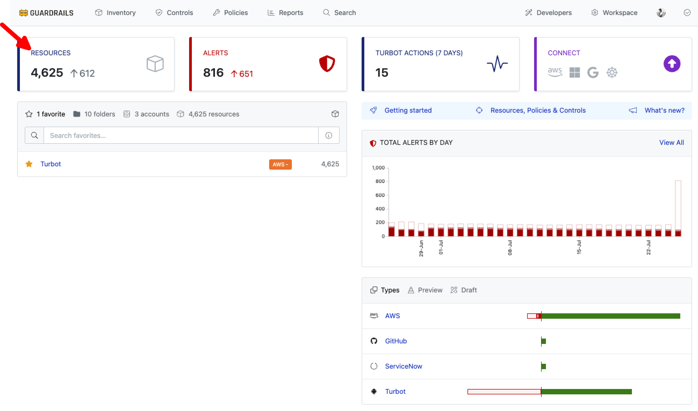
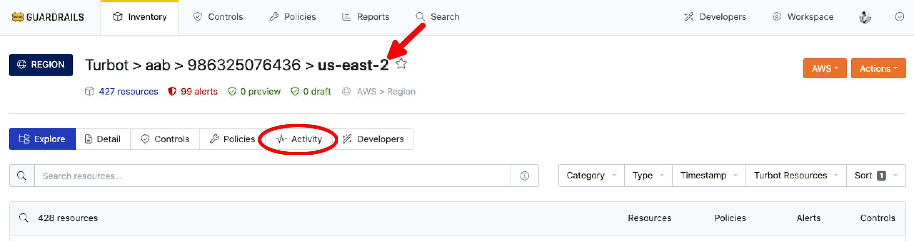
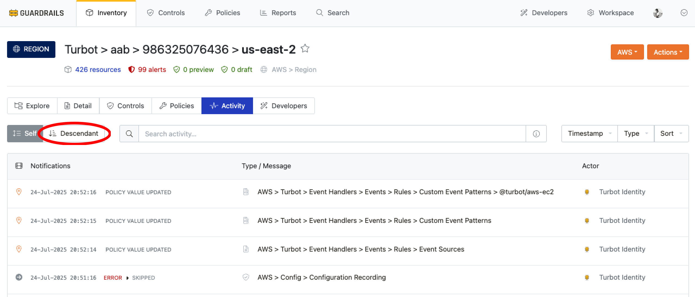
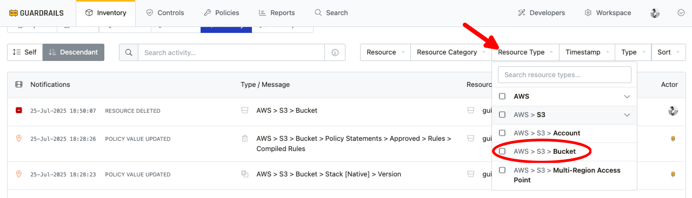
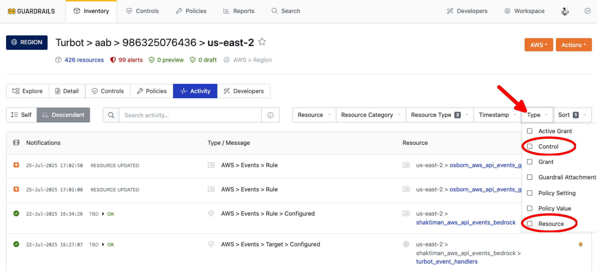
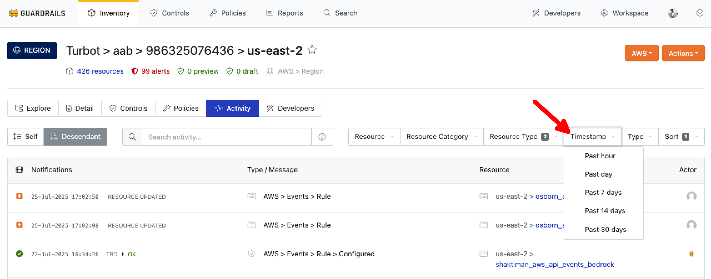
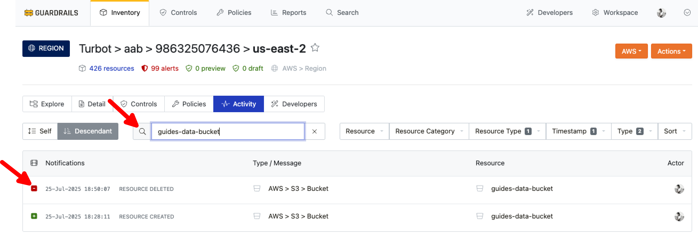
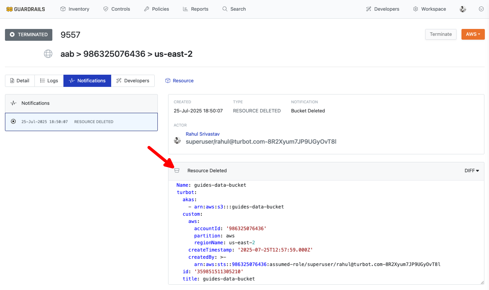

# Find Deleted Resources History

In this guide, you will learn how to:
- Use the Guardrails UI to access historical data for resources that have been deleted from Guardrails.

When a resource is deleted from Guardrails, the [resource](/guardrails/docs/reference/glossary#resource) itself is no longer visible in the console. However, its historical activity remains accessible via the **Activity** tab. This information is particularly useful for troubleshooting, auditing, and debugging.

## Prerequisites

- **Turbot/Operator** permissions at the Turbot resource level.
- Familiarity with the Guardrails console.

## Step 1: Navigate to the Resources Tab

Log in to the Guardrails console using valid credentials and select the **Resources** tab from the top menu.

## Step 2: Navigate to the Region

Drill down into the region where the deleted resource previously existed. For example, navigate to `us-east-2` if the resource was located there. Select the **Activity** tab to view historical events.

## Step 3: Configure Activity Filters

Use the following filters to narrow your search and include relevant activity history:

**Descendant**: Enable the `Descendant` checkbox on the left. This allows the search to include all child resources under the selected parent.

  

**Resource Type**: From the right-hand filter pane, open the `Resource Type` dropdown and select the appropriate resource type.
  > For demonstration purposes, this guide uses `AWS > S3 > Bucket` as an example. You should select the resource type relevant to your use case.

  

**Type**: Select both **Control** and **Resource** under the `Type` dropdown to view lifecycle changes and control evaluations.

  

**Timestamp**: Use the `Timestamp` dropdown to define a date range if you know roughly when the deletion occurred.

  

## Step 4: Search Deleted Resource

Enter the resource name (or a keyword) into the **Search Box** to locate any matching historical entries. The results may include the full activity history of the deleted resource, including creation events, configuration and policy changes, control evaluations, and the deletion event itself.

 Select the entry to view detailed information.

## Step 5: Review Deleted Resource Data

The resource data is displayed under the Deleted Resource section, which can be used to understand the context and impact of the removal or to capture any required information for auditing or troubleshooting.

If you encounter any further issues, please [Open Support Ticket](https://support.turbot.com) and attach the relevant information to assist you more efficiently.

- The full resource name or ARN (if known).
- The region and approximate deletion time.
- A brief description of what you're trying to find and any filters you applied.
