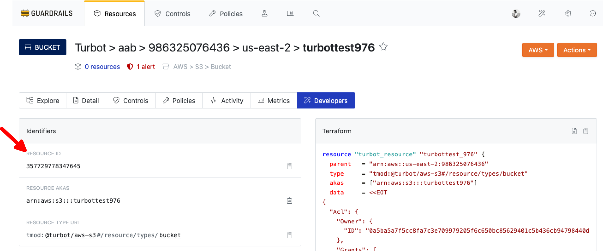

# Retrieve a Resource ID from Guardrails Console

In this guide, you will:
- Learn a step-by-step approach to locating the Resource ID of any managed resource within the Guardrails Console

In Guardrails, [resources](/guardrails/docs/reference/glossary#resource) represent real-world cloud entities like AWS S3 buckets, GCP compute instances, or Azure SQL databases. These resources are discovered, tracked, and governed by Guardrails, with their metadata and lifecycle events stored in the Guardrails [CMDB](/guardrails/docs/reference/glossary#cmdb).

Whether troubleshooting a policy issue, crafting GraphQL queries, or automating remediation workflows, the ResourceID serves as a vital identifier. It functions as a unique handle to query, inspect, and perform actions on specific resources through the [Guardrails Console](/guardrails/docs/reference/glossary#guardrails-console), [GraphQL](/guardrails/docs/reference/graphql#graphql), or [CLI](/guardrails/docs/reference/cli).

## Prerequisites

- **Turbot/Operator** permissions at the Turbot resource level.
- Familiarity with the Guardrails console.

## Step 1: Locate Resources Tab

Log in to the Guardrails console using valid credentials and from the top navigation menu, select **Resources** to access the list of cloud resources managed by Guardrails.

## Step 2: Search for Resource

Use the **search bar** to locate the specific resource by name, type, or cloud provider.

>[!TIP] Filters can be applied to narrow down results by account, region, folder, or resource type.

## Step 3: Open Resource Details Page

Select the resource from the search results to open its resource details page.

## Step 4: Locate Resource ID

From the resource details page, open the **Developers** tab to view the `Identifiers` section. The **Resource ID**, a unique numeric identifier within Guardrails, is displayed here along with a copy icon to easily copy it to the clipboard.

This ID ensures precise targeting of the resource across all Guardrails tooling. The Resource ID can now be used in:
- GraphQL queries
- CLI commands
- Logs or event history lookups
- Troubleshooting invalid controls or policies

If you encounter any issues, please [Open a Support Ticket](https://support.turbot.com) and attach the relevant information to assist you more efficiently.

- A screenshot of the Resource Details page showing the Resource ID and current state.
- A screenshot of any associated Control or Policy pages that appear in an error or invalid state.
