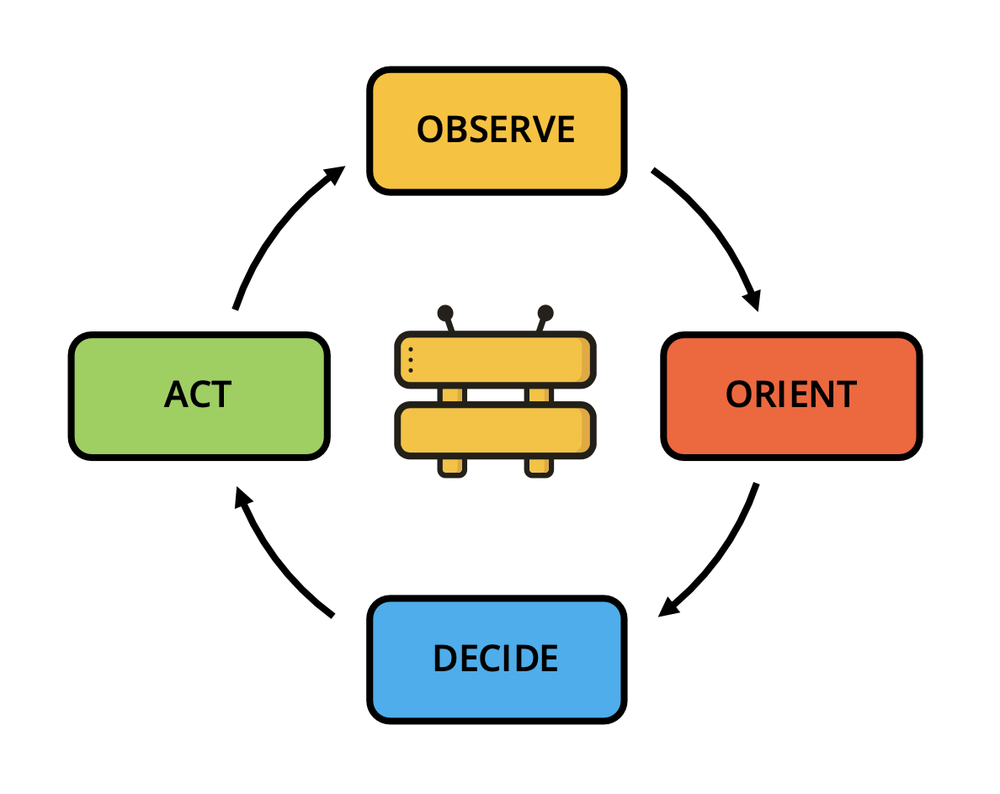
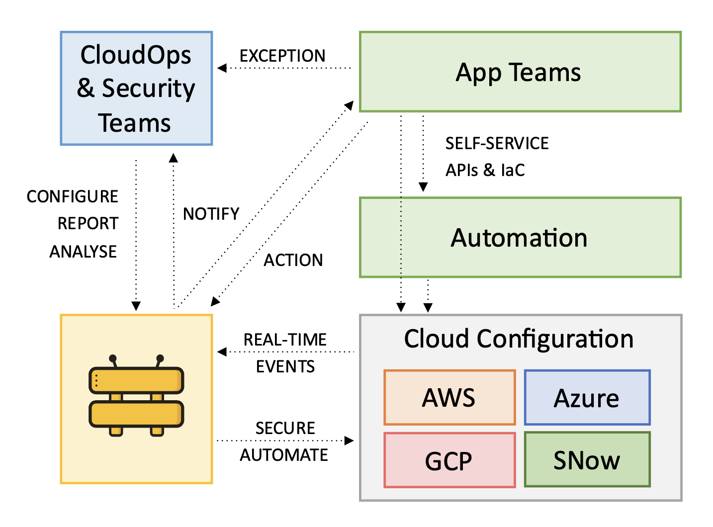
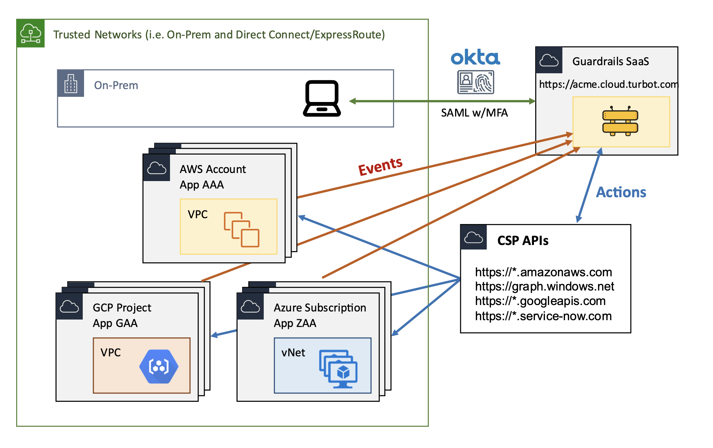
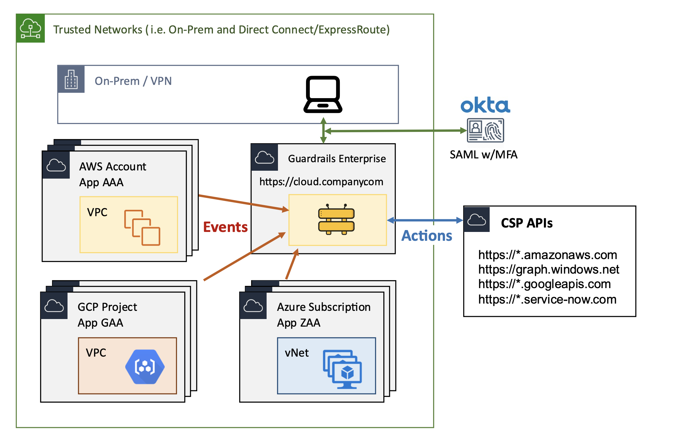
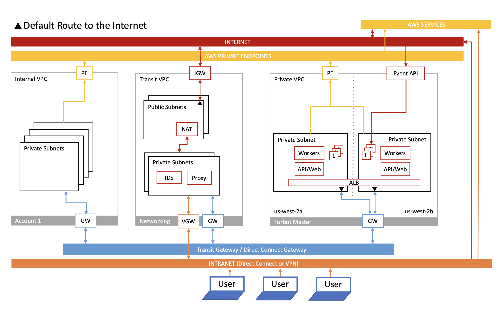
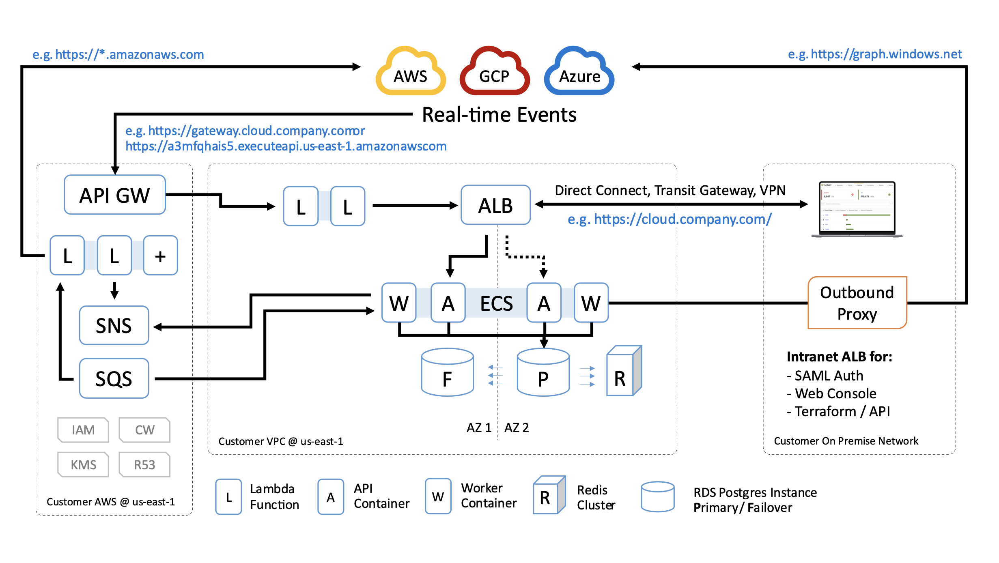
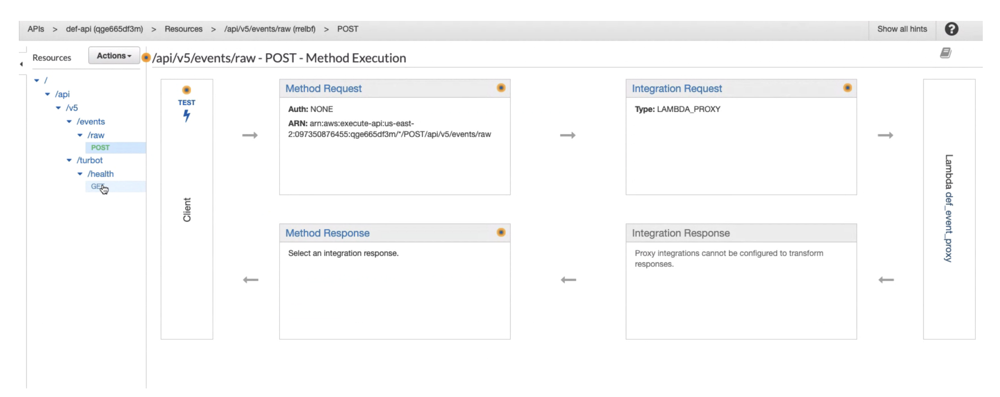
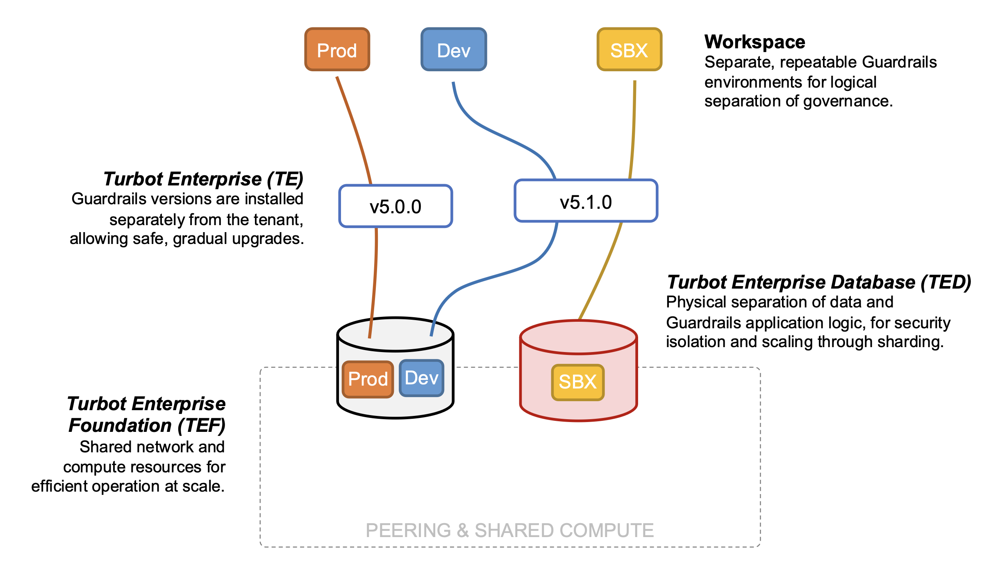

# Turbot Guardrails Hosting Architecture

## Conceptual Architecture

Turbot Guardrails is a comprehensive governance platform that automates the discovery and remediation of compliance, security, and operational objectives within your organization. The platform leverages a consistent policy language to discover resources, track changes, and automate remediation across various cloud provider platforms.

Its architecture is centered around a core event loop called the **OODA loop**:

* **Observe:** Monitor changes across your organization's cloud service providers.
* **Orient:** Record all governed resources in the Guardrails CMDB, enriching them with metadata for context.
* **Decide:** Evaluate resource configurations against organizational rules, incorporating exceptions as needed.
* **Act:**  Trigger notifications to stakeholders and/or rectify any unapproved configurations.

Guardrails continuously monitors real-time change events occurring at the cloud service providers without hindering the agility of application teams. This real-time monitoring enables Guardrails to identify configuration errors stemming from both human actions and automated processes, including intentional misconfigurations by individuals with elevated privileges.

## Deployment Options

Organizations have two primary options for deploying Turbot Guardrails:

1. **Turbot Guardrails SaaS:** This option leverages the software-as-a-service offering of Turbot Guardrails.

2. **Turbot Guardrails Enterprise:** This option allows organizations to deploy Turbot Guardrails within their own AWS account and VPC.

## Guardrails Hosted Deployment Architecture

The Enterprise edition of Turbot Guardrails empowers organizations to deploy the same comprehensive application used for Guardrails SaaS within their AWS environment. This fully automated deployment adheres to AWS serverless best practices, resulting in a robust platform that scales effectively from a few accounts to millions of resources across a multitude of cloud service accounts.

Key aspects of the deployment architecture include:

1. **Deployment:** The application is entirely deployed as infrastructure as code, leveraging AWS's Service Catalog service.
2. **Encryption:** During deployment, KMS CMKs are generated within the customer's AWS account. These keys are used for data persistence and the configuration of encryption in transit across various services.
3. **Data Persistence:** The platform utilizes AWS RDS Postgres instances for relational data, a Redis Cache Cluster for caching, and S3 for large blob storage.
4. **Compute:**  AWS Lambda functions provide the primary compute capabilities. An ECS cluster supplements this by offering persistent compute (e.g., Web Console and API) and support for long-running processes like Terraform stacks.
5. **Least Privilege:** Access management between platform services, including database access, is strictly governed by AWS IAM roles adhering to the principle of least privilege.

## Network Architecture

Turbot Guardrails Enterprise is engineered for secure deployment across diverse enterprise VPC configurations. This adaptability ranges from a simple public subnet with an internet gateway (IGW) to a multi-AZ, three-tier VPC (database, application, web) operating in private network space and utilizing centralized outbound network connectivity (through a transit gateway or proxy).

The most common enterprise network topology typically requires the following network configurations:

1. **Inbound Access:** Inbound TCP port 443 access from end-user devices to the Guardrails Application Load Balancer (ALB).
2. **Outbound Access to AWS APIs:** Outbound TCP port 443 access to AWS APIs (`https://*.amazonaws.com`). When an on-premises proxy is employed for outbound internet access, it is highly recommended to enable AWS PrivateLink endpoints for essential services such as KMS, S3, IAM, RDS, CloudWatch Events/Logs, SNS, SQS, ECS, ECR, and EC2.
3. **Outbound Access for Utilities:** Outbound access to NTP, DNS, and SMTP for alerts.
4. **Outbound Access to Cloud Services:** Outbound access to enabled cloud services including AWS, Azure, GCP, and ServiceNow.

## Real-time Event Architecture

In a private VPC deployment, Guardrails utilizes the AWS API Gateway service to receive external events from cloud service providers. The API gateway is configured to accept only properly signed events and does not expose any data externally.

Key characteristics of the API gateway configuration:

* **Single Gateway per Installation:** One gateway is deployed for each Guardrails installation.
* **Limited HTTP Methods:** Only accepts HTTPS GET requests on `{{endpoint-url}}/api/v5/turbot/health` for health check keep-alives and HTTPS POST requests on `{{endpoint-url}}/api/v5/events/raw` for event data.
* **Data Handling:** Returns only success/error codes and does not return any data externally.
* **Security:** POST requests are signed with a JWT access token using a shared secret.

Event processing flow:

1. A Lambda function forwards POST data to the private ALB.
2. Turbot's API handlers validate the message signature and data format.
3. The event data is parsed, and the resulting event object is placed on the SQS queue (via SNS) to be processed by worker Lambda functions.

Security Measures:

* **Signed JWT:** A signed JSON Web Token (JWT) validates that the request originates from a known account.
* **Shared Secret:** During installation, a random string is generated as a seed for the hash. Customers can retain this secret or replace/rotate it through the UI or API.
* **AWS SNS Signature Validation:** Turbot verifies the AWS SNS signature using the method outlined in the AWS documentation: [https://docs.aws.amazon.com/sns/latest/dg/sns-verify-signature-of-message.html](https://docs.aws.amazon.com/sns/latest/dg/sns-verify-signature-of-message.html)

## Application Architecture

The logical components of the architecture are deployed and managed independently to maintain separation of concerns and provide flexibility in deployment scenarios. The application layer comprises four key layers:

**1. Turbot Enterprise Foundation (TEF)**

- An instance of the TEF stack is referred to as a **Collective**. Each Collective defines the networking and compute resources shared by all tenants. This shared infrastructure model ensures secure resource reuse (e.g., VPC, EC2 instances) while maintaining data isolation.
- Multi-region failover should be configured using 1 to 3 geographically and politically similar regions, facilitating free and fast data movement.
- Deployment and management are handled through the Turbot Enterprise Foundation (TEF) product in the AWS Service Catalog. At Turbot, foundation stacks are typically named after prominent bridges or tunnels (representing connections) in the relevant region. For example, `peace` (ca-central-1), `brooklyn` (us-east-1), `tower` (eu-west-2).

**2. Turbot Enterprise Database (TED)**

- An instance of the TED stack is called a **Hive**. Each Hive defines the physical data storage and caching resources utilized in Guardrails Enterprise.
- While a Hive can be shared by multiple workspaces, a single workspace cannot span multiple Hives. Within each Hive (physical database), workspaces are segregated into distinct logical schemas to ensure data isolation and enable data movement between Hives if needed.
- Hives are deployed and managed using the Turbot Enterprise Database (TED) product within the AWS Service Catalog. Turbot typically names Hives after renowned scientists in the area (e.g., newton, edison—inspired by the concept of a “hive mind”).
- The use of multiple Hives allows for physical data separation (e.g., isolating critical tenants) and scalability through physical sharding. However, most Turbot Enterprise customers initially start with a single Hive.

**3. Turbot Enterprise (TE)**

- An instance of the TE stack is called a **Version**. Each Collective hosts zero or more versions of Guardrails. Each version is installed independently and remains immutable. This allows for simultaneous operation of multiple versions, such as 5.1.0, 5.1.1, and 5.2.0. Changes are implemented exclusively through the installation of new versions, and existing versions are never directly updated.
- Each Version can serve zero or more Tenants concurrently.
- Versions define the majority of their infrastructure in a self-contained and reproducible manner. For instance, load balancers, IAM roles, Lambda functions, and container instances are uniquely defined within each version. This approach enhances reproducibility and accuracy while mitigating risks associated with installations and upgrades.
- Versions are deployed and managed via the Turbot Enterprise (TE) product in the AWS Service Catalog. They are immutable; as Turbot releases new Guardrails versions, installation should be performed as a new instance of the product rather than an update to a previous version.

**4. Turbot Guardrails Workspaces**

- Each **Workspace** functions as an independent tenant within Guardrails, possessing its own version and schema (logical shard) within the Hive (TED). Every Workspace has its unique set of mods and a dedicated web console endpoint.
- Multiple workspaces can coexist within the same Collective, potentially sharing the same database. However, they operate independently. Each workspace can be upgraded or downgraded separately, and there is no data sharing between workspaces.
- Deployment and management of Workspaces are handled through Guardrails' Workspace Manager, implemented as a CloudFormation custom resource.
- Organizations can utilize multiple workspaces for various purposes, such as separating a development instance from a production instance for testing new Guardrails versions, modules, and so on.
- Workspace naming typically reflects their lifecycle phase. For instance, within the `brooklyn` namespace (TEF) for vandelay.com, workspaces might be named:  `dev.brooklyn.vandelay.com`, `qa.brooklyn.vandelay.com`, and `prod.brooklyn.vandelay.com`.
