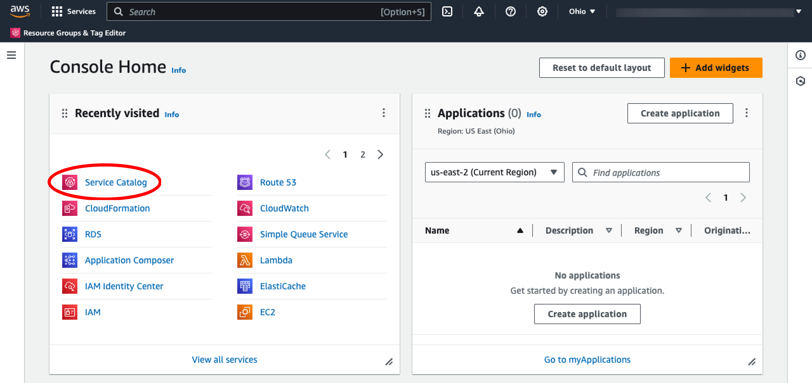
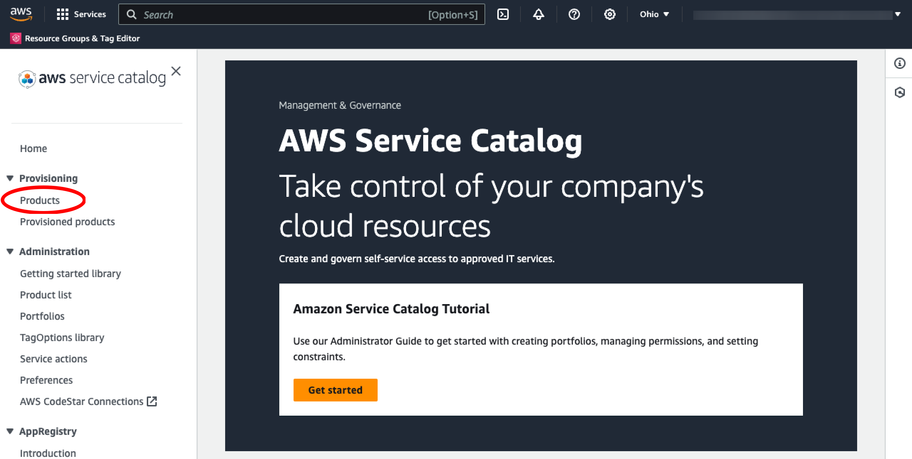
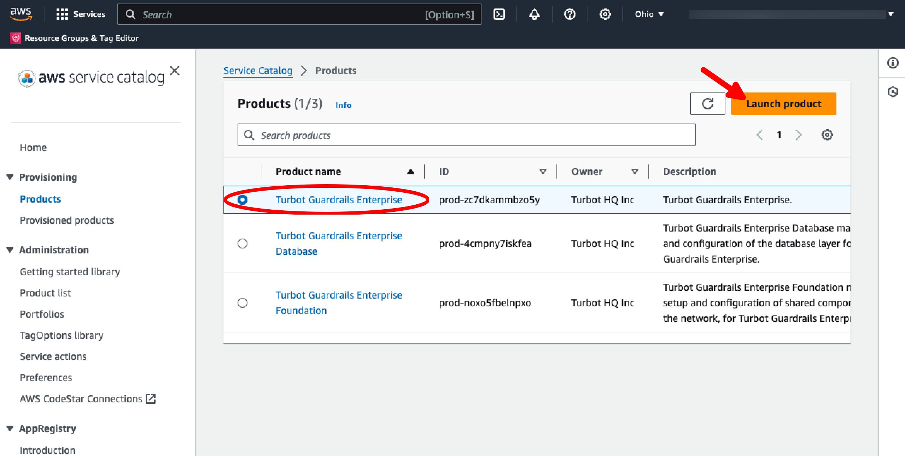
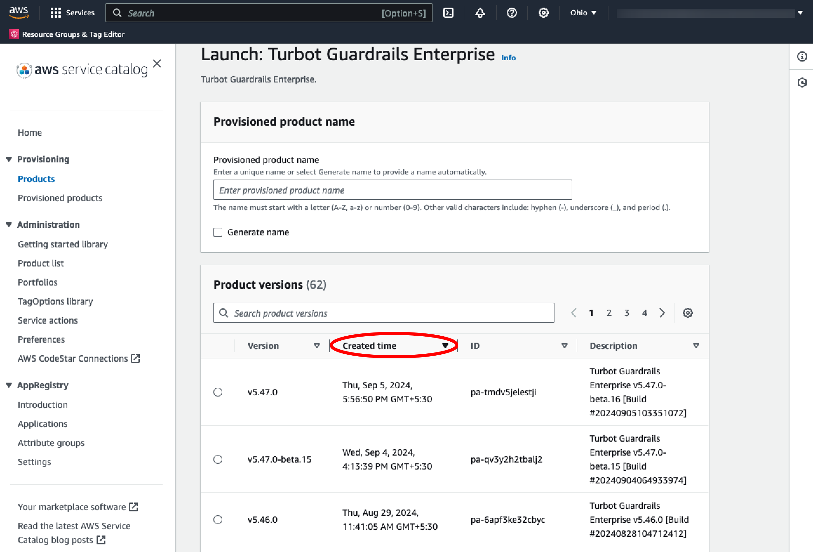
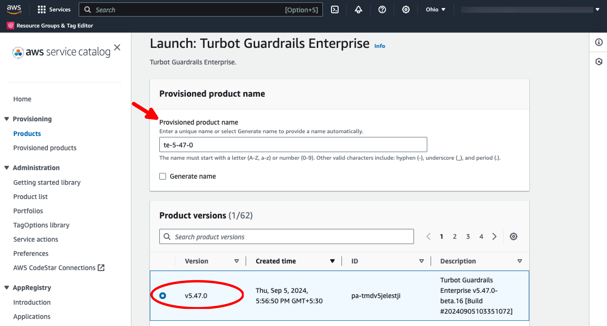
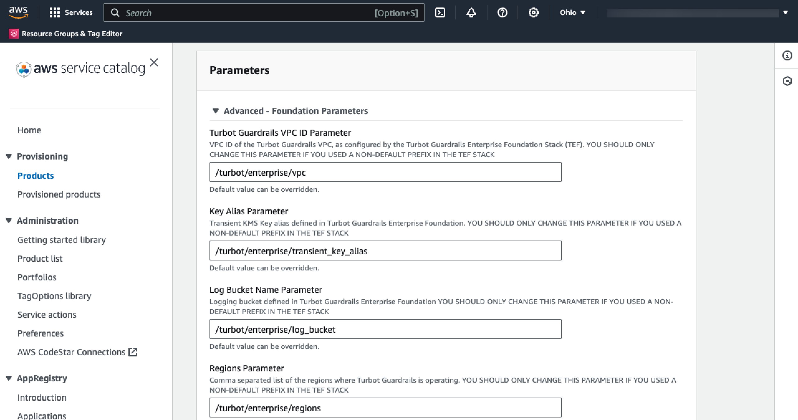
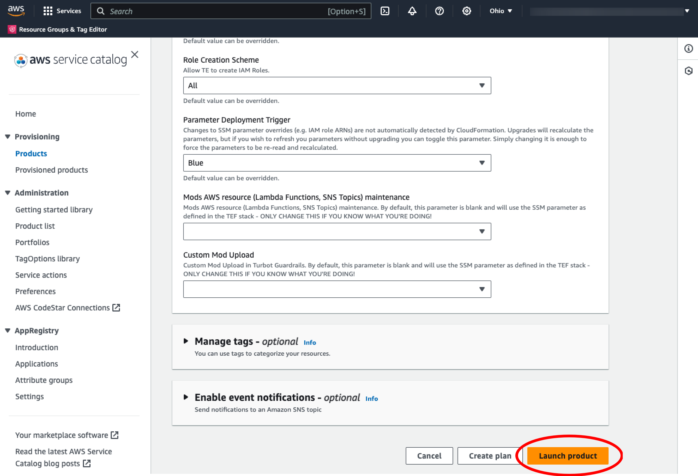
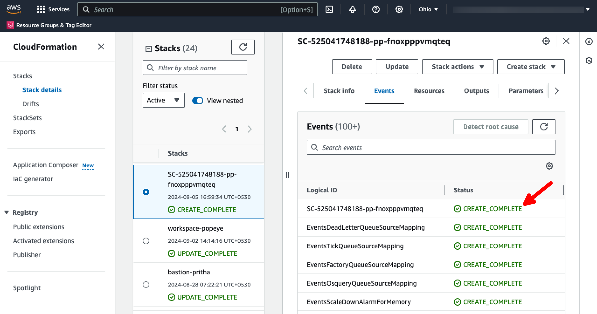
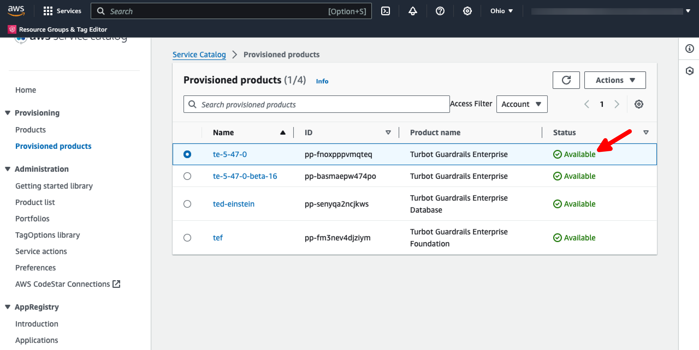

# Install Turbot Guardrails Enterprise (TE)

In this guide, you will:

- Use AWS Service Catalog to install Turbot Guardrails Enterprise (TE).
- Monitor and troubleshoot the installation process.

[Turbot Guardrails Enterprise (TE)](/guardrails/docs/reference/glossary#turbot-guardrails-enterprise-te) is an AWS Service Catalog product that provides automated configuration and management of the infrastructure needed to run the enterprise version of Turbot Guardrails in your AWS account.

TE is application layer of a Turbot Guardrails Enterprise deployment. Relies on the [Turbot Guardrails Enterprise Database (TED)](/guardrails/docs/reference/glossary#turbot-guardrails-enterprise-database-ted) and [Turbot Guardrails Enterprise Foundation (TEF)](/guardrails/docs/reference/glossary#turbot-guardrails-enterprise-foundation-tef) products. TE deploys a new version of the Turbot software -- Every Turbot release requires a new TE version.

## Prerequisites

- Access to the Guardrails AWS account with [Administrator Privileges](/guardrails/docs/enterprise/FAQ/admin-permissions).
- Familiarity with AWS Console, Service Catalog, and CloudFormation services.

## Step 1: Access AWS Console

Open the AWS Console and navigate to the Service Catalog service in the region to deploy TE.

## Step 2: Navigate to Products

Select the **Products** section from the left navigation menu.

Select **Turbot Guardrails Enterprise** from the products list, select **Launch Product**.

## Step 3: Find Version

Sort the Product versions section by `Created time` (descending) to see the latest available version.

## Step 4: Name Provisioned Product

Select the desired TE version under **Product Versions**., then name the provisioned product.

> [!NOTE]
> When selecting a name for the provisioned product, it is common practice to start with “te” and include the version number (e.g., te-5-45-1).

## Step 5: Verify Parameters

The parameters for the TE product are derived from settings chosen earlier during the TEF install, so it is rare that any of the existing parameter values need to be modified. Unless directed to by Turbot support you may safely scroll to the bottom of the parameter list.

## Step 6: Launch Product

Select **Launch product**.

## Step 7: Monitor Installation

You have initiated the installation of the new TE version. This triggers an update of several nested CloudFormation stacks.

Select the TE Provisioned Product, click the **Outputs** tab, and use the **CloudFormationStackARN** **Value** link to navigate to CloudFormation and monitor the install progress.

The TE CloudFormation stack status should would be `CREATE_IN_PROGRESS` indicating the install process is in progress.

## Step 8: Review

- [ ] The TE CloudFormation stack status should change to `CREATE_COMPLETE` indicating the installation completed successfully.

- [ ] The TE `Provisioned product` status should change to `Available`.

## Next Steps

Please see the following resources to learn more about Turbot Guardrails Enterprise:

- Learn more about [Updating a Workspace to this version](/guardrails/docs/enterprise/updating-stacks/update-workspace#updating-the-workspace).

## Troubleshooting

| Issue                                      | Description                                                                                                                                                                                                 | Guide                                |
|----------------------------------------------|-------------------------------------------------------------------------------------------------------------------------------------------------------------------------------------------------------------------|-----------------------------------------------------|
| Permission Issues                        | If the current logged-in user lacks permission to modify, update, or create resources in the stack, or if IAM roles or SCPs have changed, preventing built-in roles from accessing needed configuration settings.   | [Troubleshoot Permission Issues](/guardrails/docs/enterprise/FAQ/admin-permissions#aws-permissions-for-turbot-guardrails-administrators)             |
| Further Assistance                       | If you continue to encounter issues, please open a ticket with us and attach the relevant information to assist you more efficiently.                                                 | [Open Support Ticket](https://support.turbot.com)   |
