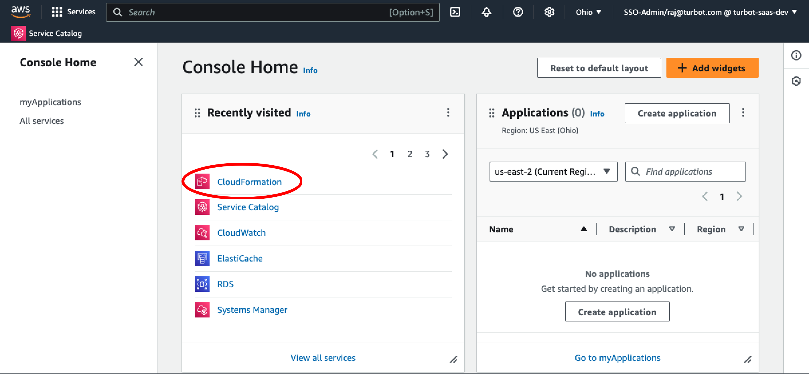
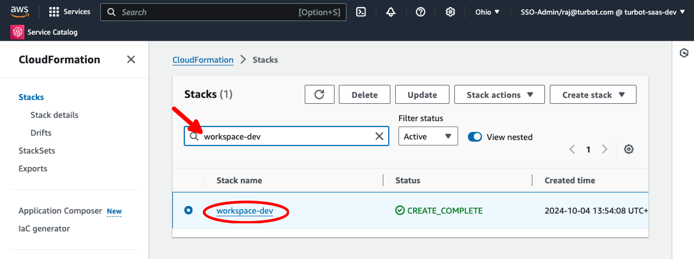
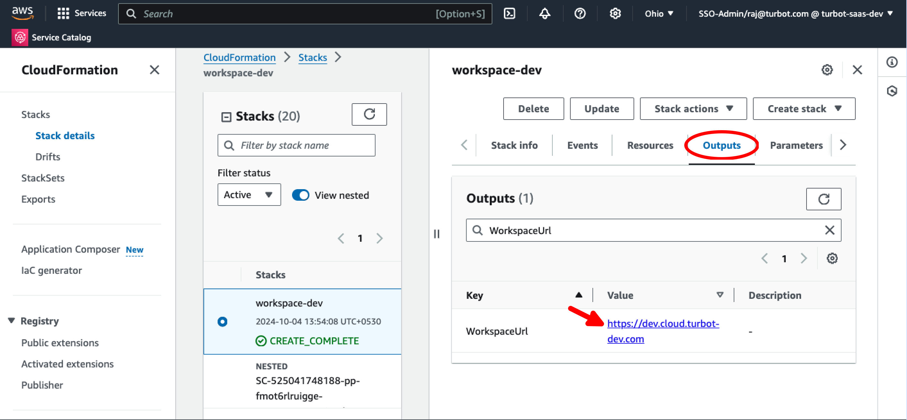
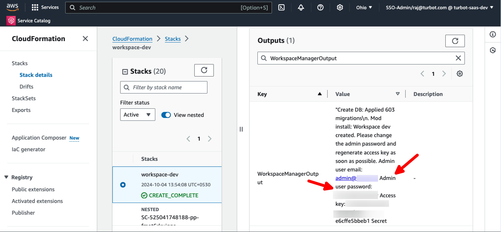
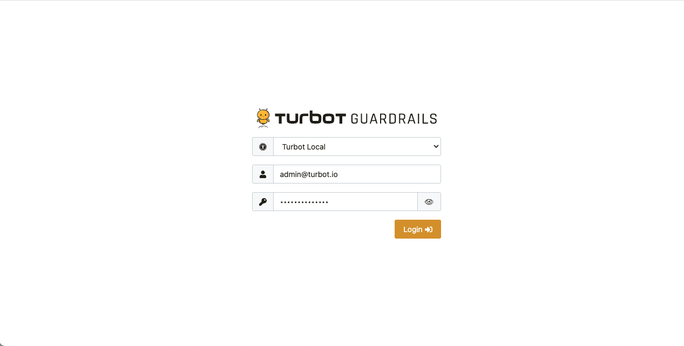
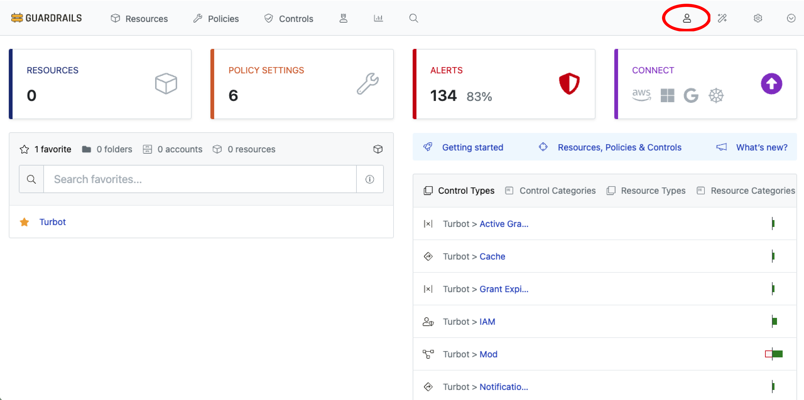
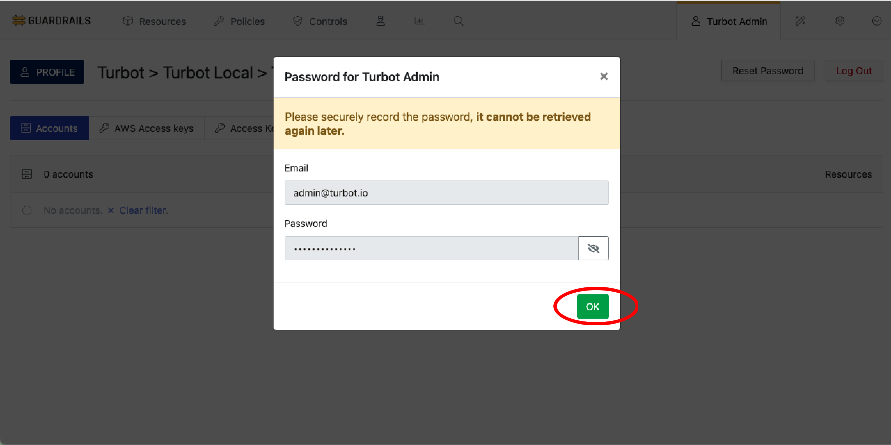
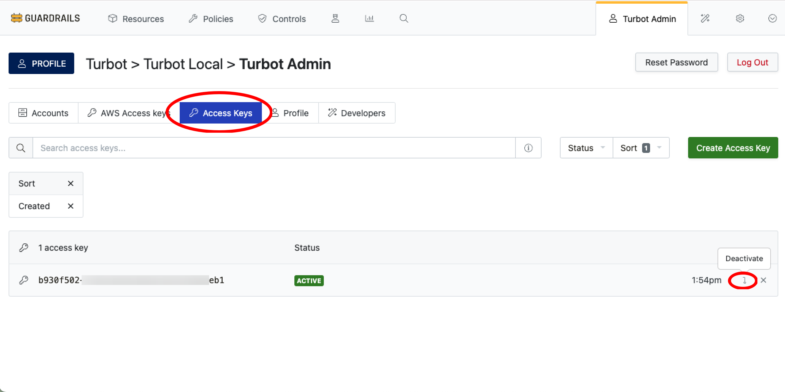
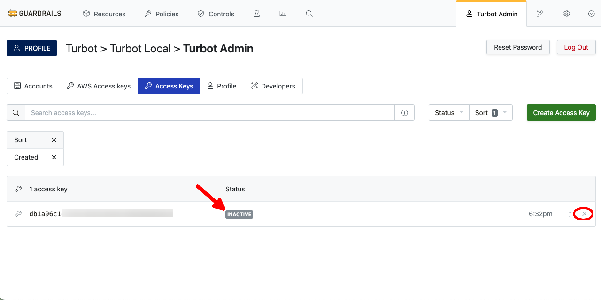
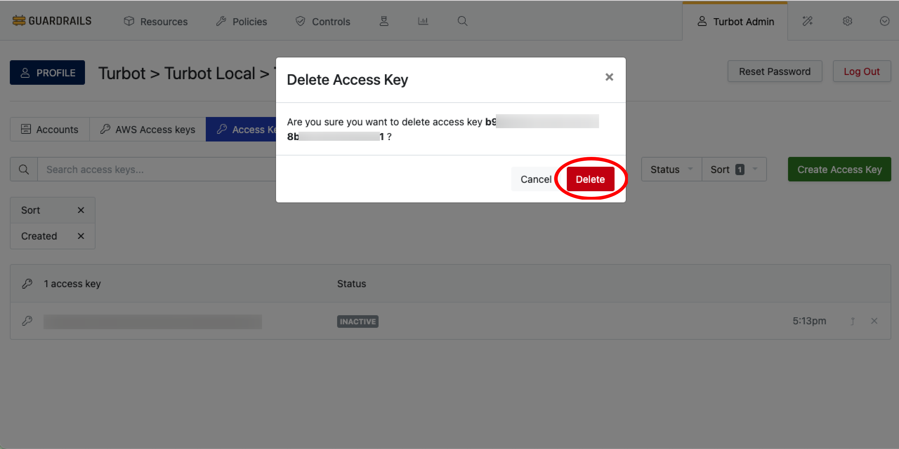

# Workspace Login

In this guide, you will:

- Use Guardrails console to login to the Workspace.
- Perform initial credentials rotation operation.

A [Workspace](/guardrails/docs/reference/glossary#workspace) is an independent tenant of Guardrails, with its own version and its
own schema (logical shard) in a hive. Each Workspace has its own root resource as [Turbot](/guardrails/docs/reference/glossary#turbot-resource),
its own set of mods, and its own web console endpoint. Workspaces will use the [Collective](/guardrails/docs/reference/glossary#collective), [Hive](/guardrails/docs/reference/glossary#hive), and versions that you deployed previously, using the [TEF](/guardrails/docs/reference/glossary#turbot-guardrails-enterprise-foundation-tef), [TED](/guardrails/docs/reference/glossary#turbot-guardrails-enterprise-database-ted), and [TE](/guardrails/docs/reference/glossary#turbot-guardrails-enterprise-te) products in the Service Catalog.

> [!CAUTION]
> After the [creating the workspace](/guardrails/docs/guides/hosting-guardrails/installation/workspace-login), it is recommended to rotate the initial credentials for the `Admin` profile.

## Prerequisites

- You must have completed the [Workspace creation](/guardrails/docs/guides/hosting-guardrails/installation/workspace-login).

## Step 1: Access AWS Console

In the AWS Console, navigate to the CloudFormation service in the alpha region.

## Step 2: Find Workspace Stack

While CloudFormation `Stacks`, search for the stack name and select the stack.

## Step 3: Access Initial Credentials

During the Workspace creation, the Workspace Manager generates the initial Turbot `Admin` profile and password, along with a key pair. Go to the stack outputs to find the required values.

`Console URL` available in the `WorkspaceUrl` **Outputs** variable. Use this `WorkspaceUrl` link to access the web console.

`Admin Credentials` is displayed in the `WorkspaceManagerOutput` variable in the stack outputs.

> [!WARNING]
> The username, password, and keys will appear in plain text in the CloudFormation stack output variables. If you re-run the stack, the stack output variables will be overwritten, so it’s important to secure this information immediately after stack creation.

## Step 4: Login Workspace with Initial Credentials

Login using the generated admin credentials.

## Step 5: Rotate Initial Password

After successful login to Guardrails console, select to **Profile** in right top corner.

While in **Turbot Admin** profile, select **Reset Password** to initiate rotate `Password`.

Guardrails generates an automatic complex password, and when you confirm the rotation by selecting **OK**, the new credentials will be applied.

## Step 6: Deactivate Access Key

The initial admin login access key created during the workspace creation process remains active. First, `deactivate` the access key.

Confirm by selecting **Deactivate**.

## Step 7: Delete Access Key

Once the access key is deactivated, check access key status is shown as `INACTIVE`, select **`X`** to delete.

Confirm deletion by selecting **Delete** button.

> [!NOTE]
> New access keys can be created if necessary.

## Next Steps

- Head over to the [Post Installation document](/guardrails/docs/guides/hosting-guardrails/installation/post-installation) for further instructions after setting up the workspace.
- Learn more about managing versions and updating workspaces from [Turbot Guardrails Enterprise Documentation](/guardrails/docs/guides/hosting-guardrails/updating-stacks).

## Troubleshooting

| Issue                                      | Description                                                                                                                                                                                                 | Guide                                |
|----------------------------------------------|-------------------------------------------------------------------------------------------------------------------------------------------------------------------------------------------------------------------|-----------------------------------------------------|
| Permission Issues                        | If the current logged-in user lacks permission to modify, update, or create resources in the stack, or if IAM roles or SCPs have changed, preventing built-in roles from accessing needed configuration settings.   | [Troubleshoot Permission Issues](/guardrails/docs/enterprise/FAQ/admin-permissions#aws-permissions-for-turbot-guardrails-administrators)             |
| Further Assistance                       | If you continue to encounter issues, please open a ticket with us and attach the relevant information to assist you more efficiently.                                                 | [Open Support Ticket](https://support.turbot.com)   |
