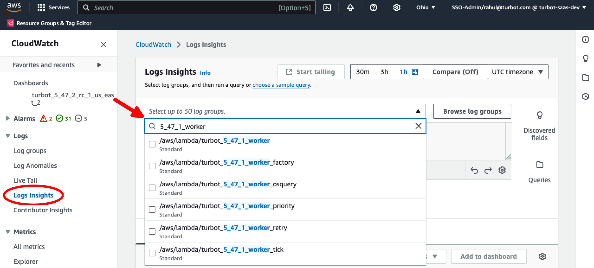
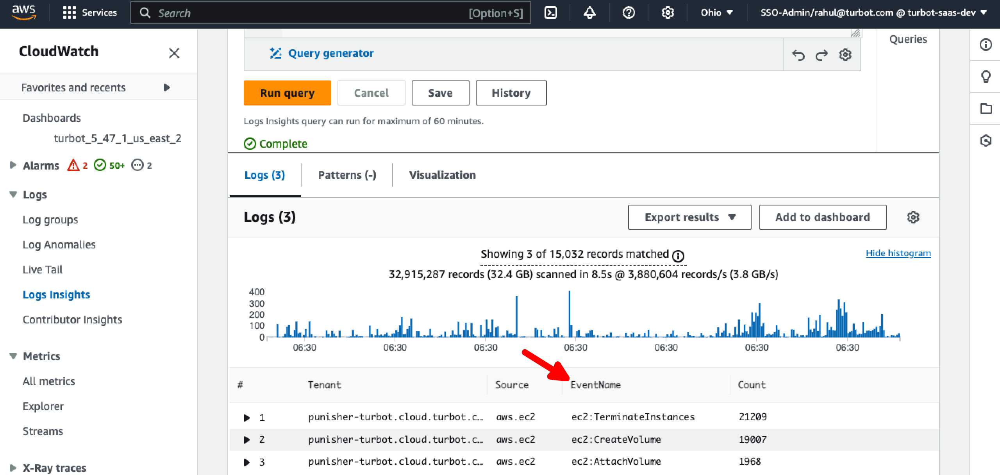

# Investigate Event Flood

In this guide, you will:
- Use AWS console to investigate an event flood.

An event flood occurs when there is a substantial and sustained backlog of events in the Turbot Guardrails Events queue. Common causes include rogue automation, excessive workloads that exhaust API quotas, conflicting or misconfigured Guardrails policies. Resolving an event flood requires thorough investigation and addressing the underlying root cause.

The best way to identify an event flood is by checking the **Events Queue Backlog** graph in the [Turbot Guardrails Enterprise (TE)](/guardrails/docs/reference/glossary#turbot-guardrails-enterprise-te) CloudWatch dashboard. Prolonged control processing times and CloudWatch alarms are also common indicators of an event flood.

## Prerequisites

- Access to the Guardrails AWS account with Administrator privileges.
- Familiarity with AWS Console and CloudWatch service.

## Step 1: Access AWS Console

Open the AWS Console and navigate to the CloudWatch service in the region where Guardrails is deployed.


## Step 2: Navigate to Dashboards

Choose **Dashboards** from the left navigation menu.


## Step 3: Select Dashboard

In **Custom dashboards**, select the Turbot Guardrails Enterprise (TE) CloudWatch dashboard, which is typically named after the TE version in use.


## Step 4: View Events Queue

Select the desired duration from the time range option in the top-right corner, and check the **Events Queue Backlog** graph in the TE CloudWatch dashboard for spikes indicating a event flood state.


## Step 5: Identify Noisy Tenant

Scroll down in the same dashboard page to the **Activities** section, use the **View All Messages By Workspace** widget to filter and identify the noisy tenant causing the issues.
The number of messages received by the top tenant over a specified duration, along with the difference between the top three tenants, can be a strong indicator of an event flood.


## Step 6: Analyze Log Insights

With the workspace identified from the above step, navigate to **CloudWatch > Logs Insights**, select the appropriate worker log group for the TE version(s) and choose the desired query duration to proceed to investigate further by analyzing events, event sources, and account IDs for the workspace. This will render the query editor with the selected log group(s).

> [!IMPORTANT]
> Longer durations will increase the log group size and query time, which may result in higher billing costs for CloudWatch.



> [!NOTE]
> You can select multiple TE version log groups if required.

## Step 7: External Messages by Accounts in a Tenant

In the query editor, use the below query to identify AWS `AccountId(s)` contributing to the events.

```
fields @timestamp, @message
| filter message='received SQS message' and ispresent(data.msgObj.payload.account)  and data.msgObj.meta.tenantId='your-tenant-here.cloud.turbot.com'
| filter data.msgObj.type='event.turbot.com:External'
| stats count() as Count by data.msgObj.meta.tenantId as Tenant, data.msgObj.payload.account as AccountId
| sort Count desc | limit 5
```


## Step 8: External Messages by Source for a Tenant

Use below query to identify specific event `Source` from the different services.

```
fields @timestamp, @message
| filter message='received SQS message' and ispresent(data.msgObj.payload.account) and ispresent(data.msgObj.payload.source) and data.msgObj.meta.tenantId='your-tenant-here.cloud.turbot.com'
| filter data.msgObj.type='event.turbot.com:External'
| stats count() as Count by data.msgObj.meta.tenantId as Tenant, data.msgObj.payload.source as Source
| sort Count desc | limit 5
```


## Step 9: External Messages by Event Name

Use below query to identify the specific `EventName` associated with the service.

```
fields @timestamp, @message
| filter message='received SQS message' and ispresent(data.msgObj.payload.account) and ispresent(data.msgObj.payload.source) and data.msgObj.meta.tenantId='your-tenant-here.cloud.turbot.com' and data.msgObj.payload.source='aws.ec2'
| filter data.msgObj.type='event.turbot.com:External'
| stats count() as Count by data.msgObj.meta.tenantId as Tenant, data.msgObj.payload.source as Source, data.msgObj.meta.eventRaw as EventName
| sort Count desc | limit 5

```


## Step 10: Measures To Fix Event Flood

**Isolate the Noisy Workspace:** As an immediate fix, move the noisy workspace to a separate TE version to prevent performance issues or throttling for neighboring workspaces.

**Exclude Events from the Event Poller:** If the event is coming from the Event Poller, update the policy AWS > Turbot > Event Poller > Excluded Events to exclude the problematic event.

Additionally, you may off-board the affected account until the issue is resolved or turn off the relevant policies where applicable to prevent further disruptions.

If you encounter further issues, please [Open Support Ticket](https://support.turbot.com) and attach the relevant information to assist you more efficiently.

- A screenshot of the CloudWatch Events Queue Backlog graph.
- A screenshot of the CloudWatch Log Insights Query results.