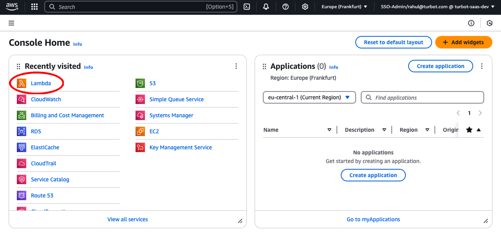
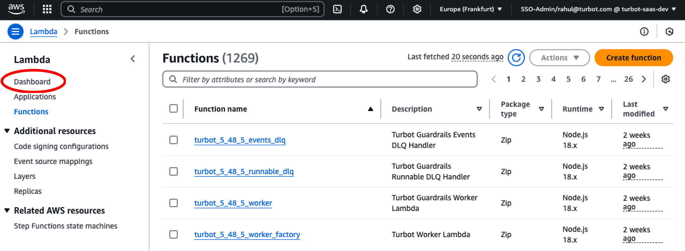
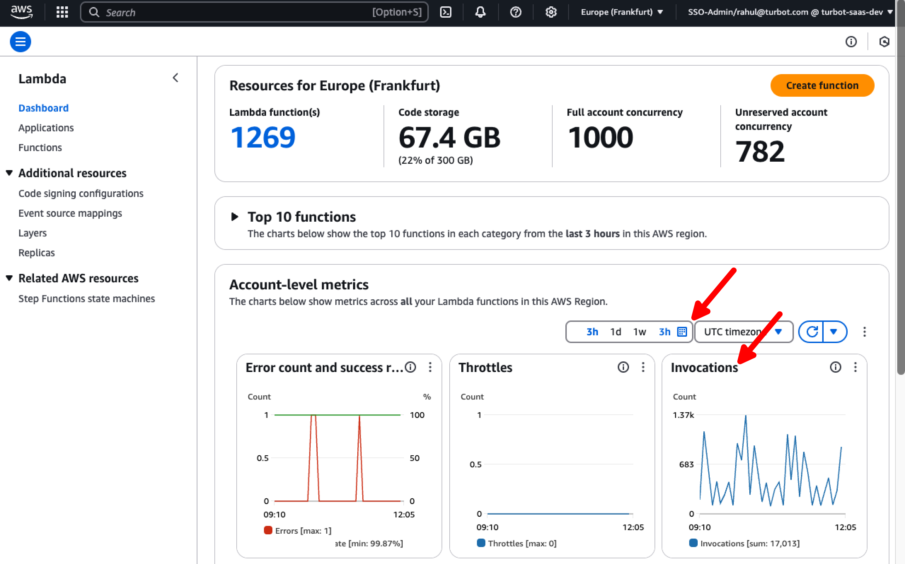
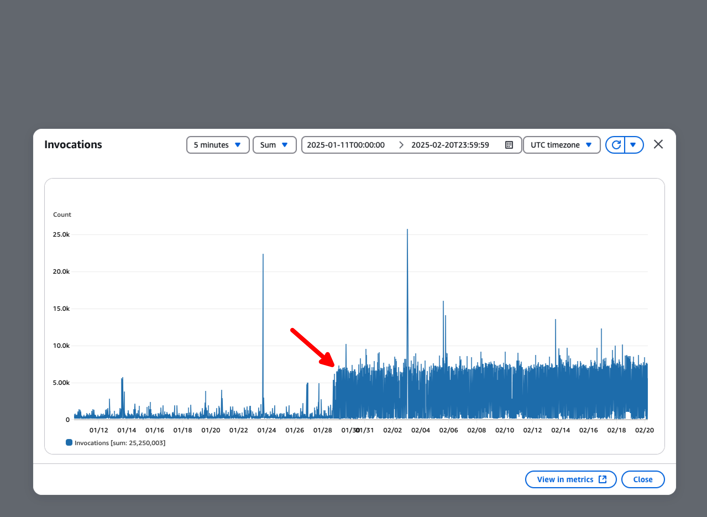
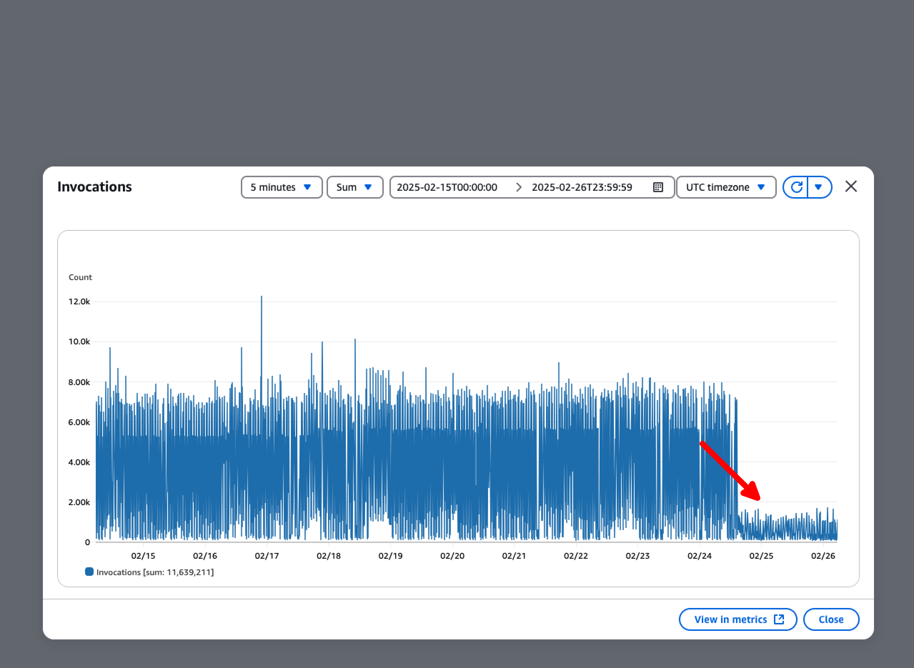

# Monitoring AWS Lambda Invocations

In this guide, you will:
- Use the AWS Console to monitor AWS Lambda invocations in **self-hosted** environments.

Monitoring AWS Lambda invocations is crucial for *detecting performance bottlenecks, optimizing execution efficiency, and managing AWS costs effectively*. Worker Lambda functions process [events](/guardrails/docs/guides/azure/real-time-events#configuring-real-time-events), and prolonged execution times can result from *high concurrency, database overload, or excessive SQS message throughput*.

When durations exceed defined thresholds, they *increase costs* and may indicate inefficiencies. Proactive monitoring helps ensure smooth execution, efficient resource utilization, and minimized costs.

## Prerequisites

- Access to the Guardrails AWS account with **ReadOnly** privileges.
- Familiarity with AWS Console.

## Step 1: Log in to AWS Console

Open the AWS Console and navigate to the **Lambda** service in the region where Guardrails is deployed.

## Step 2: Navigate to Dashboards

From the left navigation menu, select **Dashboards**.

## Step 3: View Lambda Invocations

In **Account-level metrics**, select **Invocations** and set the desired date range.

## Step 4: Identify Invocation Spikes

Analyze the graph for spikes in invocation counts over the selected time range. In this example, a spike is observed starting from `01/29/2025`.

## Step 5: Investigate and Resolve Spike

A spike in Lambda invocations may be caused by *increased concurrency, database overload, or excessive SQS message throughput*, often due to misconfigured policies or external API events.

To identify the root cause, [**analyze event floods**](/guardrails/docs/guides/hosting-guardrails/monitoring/investigate-event-flood) for unusual spikes in external events.

### Common causes include:
- Unintended API calls
- Excessive policy evaluations
- High-frequency control triggers

Once identified, apply necessary fixes as recommended by Turbot support.

## Step 6: Review

- [ ] Ensure that the Lambda invocation spike stabilizes and returns to normal levels.

## Next Steps

Explore additional monitoring guides for Guardrails Enterprise:

- Learn how to [Monitor Alarms](https://turbot.com/guardrails/docs/guides/hosting-guardrails/monitoring/diagnose-control-error).
- Learn how to [Diagnose Control Errors](/guardrails/docs/guides/hosting-guardrails/monitoring/diagnose-control-error).

## Troubleshooting

| **Issue**                           | **Description**                                                                                          | **Guide** |
|--------------------------------------|----------------------------------------------------------------------------------------------------------|-----------------------------------------------------|
| Common Errors                        | Any errors preventing controls from running.                                                            | Refer to [Common Troubleshooting](/guardrails/docs/guides/troubleshooting) for more information. |
| Further Assistance and Feedback | If you encounter issues or have suggestions to improve this guide, please open a support ticket with detailed logs, screenshots, and your feedback. | [Open Support Ticket](https://support.turbot.com) |