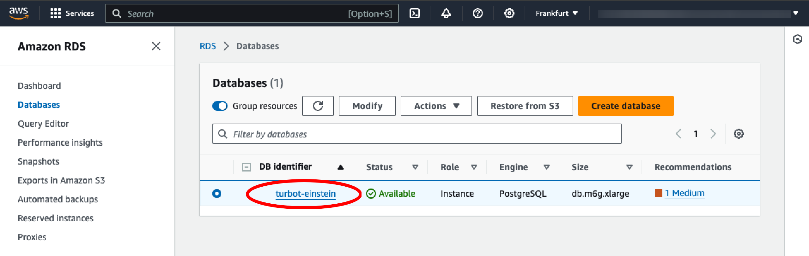

# Database Instance Not in Available State

In this guide, you will:
- Use AWS Service Catalog to manage Turbot Guardrails Enterprise Database.
- Troubleshoot database instance state issues between Service Catalog and RDS.

When working with the [TED (Turbot Enterprise Database)](/guardrails/docs/reference/glossary#turbot-guardrails-enterprise-database-ted) stack, you might encounter an issue where the database instance is not in an `Available` state. This can prevent you from making necessary changes or updates to the database and may cause the TED provisioned product in Service Catalog to change to a `Tainted` status.

## Prerequisites

- Access to the Guardrails AWS account with [Administrator Privileges](/guardrails/docs/enterprise/FAQ/admin-permissions).
- Familiarity with AWS Console, Service Catalog, CloudFormation and RDS services.

## Step 1: Check Provisioned Product Status

During execution of the [TED update](/guardrails/docs/runbooks/enterprise-install/update-ted#update-turbot-guardrails-enterprise-database-ted), check if the provisioned product in the Service Catalog changes to a `Tainted` status.

<!-- (/images/docs/guardrails/guides/hosting-guardrails/troubleshooting/service-catalog-out-of-sync/ted-tained-status-view-details.png) -->

## Step 2: Check Stack Failure Details

In the selected provisioned product, select the **Events** tab, in `UPDATE_PROVISIONED_PRODUCT` section select **View details**.

Select **View more in CloudFormation** to navigate to CloudFormation stack. This will display **Error Message** as
`Database instance is not in available state. (Service: Rds, Status Code: 400, Request ID: 3f4bddc5-e656-4ebe-8efe-3b9bdcfac026)`

> [!NOTE]
> The most common reason for this issue is that the database is in a state where modifications are not allowed, such as `Backing-up`. Attempting to make changes during this time will result in an error.

## Step 3: Review DB Status

- [ ] Open the AWS Console and navigate to the **RDS** service in the region where TED is deployed.

- [ ] Find the **DB Instance** associated with your TED stack.

- [ ] Navigate to the DB Instance **Summary** and check for `Status`

## Step 4: Wait for Database Availability

If the database is in a state such as `Backing-up`, you will need to wait until the process is complete and the status changes to `Available`. This may take some time depending on the operations being performed on the database.

## Step 5: Execute Service Catalog Stack Update

Once the database instance is in the `Available` state, navigate to the Service Catalog and update the TED provisioned product with any planned updates or modifications to the TED stack.

Initiate Service Catalog [TED **Update**](/guardrails/docs/runbooks/enterprise-install/update-ted). CloudFormation will check for changes. If there are no discrepancies, the stack will transition to `Update Complete`.

## Step 6: Review CloudFormation Stack

If you continue to encounter issues, please [Open Support Ticket](https://support.turbot.com) and attach the relevant information to assist you more efficiently.

- A screenshot of the RDS instance's Summary and Configuration tab.
- A screenshot of the CloudFormation Events tab for TED stack.
- A screenshot of the Service Catalog with provisioned products.
