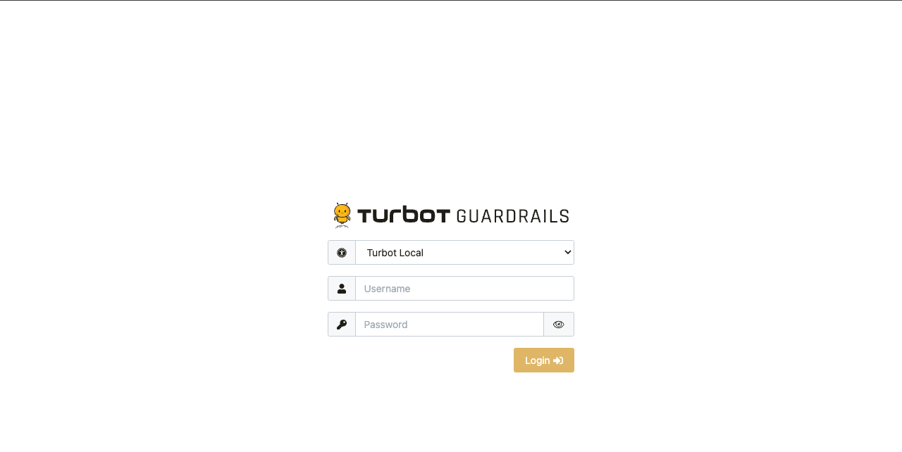
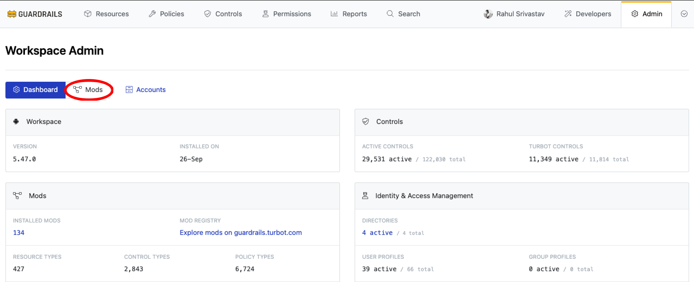
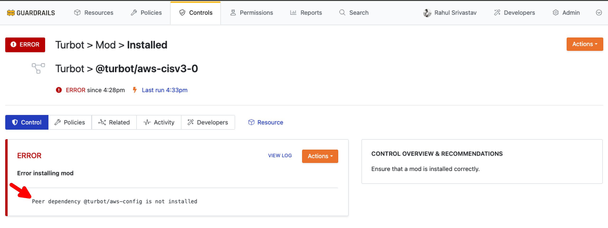
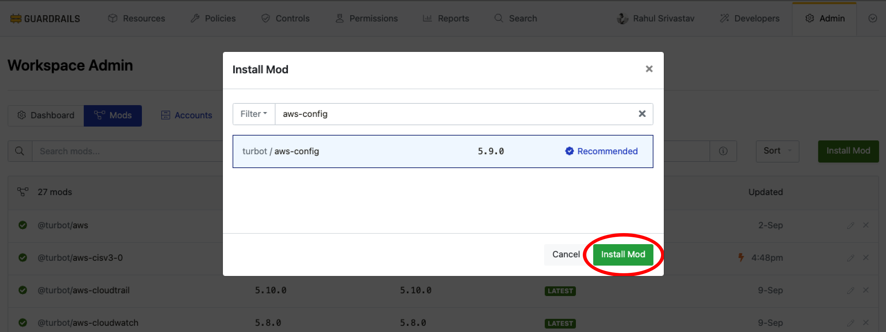
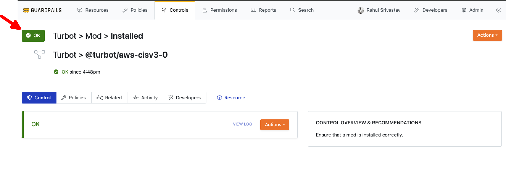

# Peer Mod Dependency Error

In this guide, you will:
- Use Turbot Guardrails console to troubleshoot mod dependency errors encountered while installing a mod.

When installing Mods, you may encounter an issue where a mod is dependent on another mod that is either not installed or unavailable, leading to the installation being in an error state.

## Prerequisites

- **Turbot/Owner** permissions at the Turbot resource level.
- Familiarity with Guardrails console.

## Step 1: Login to Guardrails Console

Log into the Guardrails console.

## Step 2: Navigate to Mods

Choose **Admin** from the top right corner.

Select the **Mods** tab.

## Step 3: Search Mod

Search for the installed mod that is in an error state.

Select the mod and navigate to **Turbot > Mod > Installed** control.

## Step 4: Verify Missing Mod

Verify the missing mod by reviewing the displayed error message.

## Step 5: Install Dependent Mod

Install the missing mod.

## Step 5: Run Control

Select **Run control** from the **Actions** dropdown and re-run the mod installed control.

## Step 6: Verify

The mod control moves to an **OK** state, indicating a successful mod installation.

If you encounter any further issues, please [Open Support Ticket](https://support.turbot.com) and attach the relevant information to assist you more efficiently.

- A screenshot of the mod peer dependency error.
- A screenshot of the installed mods.