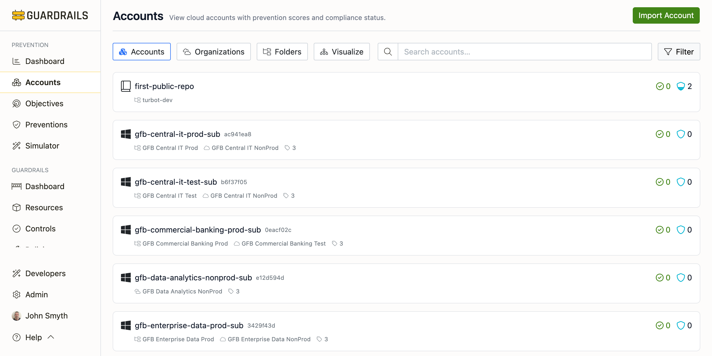
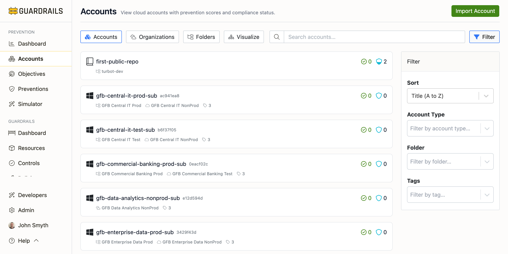
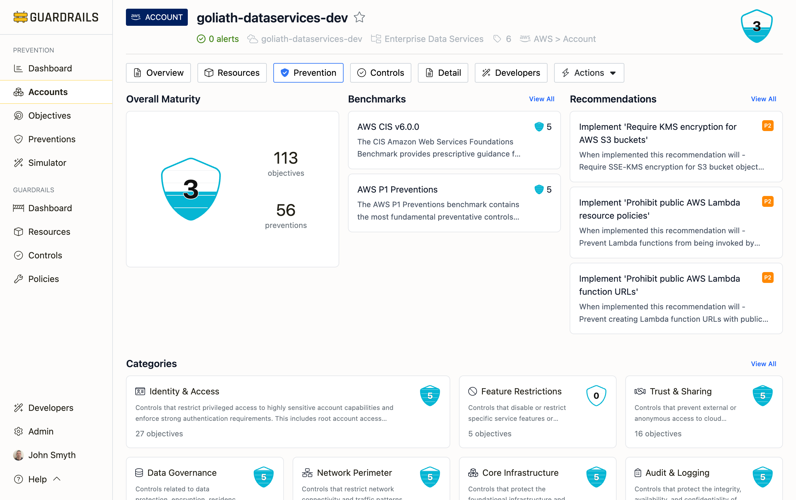

# Accounts

The Accounts tab provides a flat list view of all cloud accounts, subscriptions, and repositories managed by Turbot Guardrails. Use this view to search, filter, and sort accounts to quickly find those needing attention.

## Understanding the Accounts List

The Accounts list shows all your cloud accounts, subscriptions, and repositories in one place—AWS accounts, Azure subscriptions, GCP projects, and GitHub repositories. Each row shows the account name and ID, which organizational folder or OU it belongs to, its prevention score (0-5 indicating how well it's protected), active alerts, and how many controls are running.

This is your starting point for understanding prevention coverage across your environment. You can quickly spot accounts with weak protection by sorting by score, filter to specific cloud providers to check consistency, or search for specific accounts you're investigating. The view adapts to how you work, whether you're hunting for gaps, tracking compliance across accounts, or responding to alerts.

## Finding What You Need

Use the **Search** box to filter results with plain text search.  Enter a search string and press Enter. 

Click the **Filter** button to show and hide the Filter panel.  Filtering lets you narrow to specific cloud providers (AWS, Azure, GCP, GitHub), Turbot Guardrails folders, or resource tags. Sorting changes how accounts are ordered—alphabetically by default, but you can sort by score to find gaps (Low to High shows weakest protection first), by newest/oldest to see recently added accounts, or by updated recently to see where changes happened.

The Sort dropdown includes "Score (Low to High)" which is particularly useful for finding accounts needing attention. Accounts with scores below 3 often have significant gaps in prevention coverage.

## Understanding Prevention Scores

[Prevention scores](/guardrails/docs/prevention#prevention-scores) run from 0 to 5. Low scores (0-2) indicate minimal prevention coverage with significant gaps. Moderate scores (3) show basic protections but noticeable gaps. Good scores (4) reflect solid implementation. High scores (5) demonstrate comprehensive, defense-in-depth protection.

Account scores aggregate all prevention objectives weighted by priority. A low score might mean missing critical P1 controls or lack of coverage across many objectives. Click into an account to see which specific objectives aren't being met and what recommendations exist to improve the score.

## Account Detail View

Clicking any account name opens the Account Detail page, which provides an in-depth view of prevention coverage for that single cloud account, subscription, or repository. This page breaks down the overall prevention score into specific categories, benchmarks, and recommendations, helping you understand exactly which preventions are implemented and which gaps need to be addressed.

The Account Detail page shows:

**[Overall Maturity](/guardrails/docs/prevention#prevention-scores)** - Your prevention score as a shield icon with the number, plus total objectives and preventions evaluated. This gives you a quick sense of how well-protected this account is.

**[Benchmarks](/guardrails/docs/prevention/objectives/benchmarks)** - How this account scores against compliance frameworks such as AWS CIS v6.0.0, Azure CIS v5.0.0, GCP CIS v3.0.0, GitHub CIS v1.1.0, and P1 Preventions benchmarks. A score of 5 means full compliance while scores of 0-2 signal significant gaps.

**[Recommendations](/guardrails/docs/prevention/objectives/recommendations)** - Actionable guidance for improving this account's protection. Each recommendation shows what needs to be implemented, its priority level (P1 through P4), and the security impact you'll get. Click any recommendation to see detailed implementation guidance including step-by-step instructions and policy templates.

**[Categories](/guardrails/docs/prevention/objectives/categories)** - Preventions organized by security domain: Identity & Access, Data Governance, Trust & Sharing, Network Perimeter, Core Infrastructure, Audit & Logging, and Feature Restrictions. This helps you spot imbalances. If Identity & Access scores 4.5 but Data Governance scores 1.5, you know where to focus improvement efforts.

**[Layers](/guardrails/docs/prevention/preventions/layers)** - Coverage across different enforcement timing: Build (stop risky configurations before deployment), Access (control who can access resources), Config (enforce required configurations), and Runtime (detect and respond to risky behavior). Balanced coverage across layers provides better protection than perfect coverage at a single layer.

## Common Use Cases

- **When finding accounts with weak prevention coverage**: Sort by Score (Low to High) and review accounts below 3. Click into each one to see which objectives aren't met and implement the recommended preventions. This is especially important for production accounts where gaps represent real risk.

- **When reviewing accounts by cloud provider**: Filter to AWS, Azure, or GCP and scan the prevention scores. If some accounts score 4.5 but others score 2.0, you have inconsistent protection. This is likely because preventions were implemented in some accounts but not others. This inconsistency often happens when accounts were created at different times or by different teams without standardized baselines.

- **When you see non-zero alert counts**: Click the alert number to view details. Alerts indicate controls in alarm state—configurations that violate policies or drift from desired state. Taking corrective action based on alert severity keeps your environment compliant with the preventive controls you've defined.

- **When improving an account's prevention score**: Open the Account Detail page, check the Overall Maturity score to understand current state, then review Recommendations for prioritized actions. Start with P1 recommendations and implement them using the detailed guidance provided. Return to this page after implementation to verify the score improves.

## Next Steps

- Use the [Organizations](/guardrails/docs/prevention/accounts/organizations) view to see account hierarchy
- Use the [Folders](/guardrails/docs/prevention/accounts/folders) view to analyze accounts by logical grouping
- Use the [Visualize](/guardrails/docs/prevention/accounts/visualize) view for a graphical representation
- Review [Recommendations](/guardrails/docs/prevention/objectives/recommendations) to prioritize prevention work
