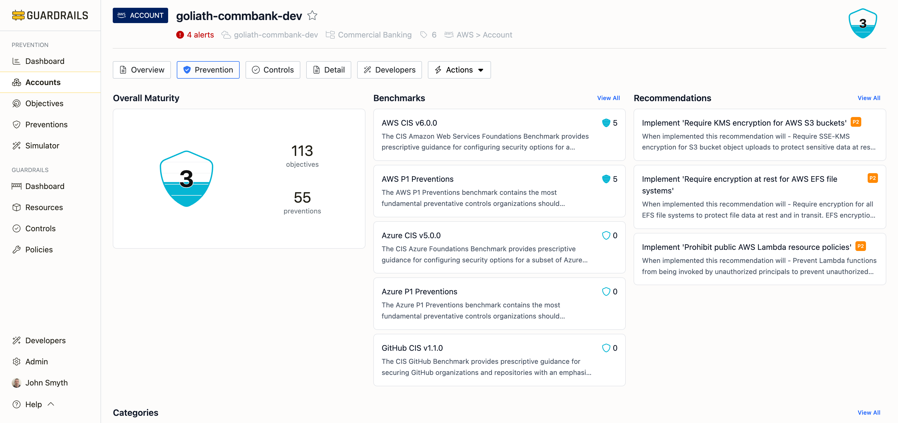

# Account Detail

The Account Detail page provides an in-depth view of prevention coverage for a single cloud account, subscription, or repository. This page breaks down the overall prevention score into specific categories, benchmarks, and recommendations, helping you understand exactly which preventions are implemented and which gaps need to be addressed.

## Accessing Account Details

Click any account name from the Accounts page, then click the Prevention tab. The page header shows the account name and ID, prevention score (0-5), which folder or OU it belongs to, alert count, and resource type (AWS Account, Azure Subscription, GCP Project, or GitHub Repository).

The Overall Maturity section at the top displays your prevention score as a shield icon with the number, plus total objectives and preventions evaluated. This gives you a quick sense of how well-protected this account is. You can click the objective/prevention counts to explore detailed coverage.

## Benchmarks

The Benchmarks section shows how this account scores against compliance frameworks—AWS CIS v6.0.0, Azure CIS v5.0.0, GCP CIS v3.0.0, GitHub CIS v1.1.0, and P1 Preventions benchmarks for each cloud. Each benchmark card shows the name, version, brief description, and score (0-5) for this specific account.

A score of 5 means full compliance—all benchmark objectives are met. Scores of 3-4 indicate partial compliance with some gaps remaining. Scores of 0-2 signal significant gaps or that the benchmark doesn't apply to this account type (Azure benchmarks will score 0 on AWS accounts). Click View All to see the complete list and drill into specific requirements.

## Recommendations

The Recommendations section provides actionable guidance for improving this account's protection. Each card shows what needs to be implemented, its priority level (P1 through P4), and the impact you'll get. Recommendations are prioritized by security impact, compliance requirements, and implementation complexity—so the highest-value, most important work surfaces first.

Click any recommendation to see detailed implementation guidance including step-by-step instructions, cloud provider-specific configuration examples, and policy templates (SCPs for AWS, Azure Policy definitions, GCP Organization Policy constraints). Click View All to see the complete list for this account.

## Categories

The Categories section organizes preventions by security domain—Identity & Access (MFA, root account restrictions, credential management), Data Governance (encryption, public access controls, data lifecycle), Trust & Sharing (external access prevention, cross-account controls), Network Perimeter (connectivity restrictions, secure protocols), Core Infrastructure (foundational protections, governance capabilities), Audit & Logging (audit trail protection, log integrity), and Feature Restrictions (disabling risky service features).

Each category card shows the category name, how many objectives it includes, and the prevention score (0-5) for this specific account in that domain. This helps you spot imbalances—if Identity & Access scores 4.5 but Data Governance scores 1.5, you know where to focus improvement efforts. Click any category to explore specific objectives and preventions within it.

## Layers

The Layers section shows coverage across different enforcement timing—Build (stop risky configurations before deployment during IaC), Access (control who can access resources and what actions they can perform via policies), Config (enforce required configurations on deployed resources like encryption and network settings), and Runtime (detect and respond to risky behavior during operation via monitoring and remediation).

Each layer card shows the layer name, number of objectives at that layer, and prevention score (0-5). The layered approach ensures defense-in-depth—even if a risky resource gets deployed, preventions at other layers can limit the damage. Aim for balanced coverage with scores of 3+ across all applicable layers rather than perfect coverage at just one layer.

## Common Use Cases

To improve an account's prevention score, check the Overall Maturity score to understand current state, then review Recommendations for prioritized actions. Start with P1 recommendations and implement them using the detailed guidance provided. Return to this page after implementation to verify the score improves.

When preparing for compliance audits, review the Benchmarks section to see compliance status, click the relevant benchmark (like AWS CIS v6.0.0), identify which objectives aren't met, and implement missing preventions following the recommendations. Verify the benchmark score reaches your target level (typically 4 or 5 for certification).

To understand prevention gaps by category, scroll to the Categories section and identify categories with low scores (0-2). Click any low-scoring category to see specific objectives and review which ones aren't met. Prioritize implementing missing preventions based on risk and compliance needs.

For analyzing defense-in-depth coverage, review the Layers section and ensure coverage across multiple layers—not just Access or just Config. If one layer has a significantly lower score, focus remediation there. Balanced coverage across layers provides better protection than perfect coverage at a single layer.

## Next Steps

- Return to [Accounts](/guardrails/docs/prevention/accounts) to view prevention scores across all accounts
- Visit [Objectives](/guardrails/docs/prevention/objectives) to understand prevention objectives in detail
- Use [Recommendations](/guardrails/docs/prevention/recommendations) to see prioritized prevention guidance
- Try the [Simulator](/guardrails/docs/prevention/simulator) to test Service Control Policies before deployment
