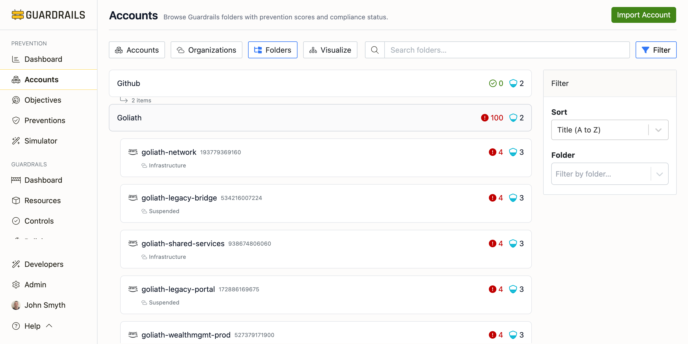

# Folders

The Folders view displays accounts organized by Turbot Guardrails folders—logical groupings that you define to organize resources across cloud providers. Unlike the Organizations view which shows cloud-native hierarchy, Folders represent your custom organizational structure within Guardrails.

## Understanding the Folders View

Folders in Turbot Guardrails allow you to:

- **Group resources logically**: Organize accounts by team, project, environment, or any custom criteria
- **Cross-cloud organization**: Group AWS accounts, Azure subscriptions, GCP projects, and GitHub repositories together
- **Policy inheritance**: Apply Guardrails policies at the folder level to affect all nested resources
- **Aggregated prevention scores**: See rollup prevention scores for entire groups of accounts

Each folder card displays:
- **Folder Name**: The custom name you've assigned
- **Alert Count**: Total alerts across all accounts in the folder
- **Item Count**: Number of accounts, subscriptions, and repositories in the folder

## Viewing Folder Contents

Click on any folder card to expand and view all accounts nested within it:

When expanded, each account shows:
- **Account Name**: The friendly name of the account or subscription
- **Account ID**: The unique identifier (account number, subscription ID, etc.)
- **Folder Path**: The nested folder structure showing the account's location
- **Sub-folder** (if applicable): Additional organizational grouping within the parent folder
- **Alert Count**: Number of active alerts for the account
- **Controls Count**: Number of controls running on the account

## Common Use Cases

### Organizing by Team or Business Unit

Create folders for each team or business unit to track prevention coverage by organizational ownership:
- Engineering folder with dev/test/prod accounts
- Data Science folder with analytics accounts
- Security folder with audit and logging accounts

### Organizing by Environment

Group accounts by environment to ensure consistent prevention policies:
- Production folder with all prod accounts across clouds
- Non-Production folder with dev, test, and staging accounts
- Sandbox folder with experimental or training accounts

### Organizing by Compliance Scope

Create folders based on compliance requirements:
- PCI-DSS folder for accounts handling payment data
- HIPAA folder for healthcare-related accounts
- Public folder for accounts with publicly accessible resources

## Filtering and Sorting

Use the Filter and Sort controls to manage large numbers of folders:

- **Search**: Quickly find folders by name
- **Filter by Folder**: Show only specific nested folders
- **Sort options**: Order folders alphabetically or by other criteria

## Folders vs Organizations

Understanding the difference:

**Organizations View**
- Shows cloud-native hierarchy (AWS Organizations, Azure Management Groups, GCP Org)
- Reflects how accounts are structured in the cloud provider
- Useful for understanding cloud-native policy inheritance (SCPs, org policies)

**Folders View**
- Shows Turbot Guardrails custom groupings
- Can include resources from multiple cloud providers in one folder
- Useful for organizing resources by your internal organizational structure
- Supports Guardrails policy inheritance

## Next Steps

- Return to the [Accounts](./index.md) view for a flat list of all accounts
- Use the [Organizations](./organizations.md) view to see cloud-native hierarchy
- Use the [Visualize](./visualize.md) view for a graphical representation
- Click into any account to view detailed prevention scores by objective
