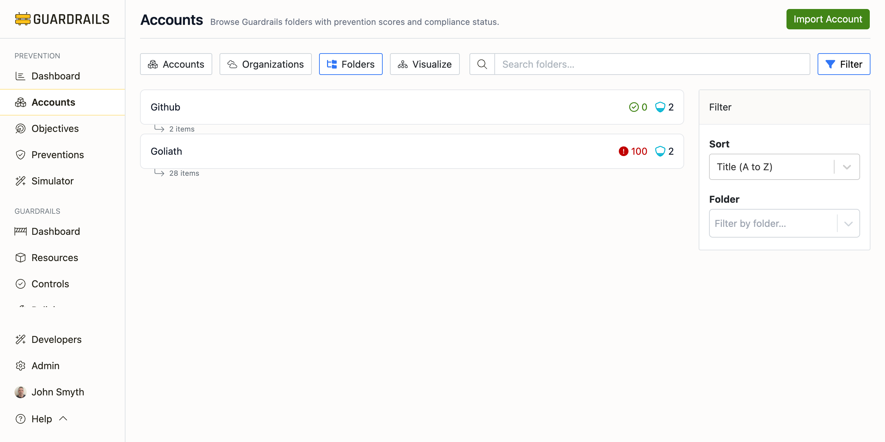

# Folders

The Folders view displays accounts organized by Turbot Guardrails folders—logical groupings that you define to organize resources across cloud providers. Unlike the Organizations view which shows cloud-native hierarchy, Folders represent your custom organizational structure within Guardrails.

## Understanding the Folders View

Folders are custom groupings you define in Turbot Guardrails to organize resources however makes sense for your organization—by team, environment, compliance scope, or any other criteria. Unlike the Organizations view (which shows cloud-native AWS/Azure/GCP hierarchy), Folders let you group resources from multiple cloud providers together. You can put AWS accounts, Azure subscriptions, and GCP projects in the same folder if they all belong to the same team or serve the same purpose.

Each folder card shows the folder name, total alerts across all accounts in the folder, and how many accounts/subscriptions/repositories it contains. Click a folder to expand and see all nested accounts with their IDs, folder paths, alert counts, and control counts. This makes it easy to see everything belonging to a specific team or environment at a glance.

Folders also support policy inheritance—you can apply Guardrails policies at the folder level and they affect all nested resources. This is powerful for ensuring consistent controls across accounts that share characteristics even if they're in different cloud providers or different parts of the cloud-native hierarchy.

## Common Use Cases

- **When organizing by team or business unit** - Create folders like Engineering (with dev/test/prod accounts), Data Science (with analytics accounts), or Security (with audit and logging accounts). This helps track prevention coverage by organizational ownership and makes it clear which team is responsible for each account.

- **When organizing by environment** - Create a Production folder with all prod accounts across AWS, Azure, and GCP, a Non-Production folder with dev/test/staging, and a Sandbox folder for experimental work. This supports applying stricter preventions to production (enforcing encryption, blocking public access) while allowing more flexibility in non-production environments.

- **When organizing for compliance** - Create folders based on regulatory scope—a PCI-DSS folder for accounts handling payment data, a HIPAA folder for healthcare-related accounts, or a Public folder for accounts with publicly accessible resources. This makes it easy to ensure accounts subject to specific regulations have the required preventive controls.

## Folders vs Organizations

The Organizations view shows cloud-native hierarchy (AWS Organizations, Azure Management Groups, GCP Org) as structured in the cloud provider—useful for understanding cloud-native policy inheritance like SCPs. The Folders view shows your custom Guardrails groupings, can include resources from multiple cloud providers in one folder, and supports Guardrails policy inheritance. Use Organizations when you need to understand cloud-native structure; use Folders when you need to organize by your internal organizational model.

## Next Steps

- Return to the [Accounts](/guardrails/docs/prevention/accounts) view for a flat list of all accounts
- Use the [Organizations](/guardrails/docs/prevention/accounts/organizations) view to see cloud-native hierarchy
- Use the [Visualize](/guardrails/docs/prevention/accounts/visualize) view for a graphical representation
- Click into any account to view detailed prevention scores by objective
