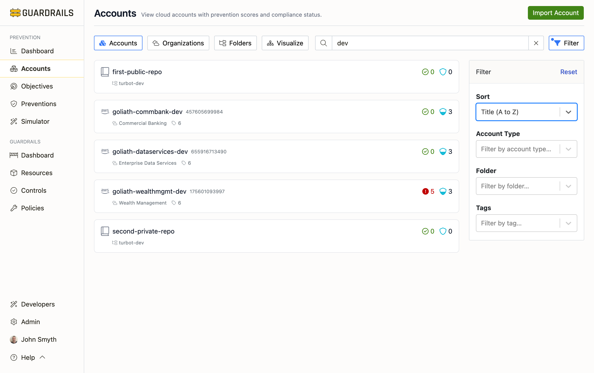

# Accounts

The Accounts section provides multiple views of your cloud accounts, subscriptions, and repositories, helping you monitor prevention coverage across your multi-cloud environment. Each view offers a different perspective on the same data—choose the view that best fits your current task.

## Available Views

The Accounts section provides four different ways to view and analyze your cloud accounts:

### Accounts Tab

The [Accounts tab](/guardrails/docs/prevention/accounts/accounts) provides a flat list view with search, filter, and sort capabilities. This is your go-to view for finding specific accounts, identifying accounts with low prevention scores, or comparing prevention coverage across cloud providers. Each account shows its prevention score (0-5), active alerts, and organizational placement.

Use this view when you need to quickly find accounts needing attention, compare prevention scores across your environment, or investigate specific accounts by name or ID.

### Organizations Tab

The [Organizations tab](/guardrails/docs/prevention/accounts/organizations) displays your cloud provider's native organizational structure—AWS Organizations with OUs, Azure Management Groups, or GCP resource hierarchy. This view helps you understand how organizational policies cascade down through the hierarchy and which accounts inherit which preventions.

Use this view when you need to understand your cloud provider's organization structure, see how SCPs or Azure Policies apply to different organizational units, or identify accounts based on their position in the hierarchy.

### Folders Tab

The [Folders tab](/guardrails/docs/prevention/accounts/folders) groups accounts using Turbot Guardrails folders—logical groupings you define that can span multiple cloud providers. Folders might represent environments (dev, staging, prod), business units, or any other organizational structure that makes sense for your operations.

Use this view when you need to analyze accounts by business context rather than cloud provider hierarchy, compare prevention coverage across logical groupings, or manage accounts that span multiple cloud providers.

### Visualize Tab

The [Visualize tab](/guardrails/docs/prevention/accounts/visualize) provides a graphical tree representation of your organization structure with prevention scores displayed visually. This view makes it easy to spot patterns—clusters of low-scoring accounts, organizational units with weak coverage, or inconsistencies in prevention implementation.

Use this view when you want to see the big picture, identify patterns in prevention coverage, or communicate security posture to stakeholders through visual representation.

## Understanding Account Prevention Scores

[Account prevention scores](/guardrails/docs/prevention#prevention-scores) range from 0 to 5, indicating how well each account is protected:

- **0-2**: Minimal coverage with significant gaps
- **3**: Moderate coverage with noticeable gaps
- **4**: Solid prevention implementation
- **5**: Comprehensive prevention across multiple layers

Account scores aggregate all prevention objectives for that account, weighted by priority. A low score might indicate missing critical P1 controls or lack of coverage across many objectives.

## Next Steps

- Start with the [Accounts tab](/guardrails/docs/prevention/accounts/accounts) to find accounts needing attention
- Use the [Organizations view](/guardrails/docs/prevention/accounts/organizations) to understand cloud provider hierarchy
- Review the [Folders view](/guardrails/docs/prevention/accounts/folders) for business-context groupings
- Explore the [Visualize view](/guardrails/docs/prevention/accounts/visualize) for graphical patterns
- Review [Objectives](/guardrails/docs/prevention/objectives) to understand what's being measured
