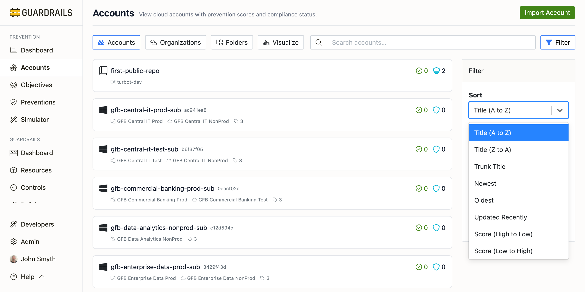

# Accounts

The Accounts page provides a centralized view of all cloud accounts, subscriptions, and repositories managed by Turbot Guardrails. Use this page to monitor prevention scores across your multi-cloud environment and identify accounts requiring attention.

## Understanding the Accounts View

The Accounts page displays all cloud resources organized by account type:

- **AWS Accounts**: Identified by 12-digit account numbers
- **Azure Subscriptions**: Identified by subscription IDs
- **GCP Projects**: Identified by project IDs
- **GitHub Repositories**: Identified by organization/repository name

Each account row displays:

- **Account Name**: The friendly name of the account or subscription
- **Account ID**: The unique identifier (account number, subscription ID, or repository path)
- **Folder/OU**: The organizational folder or organizational unit the account belongs to
- **Prevention Score**: A 0-5 score indicating prevention coverage strength
- **Alerts**: Number of active alerts for the account (click to view alert details)
- **Controls**: Number of controls running on the account

## Navigating Between Views

The Accounts section offers multiple ways to visualize your cloud accounts:

- **Accounts**: List view of all accounts with filtering and sorting (default)
- **Organizations**: Hierarchical view of cloud organization structures
- **Folders**: Logical grouping by Turbot Guardrails folders
- **Visualize**: Graphical representation of account relationships

Switch between views using the tabs at the top of the page.

## Searching and Filtering

### Search

Use the search box to quickly find accounts by name or identifier. The search filters results in real-time as you type.

### Filter Panel

Click the **Filter** button to open the filter panel and narrow your view:

Available filters:

- **Account Type**: Filter by AWS, Azure, GCP, or GitHub accounts
- **Folder**: Show only accounts within specific Turbot Guardrails folders
- **Tags**: Filter by resource tags

## Sorting Accounts

Click the **Sort** dropdown to change how accounts are ordered:

Available sort options:

- **Title (A to Z)**: Alphabetical by account name (default)
- **Title (Z to A)**: Reverse alphabetical order
- **Trunk Title**: Sort by organizational hierarchy path
- **Newest**: Most recently created accounts first
- **Oldest**: Longest-standing accounts first
- **Updated Recently**: Accounts with recent changes first
- **Score (High to Low)**: Best prevention scores first
- **Score (Low to High)**: Lowest prevention scores first—useful for finding gaps

## Understanding Prevention Scores

Prevention scores range from 0 to 5 and indicate how well an account is protected by preventions:

- **0**: No prevention coverage—account has minimal or no preventive controls
- **3**: Moderate coverage—some preventions in place but gaps exist
- **4**: Good coverage—solid prevention implementation
- **6-7**: Strong coverage—comprehensive prevention across multiple layers

Low scores indicate opportunities to improve security posture by implementing additional preventions (SCPs, policies, account settings, or Guardrails controls).

## Common Workflows

**Finding accounts with weak prevention coverage**
1. Sort by Score (Low to High)
2. Review accounts with scores below 4
3. Click into each account to see which objectives are not being met
4. Implement recommended preventions to improve the score

**Reviewing accounts by cloud provider**
1. Open the Filter panel
2. Filter by Account Type (e.g., AWS, Azure, GCP)
3. Review prevention scores across all accounts of that type
4. Identify inconsistencies where some accounts have stronger coverage than others

**Investigating accounts with alerts**
1. Look for accounts with non-zero alert counts in the Alerts column
2. Click the alert count to view alert details in a new tab
3. Review which controls are in alarm state
4. Take corrective action based on alert severity

## Next Steps

- Click on any account name to view detailed prevention scores by objective
- Use the [Organizations](./organizations.md) view to see account hierarchy
- Use the [Folders](./folders.md) view to analyze accounts by logical grouping
- Use the [Visualize](./visualize.md) view for a graphical representation
