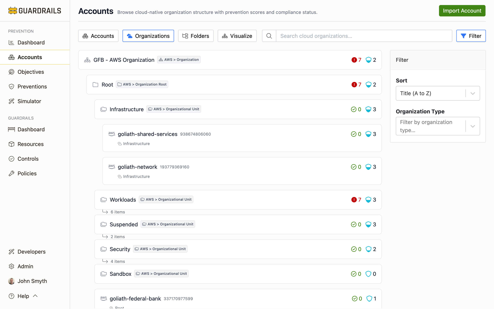

# Organizations

The Organizations view displays cloud accounts organized by their native cloud provider hierarchy. This view shows the organizational structure as defined in AWS Organizations, Azure Management Groups, or GCP Organization hierarchy, making it easy to understand how accounts are structured and where prevention coverage may be inconsistent across organizational boundaries.

## Understanding the Organizations View

The Organizations view shows your cloud accounts in their native hierarchy—AWS Organizations with OUs and accounts, Azure Management Groups with subscriptions, or GCP Organization with folders and projects. Each level displays prevention scores, making it easy to see which branches of your organization have strong or weak coverage.

This view is particularly useful for understanding prevention inheritance. Many preventions, especially Service Control Policies and Azure Policies, apply at the OU or management group level and affect all child accounts. Seeing the hierarchy helps you understand why certain accounts have specific preventions in place and where gaps might exist because a parent-level policy wasn't applied.

If you see "No Organizational Units found," it means no cloud-native organizational structures have been imported yet. This view only appears when accounts belong to AWS Organizations, Azure Management Groups, or GCP Organization hierarchies. Standalone accounts without organizational context won't appear here. Use the Accounts tab instead.

## What Makes This Useful

Expand organizational units to see which branches have lower prevention scores, helping you target remediation to specific business units or environments. If the Production OU scores 4.5 but the Development OU scores 2.0, you know where to focus effort, or you might decide that's acceptable risk tolerance for non-production environments.

When different teams own different OUs, you can quickly compare their prevention maturity. If Team A's OU consistently scores higher than Team B's, that suggests Team A has better implemented preventive controls. This isn't about blame. It's about identifying where teams might need additional support, guidance, or resources to improve their security posture.

The hierarchical view also clarifies why accounts have certain preventions. If an SCP is attached at the organization root, every account inherits it. If an Azure Policy applies at a management group, all subscriptions beneath it are affected. Understanding this inheritance helps you avoid accidentally removing protective controls or understand why an account can't perform certain actions.

## Next Steps

- Return to the [Accounts](/guardrails/docs/prevention/accounts) view for a flat list of all accounts
- Use the [Folders](/guardrails/docs/prevention/accounts/folders) view to see Turbot Guardrails logical groupings
- Click into any organizational unit or account to view detailed prevention scores
