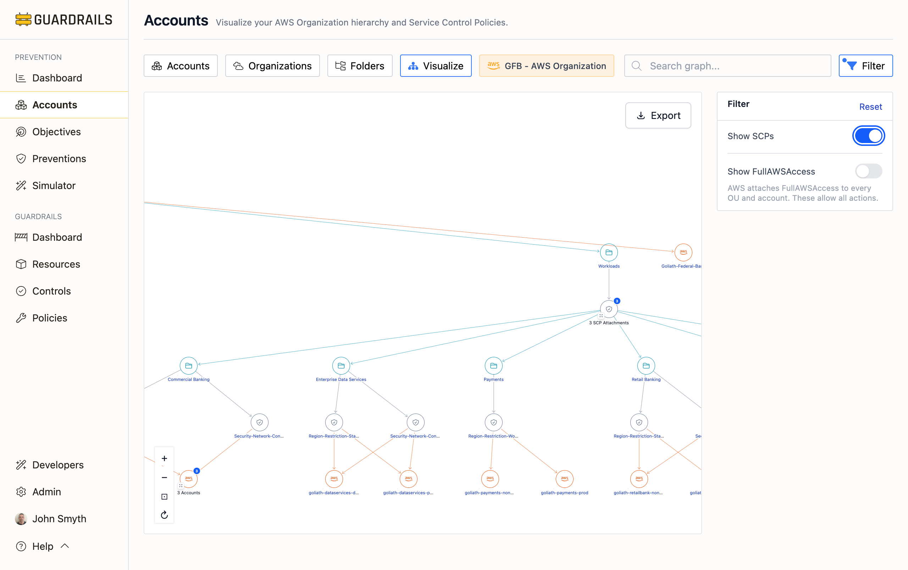

# Visualize

The Visualize page provides a graphical, interactive representation of your AWS Organization hierarchy and Service Control Policies (SCPs). This view helps you understand the structure of your AWS environment, see which accounts are grouped together, and visualize how SCPs are applied across organizational units.

## Understanding the Visualize View

The Visualize view displays AWS Organizations as an interactive tree diagram showing your organization structure from top to bottom: the organization root, organizational units (OUs), and individual accounts. Lines connect the hierarchy to show relationships, and folded nodes (e.g., "3 Accounts") indicate collapsed groups that can be expanded. When the "Show SCPs" filter is enabled, visual indicators show where Service Control Policies are applied.

This graphical representation makes it easy to see the entire organization structure at a glance, understand which accounts belong to which organizational units, and navigate complex multi-level organizational structures.

## Interactive Features

### Navigation

- **Zoom In/Out**: Use the `+` and `−` buttons in the bottom-right corner, or use mouse wheel/touch gestures
- **Pan**: Click and drag on the background to move around the visualization
- **Fit View**: Click the `⊡` button to automatically fit the entire organization tree in the viewport
- **Reset Layout**: Click the `↻` button to reset the tree to its default layout
- **Node Selection**: Click on any organizational unit or account node to navigate to its detail page
- **Search**: Use the "Search graph..." box to quickly find and highlight specific OUs or accounts by name

### Filtering

Use the **Filter** button to control what's displayed in the visualization:

- **Show SCPs**: Toggle this switch to display or hide Service Control Policy attachments on the organization tree. When enabled, SCPs attached to the organization, root, OUs, or accounts will be visually indicated on the graph.
- **Show FullAWSAccess**: Toggle this switch to display or hide the FullAWSAccess SCP that AWS automatically attaches to every OU and account. Since these policies allow all actions and are present everywhere by default, hiding them can reduce visual clutter.

The filter panel can be collapsed by clicking the Filter button again or by clicking outside the panel.

### Exporting

Use the **Export** button to save the organization visualization in various formats:

- **Export as PNG**: Download a high-quality image (1920x1080 resolution) of the entire organization tree, ideal for presentations and documentation
- **Export as SVG**: Download as scalable vector graphics, perfect for high-resolution printing or further editing in design tools
- **Export Viewport**: Export only the current visible viewport as PNG, useful for capturing a specific portion of the tree
- **Export as JSON**: Download the graph data structure (nodes and edges) in JSON format, useful for programmatic analysis or integration with other tools

## Common Use Cases

- **When onboarding new team members or documenting architecture** - Use the visualization to quickly show how your AWS environment is organized. The graphical tree makes it easy to explain which accounts belong to which organizational units, how deep the hierarchy goes, and where specific accounts sit in the structure. Export as PNG or SVG for documentation.

- **When analyzing SCP impact and inheritance** - Enable the "Show SCPs" filter to see which accounts are affected by Service Control Policies. Trace SCP inheritance from the organization root through OUs to individual accounts. This helps you understand the blast radius of policy changes and identify accounts that may be missing required preventions.

- **When planning organizational restructuring** - Use the visualization to evaluate your current structure before making changes. See which accounts would be affected if you move them between OUs, identify OUs that might need consolidation or splitting, and understand dependencies before restructuring the organization hierarchy.

- **When troubleshooting access or policy issues** - Search for a specific account experiencing issues, then trace upward through its OU hierarchy to see all inherited SCPs. This helps identify which policy at which level might be blocking an action or causing unexpected behavior.

## Next Steps

- Return to the [Accounts](/guardrails/docs/prevention/accounts) view for a list of all accounts
- Use the [Organizations](/guardrails/docs/prevention/accounts/organizations) view for a table-based hierarchy view
- Use the [Folders](/guardrails/docs/prevention/accounts/folders) view to see Turbot Guardrails logical groupings
- Click into any account to view detailed prevention scores by objective
