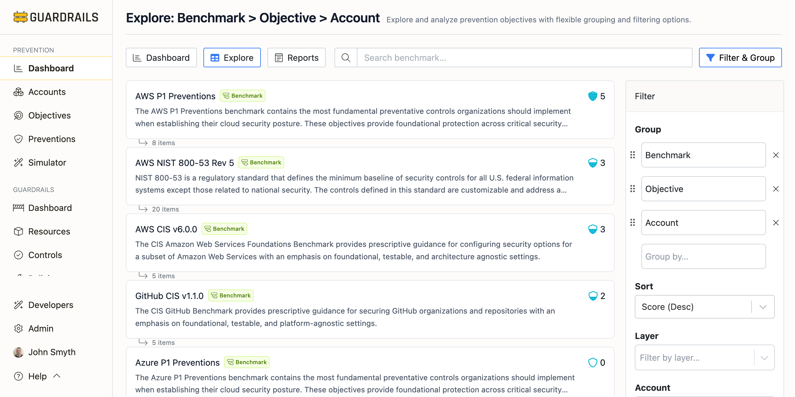
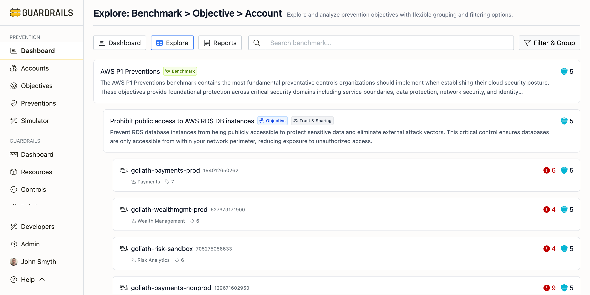
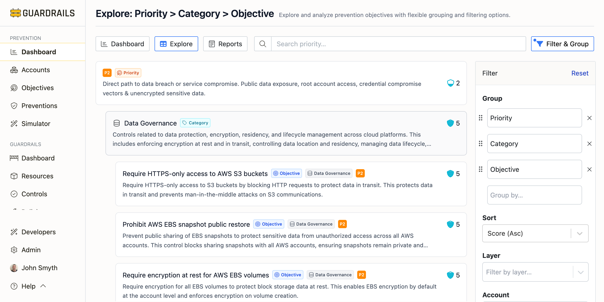
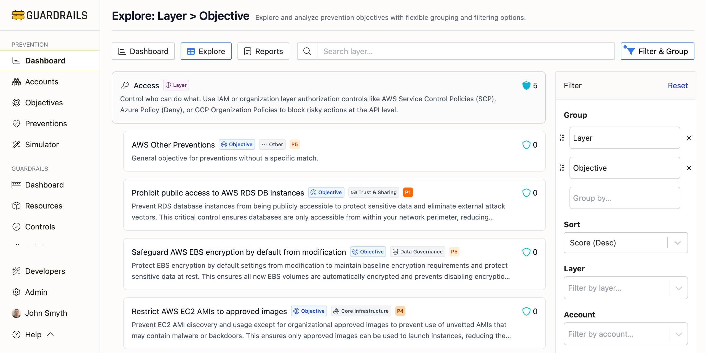

# Explore

The Explore tab lets you analyze prevention scores from multiple perspectives using custom grouping, filtering, and sorting. Think of it as a pivot table for your prevention data—you can arrange it by benchmark, account, category, layer, or priority, filter to specific subsets, and sort to find what matters most.

## Understanding the Explore View

The view displays prevention data in a hierarchical table where [scores](/guardrails/docs/prevention#prevention-scores) aggregate at each level. By default, it groups by Benchmark > Objective > Account, but you can reorganize this however makes sense for your analysis.

Each row shows the name and description, prevention score, and number of child items. Scores are calculated and displayed at every grouping level, rolling up from the most granular data to provide aggregate views at each hierarchy level.

Click the expand/collapse arrow on any card to show or hide its children—this lets you drill down into details or collapse sections to see the big picture. Click on a card's title to navigate to its related detail page for comprehensive information about that specific item.

## Grouping Data

Organize your prevention data hierarchically using up to four levels from these options:

- [Benchmark](/guardrails/docs/prevention/objectives/benchmarks) - Compliance frameworks
- [Objective](/guardrails/docs/prevention/objectives/objectives) - Prevention goals
- [Account](/guardrails/docs/prevention/accounts) - Cloud accounts
- [Category](/guardrails/docs/prevention/objectives/categories) - Security domains
- [Layer](/guardrails/docs/prevention/preventions/layers) - Enforcement stages
- [Priority](/guardrails/docs/prevention/objectives/priorities) - P1-P5 importance levels

Drag and drop grouping handles in the Filter & Group panel to reorder levels.

## Filtering and Sorting

Filter to narrow data by layer, account, objective, category, or priority. This lets you focus on areas of responsibility or concern without noise from irrelevant data.

Sort controls how items order within each group level:

- Score (Asc) - Shows lowest scores first, useful for finding gaps needing attention
- Score (Desc) - Shows highest scores first, good for identifying your strongest areas
- Name (A-Z) - Provides alphabetical order for systematic reviews
- Priority (High to Low) - Puts critical objectives first for prioritization work

## What to Look For

Low scores indicate gaps in prevention coverage—opportunities to add SCPs, policies, or account settings to improve posture. Inconsistent scores across accounts (some score well, others don't) suggest inconsistent policy application—consider organization-wide policies. Missing layers (objectives covered at only one layer) signal opportunities for defense-in-depth by adding controls at additional layers. High-priority gaps (low scores on P1 or P2 objectives) represent the most critical risks and should be prioritized for remediation.

## Common Use Cases

**For compliance audit preparation**, group by Benchmark > Objective > Account, filter to the specific compliance framework, sort by Score (Asc) to identify failing objectives, then expand each low-scoring objective to see which accounts need remediation.

**For account security reviews**, group by Account > Category > Objective, filter to the specific account, review scores across all categories, and identify objectives with low scores to understand what preventions exist (or don't).

**For priority-driven remediation**, group by Priority > Category > Objective, filter to P1 and P2 priorities, sort by Score (Asc), and focus remediation on the lowest-scoring critical objectives first.

**For layer coverage analysis**, group by Layer > Objective, review distribution of objectives across layers, identify objectives with coverage at only one layer, and plan additional controls at other layers for defense-in-depth.

## Next Steps

- Experiment with different grouping combinations to find views matching your analysis needs
- Use filters to focus on areas of concern or responsibility
- Bookmark useful views by copying the URL—filters and groupings are included in URL parameters
- Click through to individual objectives to see detailed prevention and recommendation information
