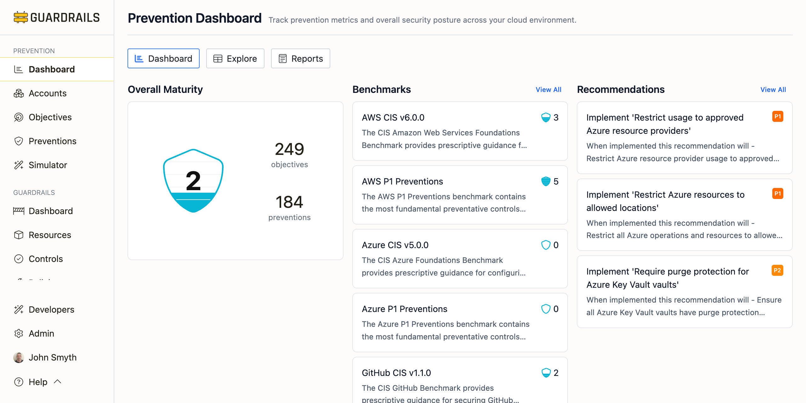

# Dashboard

The Prevention Dashboard gives you a single-page view of your preventive security posture, including your overall prevention score, how you're tracking against compliance benchmarks, top recommendations for improvement, and breakdowns by category and layer. This is your starting point for understanding where you stand and where to focus effort.

## Overall Maturity

Your [prevention score](/guardrails/docs/prevention#prevention-scores) (0-5 scale) appears at the top, reflecting how effectively your preventions meet security objectives across all accounts. The score considers coverage (how many objectives have preventions), quality (how strong those preventions are through layer weighting), and importance (priority weighting). Below the score you'll see total objectives being tracked and total preventions discovered in your environment. Click this section to explore detailed scores by account and objective.

## Benchmarks

Shows your prevention scores against compliance frameworks such as AWS CIS, NIST 800-53, Azure CIS, GitHub CIS, and P1 Preventions for each platform. Each benchmark card displays the name, description, and your current score. This helps you quickly see how close you are to compliance certification or where gaps exist. Click View All to see your complete list of benchmarks and drill into objective-level details.

## Recommendations

Your top 3 recommendations for improving prevention posture appear here. Each shows the objective title, priority level (P1-P5), what will be accomplished when implemented, and concrete implementation guidance. These are prioritized by opportunity, considering security impact, coverage gaps, and compliance requirements, so the highest-value work surfaces first. Click View All to browse all available recommendations and their detailed implementation steps.

## Categories

Shows your prevention score for each of the seven security domains: Identity & Access (privileged access and authentication), Feature Restrictions (disabling risky service features), Trust & Sharing (external access prevention), Data Governance (data protection and encryption), Network Perimeter (connectivity restrictions), Core Infrastructure (foundational governance protections), and Audit & Logging (audit trail protection).

Each category card shows the number of objectives and your prevention score. This helps spot imbalances. If most categories score 4+ but Data Governance scores 1.5, you know where to focus. Click any category or View All to explore objectives and detailed scores.

## Layers

Shows how your preventions are distributed across enforcement layers: Build (IaC scanning and CI/CD controls), Access (organization-level policies like SCPs and Azure Policies), Config (account and service settings enforcing secure defaults), and Runtime (real-time remediation and enforcement).

Each layer card shows the number of objectives with controls at that layer and your prevention score. Balanced coverage across layers provides defense-in-depth. If one layer fails, others provide backup. Click any layer or View All to analyze your defense-in-depth strategy.

## Next Steps

- Click any section on the dashboard to drill into detailed scores and analysis
- Use the [Explore](/guardrails/docs/prevention/dashboard/explore) tab to customize groupings and filters for deeper investigation
- Review [Reports](/guardrails/docs/prevention/dashboard/reports) for specialized views like service boundaries and region restrictions
- Implement your top recommendations—starting with P1 priorities—and monitor your score over time as you add new preventions and expand coverage
