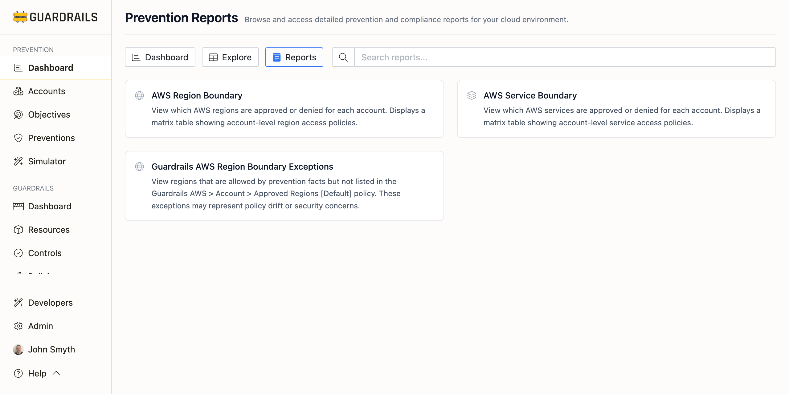
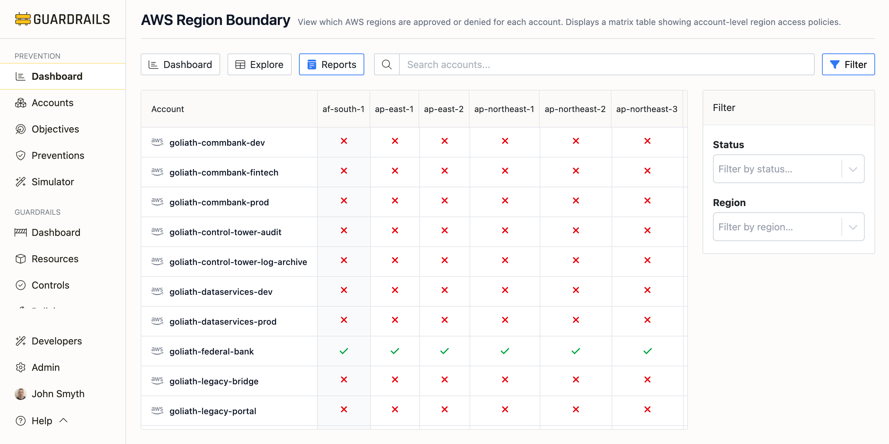
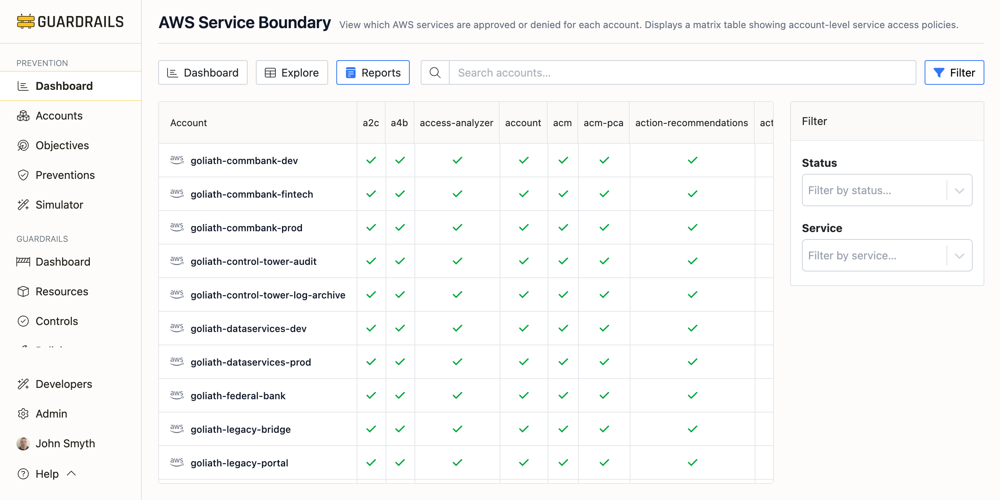
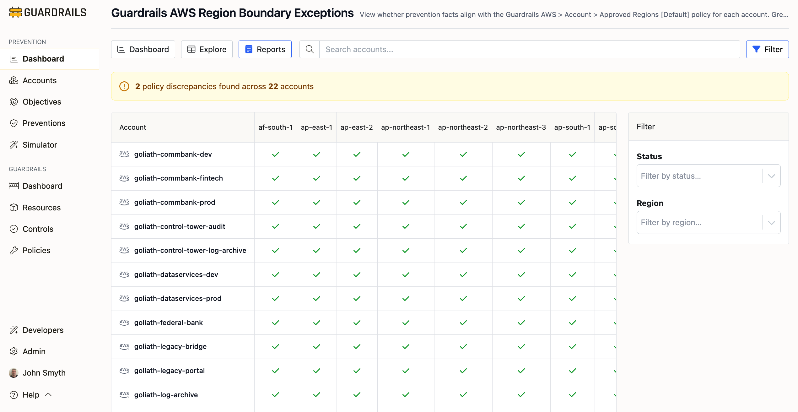

# Reports

The Reports tab provides specialized views that show the effective security boundaries in your cloud environment. These reports aggregate prevention data to answer practical questions like "Which AWS services can my developers use?" or "What regions are blocked across my organization?"

## Understanding Prevention Reports

Reports focus on the **net effect** of your preventions rather than individual policies. They are particularly valuable for:
- **Troubleshooting**: Understanding why operations are blocked or allowed
- **Compliance auditing**: Verifying security boundaries match your policies
- **Change validation**: Confirming preventions work as intended
- **Communication**: Explaining security boundaries to development teams

## Available Reports

### AWS Region Boundary

Shows which AWS regions are approved or denied for each account in a matrix table. Use this report to:
- Identify which regions are available in each account
- Spot inconsistencies in region policies across accounts
- Verify compliance with data residency requirements
- Understand effective region boundaries enforced by SCPs and policies

The report aggregates all preventions (SCPs, RCPs, and access policies) to show actual usable regions.

### AWS Service Boundary

Shows which AWS services are approved or denied for each account in a matrix table. Use this report to:
- See which AWS services can be provisioned in each account
- Identify service restrictions that may block legitimate workloads
- Verify high-risk services are properly restricted
- Understand your approved service catalog

Aggregates all preventions to show which services are available after all policies are evaluated.

### Guardrails AWS Region Boundary Exceptions

Identifies regions allowed by preventions (SCPs, RCPs) but NOT listed in the Guardrails `AWS > Account > Approved Regions [Default]` policy. These exceptions may indicate:
- **Policy drift**: SCPs and Guardrails policies are out of sync
- **Security concerns**: Regions allowed at SCP level but not approved in Guardrails
- **Configuration errors**: Guardrails policy needs updating

Useful when using both preventions and Guardrails runtime controls to maintain consistency between access-layer and runtime-layer enforcement.

## Using Reports

Reports are derived from **prevention facts**—information extracted from your preventions. For example, when Guardrails discovers an SCP deny statement blocking EC2 in us-west-1, it creates a fact recording that region as blocked. Reports aggregate these facts across accounts to show the complete picture.

### Common Use Cases

**Onboarding new accounts**
Review service and region boundary reports to understand what will be available based on organizational SCPs.

**Troubleshooting deployment failures**
Check the service boundary report when deployments fail with access denied errors.

**Compliance reporting**
Use region boundary reports to demonstrate resources cannot be created in non-compliant regions.

**Security validation**
After implementing new preventions, review boundary reports to confirm intended effects.

### Understanding Boundaries

Service and region boundaries are calculated by evaluating:
1. **Deny statements** in SCPs and RCPs that block services or regions
2. **Allow boundaries** defined by SCP allow statements (when using allow lists)
3. **Service control settings** like enabled/disabled services
4. **Inheritance** of policies from parent organizational units

Reports show the **effective boundary**—what is actually accessible after all policies are applied.

## Next Steps

- Review the AWS Service Boundary report to verify your approved service catalog
- Check the AWS Region Boundary report to ensure data residency requirements are enforced
- If using Guardrails runtime controls, review Region Boundary Exceptions to identify policy drift
- Use reports during security reviews and compliance audits
