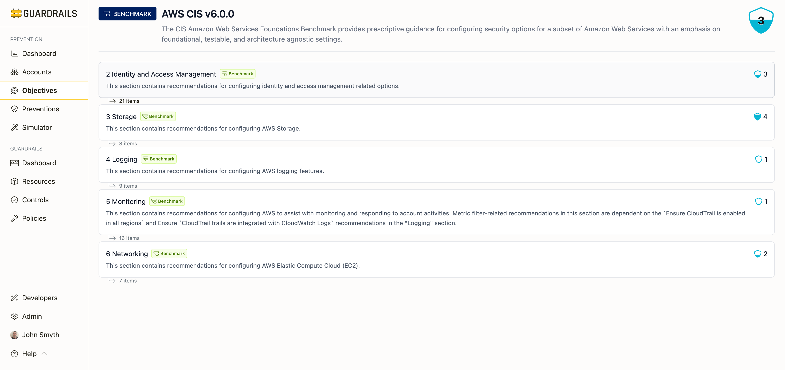

# Benchmark Detail

The Benchmark Detail page provides a comprehensive view of a compliance framework or industry standard, showing how your organization scores against each section of the benchmark and which specific objectives need attention.

## Understanding Benchmarks

Benchmarks are collections of prevention objectives organized into logical groups. They represent industry standards, compliance frameworks, or vendor best practices for securing cloud environments.

**Common benchmark types:**
- **CIS Benchmarks**: Center for Internet Security foundations for AWS, Azure, GCP, and GitHub
- **NIST Standards**: Federal security standards like NIST 800-53
- **Vendor P1 Preventions**: Cloud provider-specific fundamental controls
- **Custom Benchmarks**: Organization-specific security frameworks

## Page Layout

The benchmark detail page displays:

### Header Section

- **Benchmark name and version**: E.g., "AWS CIS v6.0.0"
- **Description**: What the benchmark covers and its purpose
- **Overall score**: Current prevention score (0-5) across all accounts

### Sections

Benchmarks are organized into collapsible sections representing logical groupings of objectives:

**Example sections from AWS CIS v6.0.0:**
- 2 Identity and Access Management (21 items, score: 3)
- 3 Storage (3 items, score: 4)
- 4 Logging (9 items, score: 1)
- 5 Monitoring (16 items, score: 1)
- 6 Networking (7 items, score: 2)

Each section displays:
- **Section number and name**: How the benchmark organizes objectives
- **Section description**: What this section covers
- **Item count**: Number of objectives in this section
- **Section score**: Prevention score (0-5) for this section

## Expanding Sections

Click on any section to expand it and view the objectives it contains:

When expanded, each section shows:
- Individual objective titles
- Objective descriptions
- Priority levels (P1, P2, P3, P4)
- Current scores for each objective
- Categories each objective belongs to

This hierarchical view helps you:
- Understand how objectives are grouped in the benchmark
- Identify which sections have lower scores
- Focus remediation efforts on specific benchmark areas
- Track progress toward benchmark compliance

## Interpreting Scores

**Benchmark scores** represent overall compliance with the framework:
- **5**: Full compliance—all objectives are met
- **4**: Strong compliance—most objectives are met
- **3**: Moderate compliance—partial implementation
- **2**: Limited compliance—significant gaps exist
- **0-1**: Minimal or no compliance

**Section scores** show compliance within each grouping:
- High-scoring sections indicate strong coverage in that domain
- Low-scoring sections highlight areas needing attention

**Why section scores matter:**
Some compliance frameworks require minimum scores in specific sections. For example, you might need a score of 4+ in the "Identity and Access Management" section to meet certain regulatory requirements.

## Common Workflows

**Assessing compliance against a benchmark**
1. Open the benchmark detail page
2. Review the overall score in the header
3. Scan the section scores to identify weak areas
4. Expand low-scoring sections to see specific objectives
5. Note which objectives have scores below your target threshold

**Planning remediation work**
1. Identify sections with the lowest scores
2. Expand those sections to see individual objectives
3. Click on each objective to understand:
   - Why it's important (from the objective detail page)
   - Which accounts fail this objective
   - What preventions are needed
   - How to implement those preventions
4. Create a remediation plan prioritizing P1 and P2 objectives
5. Track progress by monitoring section scores over time

**Comparing compliance across frameworks**
1. Open multiple benchmark detail pages in different tabs
2. Compare overall scores across benchmarks
3. Identify common objectives that appear in multiple benchmarks
4. Focus on implementing objectives that satisfy multiple frameworks
5. Use this analysis to prioritize work that provides broad compliance value

**Reporting compliance to stakeholders**
1. Open the relevant benchmark (e.g., AWS CIS v6.0.0)
2. Note the overall score and date
3. Document section scores to show compliance breakdown
4. Screenshot or export section scores for reports
5. Highlight sections with high scores to demonstrate strengths
6. Identify low-scoring sections and explain remediation plans

## Understanding Benchmark Sections

Different benchmarks organize objectives differently:

**CIS Benchmarks** typically group by service or function:
- Identity and Access Management
- Storage
- Logging
- Monitoring
- Networking
- Data Protection

**NIST Frameworks** organize by control families:
- Access Control (AC)
- Audit and Accountability (AU)
- Configuration Management (CM)
- Identification and Authentication (IA)
- System and Communications Protection (SC)

**Vendor P1 Preventions** group by prevention category:
- Core Infrastructure
- Identity & Access
- Data Governance
- Trust & Sharing
- Network Perimeter
- Audit & Logging

Understanding how your benchmark organizes objectives helps you navigate the framework and communicate with stakeholders who are familiar with the standard.

## Working with Custom Benchmarks

You can create custom benchmarks to track organization-specific security requirements:

**When to create custom benchmarks:**
- Your organization has security requirements beyond industry standards
- You need to track internal security policies
- You want to measure progress toward organizational security goals
- You need to demonstrate compliance with customer-specific requirements

Custom benchmarks follow the same structure as industry standards, allowing you to organize objectives into meaningful sections that align with your security program.

## Next Steps

- Return to [Objectives](./index.md) to view all benchmarks
- Click into individual objectives to see account coverage and implementation guidance
- Review [Recommendations](../recommendations/index.md) for prioritized remediation guidance
- Check [Accounts](../accounts/index.md) to see which accounts need attention for this benchmark
