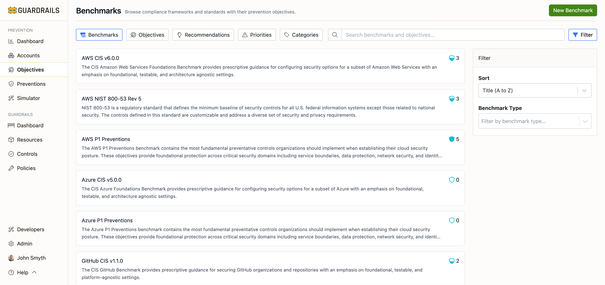

# Benchmarks

The Benchmarks tab displays compliance frameworks and industry standards that define prevention objectives. This page helps you track your compliance posture across multiple frameworks and understand which objectives you need to implement to meet specific compliance requirements.



## Understanding Benchmarks

Benchmarks are collections of security objectives organized by compliance frameworks and industry standards. Each benchmark provides prescriptive guidance for securing your cloud environment according to established best practices.

**Common benchmarks:**
- **AWS CIS v6.0.0**: CIS Amazon Web Services Foundations Benchmark
- **AWS NIST 800-53 Rev 5**: NIST security controls for federal information systems
- **AWS P1 Preventions**: Fundamental preventative controls for AWS
- **Azure CIS v5.0.0**: CIS Azure Foundations Benchmark
- **Azure P1 Preventions**: Fundamental preventative controls for Azure
- **GCP CIS v3.0.0**: CIS Google Cloud Platform Foundation Benchmark
- **GitHub CIS v1.1.0**: CIS GitHub Benchmark for repository security

## Page Layout

### Header Section

- **Page title**: "Benchmarks - Browse compliance frameworks and standards with their prevention objectives"
- **Navigation tabs**: Benchmarks, Objectives, Recommendations, Priorities, Categories
- **Search box**: Find benchmarks by name or description
- **Filter button**: Filter by benchmark type or account
- **Sort dropdown**: Order by title, type, or score

### Benchmark Cards

Each benchmark card displays:
- **Benchmark name and version**: e.g., "AWS CIS v6.0.0"
- **Description**: What the benchmark covers and its purpose
- **Prevention score**: Current score (0-5) indicating compliance across all accounts
- **Icon**: Visual indicator of the framework type

**Example benchmark card:**
```
AWS CIS v6.0.0
The CIS Amazon Web Services Foundations Benchmark provides prescriptive guidance
for configuring security options for a subset of Amazon Web Services with an
emphasis on foundational, testable, and architecture agnostic settings.

Score: 3
```

## Search and Filter

**Search functionality:**
Use the search box to find benchmarks by:
- Benchmark name (e.g., "CIS", "NIST", "PCI")
- Cloud provider (e.g., "AWS", "Azure", "GCP")
- Framework version (e.g., "v6.0.0", "Rev 5")

**Filter options:**
Click the Filter button to narrow the list:
- **By Benchmark Type**: CIS, NIST, P1 Preventions, custom benchmarks
- **By Account**: Show only benchmarks that apply to specific accounts
- **By Cloud Provider**: AWS, Azure, GCP, GitHub, or multi-cloud

**Sort options:**
Order benchmarks by:
- **Title (A to Z)**: Alphabetical order (default)
- **Title (Z to A)**: Reverse alphabetical
- **Score (High to Low)**: Show best-performing benchmarks first
- **Score (Low to High)**: Show benchmarks needing the most work

## Understanding Benchmark Scores

Benchmark scores range from 0 to 5 and indicate your overall compliance level:

- **5**: Full compliance—all benchmark objectives are met across all accounts
- **4**: Strong compliance—most objectives are met, minor gaps exist
- **3**: Moderate compliance—significant objectives are met, some work needed
- **2**: Limited compliance—many objectives are not yet met
- **0-1**: Minimal compliance—benchmark requirements are largely unmet

The score is calculated based on how many of the benchmark's objectives have been achieved across all applicable accounts in your environment.

## Benchmark Structure

Benchmarks are organized hierarchically:

**Sections**
Each benchmark is divided into logical sections (e.g., "Identity and Access Management", "Storage", "Logging").

**Objectives**
Each section contains multiple prevention objectives that define specific security goals.

**Recommendations**
Each objective can be satisfied by implementing one or more preventions (SCPs, Azure Policies, etc.).

## Common Workflows

**Reviewing compliance for a specific framework**
1. Find your target benchmark (e.g., AWS CIS v6.0.0) in the list
2. Note the current score across all accounts
3. Click the benchmark card to view its detail page
4. Review sections to identify which areas have lower scores
5. Drill into low-scoring sections to see specific objectives that need work

**Tracking compliance progress over time**
1. Note the current score for your target benchmark
2. Implement preventions for low-scoring objectives
3. Return to the benchmarks page regularly to monitor score improvements
4. Focus on P1 and P2 objectives first for maximum impact

**Comparing frameworks**
1. Review scores across multiple benchmarks
2. Identify which frameworks you're closest to achieving
3. Note common objectives across frameworks
4. Prioritize implementing preventions that satisfy multiple frameworks

**Planning compliance initiatives**
1. Select the benchmark you need to achieve (e.g., for audit requirements)
2. Click the benchmark to see all its objectives
3. Filter by priority to focus on critical requirements first
4. Use the Recommendations tab to get implementation guidance
5. Track progress by monitoring the benchmark score

**Understanding framework requirements**
1. Click on a benchmark to view its detail page
2. Review the benchmark description to understand its scope
3. Examine the section structure to see how objectives are organized
4. Click into individual sections to see detailed objectives
5. Note the priority levels assigned to each objective

## Benchmark Types

**Industry Standards**
- CIS Benchmarks: Community-developed security configuration standards
- NIST Frameworks: US government security frameworks (800-53, CSF)
- PCI DSS: Payment Card Industry Data Security Standard
- ISO 27001: International information security management standard

**Cloud Provider Best Practices**
- AWS Well-Architected Framework Security Pillar
- Azure Security Benchmark
- Google Cloud Security Best Practices

**Turbot Prevention Frameworks**
- P1 Preventions: Most fundamental preventative controls
- P2 Preventions: Important high-impact preventions
- Industry-Specific: Healthcare (HIPAA), Finance (SOX), Government (FedRAMP)

**Custom Benchmarks**
Organizations can create custom benchmarks tailored to:
- Internal security policies
- Regulatory requirements
- Client or partner obligations
- Industry-specific needs

## Best Practices

**Focus on one benchmark at a time**
Rather than trying to achieve multiple benchmarks simultaneously, focus efforts on completing one framework to build momentum and demonstrate measurable progress.

**Start with P1 objectives**
Within any benchmark, prioritize critical (P1) objectives that provide foundational security before moving to P2 and P3.

**Implement preventions that satisfy multiple benchmarks**
Many security controls are common across frameworks. Prioritize preventions that help you achieve compliance with multiple benchmarks simultaneously.

**Use benchmarks to drive remediation priorities**
When executives ask "what should we work on next?", use benchmark scores to provide data-driven guidance.

**Track and celebrate progress**
Monitor benchmark scores over time and celebrate incremental improvements to maintain team motivation.

**Align benchmarks with business objectives**
Choose benchmarks that align with your organization's compliance obligations, customer requirements, and security maturity goals.

## Next Steps

- Click into any [benchmark detail page](./benchmark-detail.md) to see its grouped objectives
- Review [Objectives](./objectives.md) to see all individual objectives across all benchmarks
- Check [Priorities](./priorities.md) to focus on critical objectives first
- View [Categories](./categories.md) to ensure balanced security coverage
- Visit [Recommendations](../recommendations/index.md) for implementation guidance
