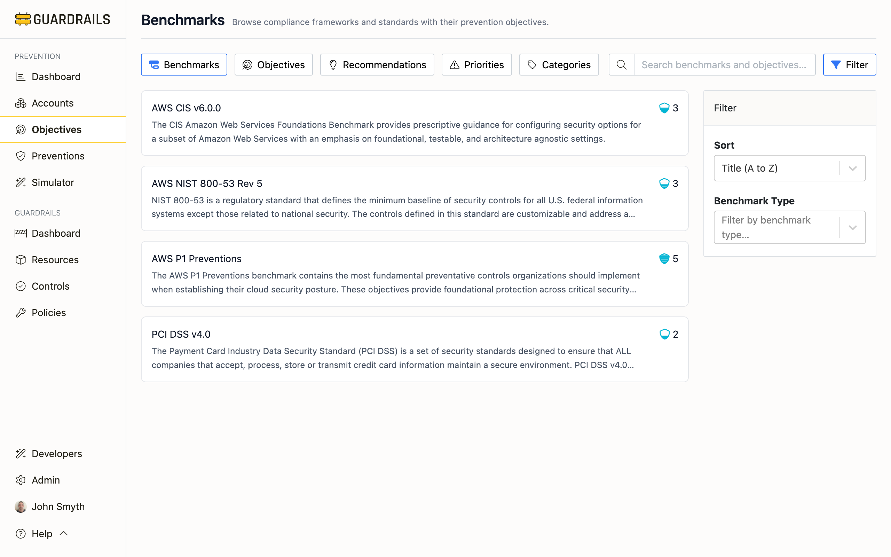

# Benchmarks

Benchmarks are compliance frameworks that define what good security looks like for a specific cloud provider or technology. When you need to prove compliance with AWS CIS, meet NIST 800-53 requirements, or follow Azure security best practices, this is where you track your progress.

## What You're Looking At

Each card represents a compliance framework. AWS CIS v6.0.0 is the Center for Internet Security's benchmark for AWS—a collection of security objectives that, when implemented, represent industry best practice. NIST 800-53 Rev 5 is the federal government's security control framework. The "P1 Preventions" benchmarks are Turbot's own frameworks focusing on the most critical preventive controls for each cloud provider.

The score next to each benchmark tells you how well you're meeting that framework's requirements across all your accounts. A score of 5 means you're fully compliant—every objective in the benchmark is being met. A score of 2 means you're missing most of the requirements. This isn't a pass/fail—it's a maturity indicator showing where you are and how much work remains.

What makes this view valuable is seeing all your frameworks in one place. Instead of tracking AWS CIS compliance separately from NIST 800-53 compliance, you can see both scores immediately and prioritize based on which certifications matter most to your organization.

## How Benchmarks Are Organized

Benchmarks aren't flat lists—they're hierarchical. Click into AWS CIS v6.0.0 and you'll see it's organized into sections like "Identity and Access Management," "Storage," and "Logging." Each section contains related objectives. For example, the IAM section might include "Require MFA for root user" and "Eliminate use of root user for administrative and daily tasks."

This structure mirrors how the frameworks themselves are published, making it easier to map audit requirements to your implementation. When an auditor asks about CIS section 1.5, you can navigate directly to that section and see your current state.

## Using Benchmarks for Compliance

If you're pursuing AWS CIS certification, click into that benchmark and review the sections. Sections with low scores need attention—click through to see which specific objectives aren't being met. From there, you can identify what preventions you need to implement.

The search and sort functions help when you're dealing with multiple frameworks. Sort by score to see which benchmarks need the most work. Search for "CIS" to see all your CIS frameworks across different cloud providers at once.

One common pattern: use the P1 Preventions benchmarks as your baseline. These represent Turbot's view of the most critical controls for each cloud. Once you have strong P1 coverage, layer on compliance frameworks like CIS or NIST as needed for certification.

## Working With Benchmark Scores

Don't fixate on achieving a perfect 5.0 score immediately. Compliance is a journey—going from 2.0 to 3.5 might take months of work, and that's meaningful progress. Focus on section-level scores to identify weak areas. If your overall CIS score is 3.2 but the Logging section scores 1.5, you know where to focus.

Some benchmarks overlap significantly. Many controls that satisfy AWS CIS also satisfy NIST 800-53. This means implementing one prevention can improve multiple benchmark scores simultaneously. The system tracks this automatically, so you don't need to manually map controls to frameworks.

A practical approach: start with P1 Preventions to build your foundation, then pursue compliance frameworks as business needs dictate. If you're selling to government customers, prioritize NIST 800-53. If you're in healthcare, prioritize frameworks that align with HIPAA requirements. Focus on one benchmark at a time rather than spreading effort across multiple frameworks—complete one, then move to the next.

## Benchmark Detail View

Clicking any benchmark opens the Benchmark Detail page, which provides a comprehensive view of that compliance framework, showing how your organization scores against each section of the benchmark and which specific objectives need attention.

The Benchmark Detail page shows:

**Hierarchical Sections** - Benchmarks organize into collapsible sections representing logical groupings. AWS CIS v6.0.0, for example, has sections like Identity and Access Management (21 items), Storage (3 items), Logging (9 items), Monitoring (16 items), and Networking (7 items). Each section shows its description, item count, and prevention score (0-5).

**Section Scores** - Show compliance within each grouping. High-scoring sections indicate strong coverage in that domain while low-scoring sections highlight areas needing attention. Section scores matter because some compliance frameworks require minimum scores in specific sections.

**Individual Objectives** - Click any section to expand and view individual objectives with their titles, descriptions, priority levels (P1-P4), current scores, and categories. This hierarchical view helps you identify which sections have lower scores and focus remediation on specific benchmark areas.

### Using the Detail View

To assess compliance against a benchmark, review the overall score in the header, scan section scores to identify weak areas, expand low-scoring sections to see specific objectives, and note which objectives score below your target threshold.

When planning remediation work, identify sections with the lowest scores, expand those sections to see individual objectives, click on each objective to understand why it's important and what preventions are needed, create a remediation plan prioritizing P1 and P2 objectives, and track progress by monitoring section scores over time.

For comparing compliance across frameworks, open multiple benchmark detail pages, compare overall scores, identify common objectives that appear in multiple benchmarks, and focus on implementing objectives that satisfy multiple frameworks.

### Custom Benchmarks

You can create custom benchmarks to track organization-specific security requirements—when you have requirements beyond industry standards, need to track internal security policies, want to measure progress toward organizational security goals, or need to demonstrate compliance with customer-specific requirements.

## Next Steps

- Review [Objectives](/guardrails/docs/prevention/objectives/objectives) to see all individual objectives across all benchmarks
- Check [Priorities](/guardrails/docs/prevention/objectives/priorities) to focus on critical objectives first
- View [Categories](/guardrails/docs/prevention/objectives/categories) to ensure balanced security coverage
- Visit [Recommendations](/guardrails/docs/prevention/objectives/recommendations) for implementation guidance
