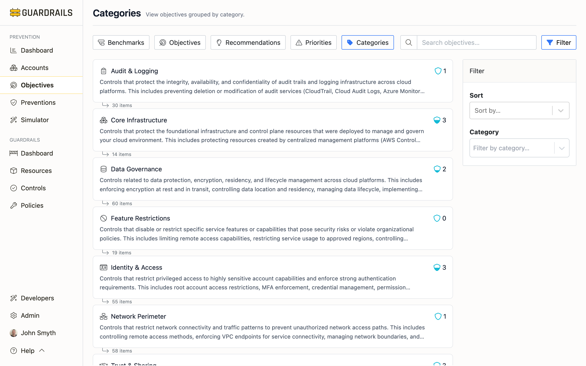

# Categories

Categories organize objectives by security domain—Identity & Access, Data Governance, Trust & Sharing, and so on. This view helps you spot blind spots. You might have excellent identity preventions but weak data protection, or strong network perimeter defenses but poor audit logging. Balanced coverage across categories generally means stronger overall security.

## Why Categories Matter

Security isn't just one thing—it's protecting data, managing identities, controlling network access, maintaining audit trails, and more. Focusing too heavily on one category while neglecting others creates vulnerabilities. Attackers don't need to break through your strongest defenses; they'll exploit your weakest area.

The category view makes these imbalances visible. If your Identity & Access objectives score 4.5 on average but your Data Governance objectives score 2.1, you have a problem. You might prevent unauthorized access perfectly, but once someone gets in (insider threat, compromised credential), your data isn't protected.

## The Seven Security Domains

### Core Infrastructure

Core Infrastructure objectives protect the foundational preventions and governance capabilities that make everything else work. This includes restricting resources to allowed regions (so you can actually monitor and protect them), limiting which cloud services can be used (reducing attack surface), and protecting the infrastructure that provides governance—like AWS Config, IAM Access Analyzer, or Azure landing zones.

If you don't restrict resources to allowed regions, you might have workloads running in regions where your security tools don't operate. If you don't enforce IMDSv2 on EC2 instances, metadata service exploits remain possible.

Common gaps include allowing resources in too many regions, not restricting risky or unnecessary services, and not protecting the governance infrastructure itself from deletion or modification.

### Data Governance

Data Governance covers everything related to protecting the data itself—encryption at rest, encryption in transit, public access controls, data classification, lifecycle management, and secret scanning. This category often has the most objectives because data protection touches so many services and configurations.

Common gaps include unencrypted data stores, missing soft delete capabilities, lack of data classification tags, and no secret scanning in source code repositories. Many organizations implement strong perimeter and identity preventions but leave data itself poorly protected.

### Identity & Access

Identity & Access objectives restrict privileged access—root account usage, administrative permissions, MFA requirements, credential management. These preventions prevent account takeover, privilege escalation, and unauthorized access to sensitive capabilities.

Common gaps include root access keys still existing, no MFA on root accounts, overly permissive IAM policies granting wildcard permissions, and too many users with administrative access. These gaps are often remnants of early-stage fast development that were never cleaned up.

### Trust & Sharing

Trust & Sharing objectives prevent external or anonymous access. This includes blocking public S3 buckets, preventing public databases, restricting cross-account access, and controlling external sharing of resources. The category is about defining and enforcing trust boundaries—who should have access and who shouldn't.

Common gaps include permitting public resource creation, not controlling cross-account IAM trust relationships, allowing anonymous access to cloud resources, and permitting overly broad resource sharing via service-specific mechanisms.

### Network Perimeter

Network Perimeter objectives restrict network connectivity—VPC configurations, security group rules, network ACLs, and traffic patterns. These preventions control how network traffic flows between resources, from internet to cloud, and between cloud environments.

Common gaps are allowing unrestricted inbound SSH or RDP (opening every instance to brute force attacks), not using private endpoints for sensitive services, overly permissive security groups, and lack of network segmentation between environments.

### Audit & Logging

Audit & Logging objectives protect audit trails and logging infrastructure. This includes enabling CloudTrail, protecting log data from deletion or modification, ensuring diagnostic settings are configured, and maintaining log retention. These preventions support forensics, compliance, and incident response.

Without logs, you can't investigate incidents, prove compliance, or detect attacks. An attacker's first move after compromise is often to disable logging or delete logs to hide their activity.

Common gaps include not enabling CloudTrail in all regions, not protecting CloudTrail from deletion or modification, missing log retention policies, not enabling diagnostic settings on key resources, and not protecting log storage from deletion.

### Feature Restrictions

Feature Restrictions objectives disable or limit risky service features—things like disabling EC2 serial console access, restricting Lambda function URLs, or controlling which AMIs can be launched.

These preventions reduce attack surface by removing capabilities that aren't needed. If you don't use Lambda function URLs, disabling them eliminates that attack vector. If you only use specific AMIs, restricting others prevents launching untrusted images.

Common gaps are leaving unused service features enabled, not restricting which resources or configurations are permitted, and allowing risky features without compensating preventions.

## Common Use Cases

- **To identify security blind spots** - Review the average [score](/guardrails/docs/prevention#prevention-scores) for each category. If most categories score 3.5-4.5 but one scores 1.5-2.5, that's your weak domain. Even if you have excellent overall coverage, the weak category represents a vulnerability attackers can exploit.

- **To assess balanced coverage** - A balanced security program typically has reasonably consistent scores across categories—maybe 3.5-4.5 across the board. Highly unbalanced programs—like 5.0 for Identity & Access but 1.5 for Data Governance—indicate resource allocation problems or strategic gaps.

- **Understanding environment-specific imbalances** - Some imbalance is normal based on your environment. If you're primarily using serverless architectures, Network Perimeter might be less relevant than Data Governance. If you're heavily IaC-driven, Core Infrastructure (region restrictions, service restrictions) might score higher naturally.

## Next Steps

- Click into any category to see all its objectives and current scores
- Review [Priorities](/guardrails/docs/prevention/objectives/priorities) to ensure high-priority objectives are addressed across all categories
- Check [Benchmarks](/guardrails/docs/prevention/objectives/benchmarks) to see how categories map to compliance frameworks
- Visit [Recommendations](/guardrails/docs/prevention/objectives/recommendations) to get guidance on improving weak categories
