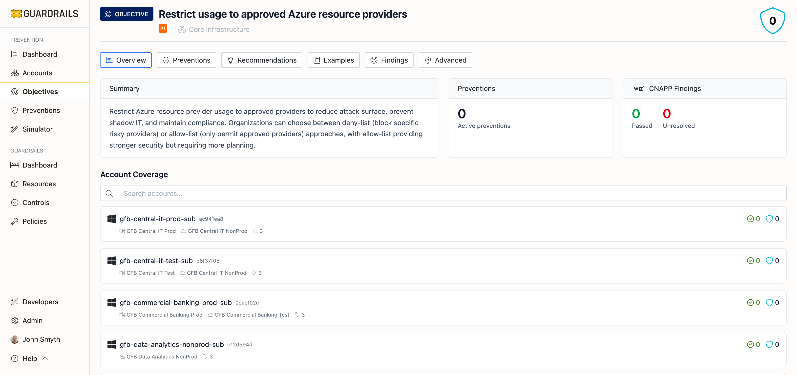

# Objective Detail

The Objective Detail page provides in-depth information about a single prevention objective—which accounts meet it, which preventions achieve it, implementation recommendations, policy examples, and CNAPP findings. This is where you go to understand a specific security goal and figure out how to implement it.

## Understanding the Page

The page header shows the objective title, priority badge (P1-P4), category (security domain like Trust & Sharing or Identity & Access), and overall score (0-5) across all accounts. Six tabs organize the information: Overview (summary and account coverage), Preventions (list of controls achieving this objective), Recommendations (actionable implementation guidance), Examples (code samples and policy templates), Findings (CNAPP tool findings), and Advanced (technical details and API information).

## Overview Tab

The Overview tab shows a summary explaining what this objective prevents or enforces, why it matters, what risks it mitigates, and how it protects your environment. It displays the number of active preventions achieving this objective (click to view the full list on the Preventions tab).

CNAPP Findings shows results from external security scanning tools like Wiz—how many resources pass this objective versus how many remain unresolved. This provides validation that complements prevention-based controls with detection-based verification.

The Account Coverage table shows all accounts and their prevention scores (0-5) for this specific objective. Score of 5 means the objective is fully met through preventions. Score of 4 indicates strong coverage. Score of 3 means partial coverage. Scores of 0-2 signal the objective is not being met or has minimal coverage. Use the search box to quickly find specific accounts when managing hundreds across multiple cloud providers.

## Preventions Tab

Lists all preventions achieving this objective. Each entry shows the prevention name (what it does), prevention type (SCP, Azure Policy, GCP Organization Policy, or Guardrails control), layer (Build, Access, Config, or Runtime), and implementation status (active, available, or recommended). Click any prevention for detailed implementation instructions.

## Recommendations Tab

Provides actionable guidance including step-by-step implementation instructions, cloud provider-specific configurations, prerequisites and dependencies, potential impact and considerations, and testing guidance. Recommendations are prioritized by security impact, compliance requirements, implementation complexity, and organizational readiness.

## Examples Tab

Provides concrete policy templates and code samples—SCP templates for AWS, Azure Policy definitions for Azure subscriptions, Organization Policy constraints for GCP, Guardrails policy settings, and Terraform/IaC examples for automated deployment. These are tested, production-ready policies you can adapt for your environment.

## Findings Tab

Shows detections from CNAPP and security scanning tools—which resources currently fail this objective, severity and risk level of each finding, when findings were first detected, current status (open, in progress, resolved), and remediation guidance. Use findings to validate that preventions work as expected, identify resources created before preventions were enabled, track remediation progress, and generate compliance reports.

## Advanced Tab

Provides technical information for API integration and automation—objective ID and metadata, API endpoints for querying objective status, GraphQL examples for retrieving objective data, webhook configurations for objective status changes, and custom policy development guidance. This tab is primarily for developers integrating prevention data into external systems or building custom reporting dashboards.

## Common Use Cases

To determine why an account has a low score, find the account in the Account Coverage table, check the Preventions tab to see which controls achieve this objective, verify whether those preventions are implemented for that account, and review the Recommendations tab for implementation guidance.

When implementing an objective across all accounts, review the Summary to understand what it protects, check the Preventions tab for available options, choose the appropriate prevention type (SCPs for AWS Organization-wide controls, Azure Policies for subscription-level controls, Guardrails controls for fine-grained management), grab policy templates from the Examples tab, use the Recommendations tab for step-by-step implementation, and monitor the Account Coverage table to track rollout progress.

For validating compliance, check the overall score in the page header, review the Account Coverage table to identify non-compliant accounts, go to the Findings tab to see specific resources that fail this objective, use findings to prioritize remediation efforts, and track score improvements after implementing preventions.

To understand CNAPP findings, click the Findings tab, review the list of resources that fail this objective, note severity and risk level, click specific findings for detailed context, and use findings to validate that preventions work or identify exceptions.

## Next Steps

- Return to [Objectives](/guardrails/docs/prevention/objectives) to browse other objectives
- Review [Recommendations](/guardrails/docs/prevention/recommendations) for implementation priorities
- Check [Accounts](/guardrails/docs/prevention/accounts) to see prevention coverage by account
- Use the [Simulator](/guardrails/docs/prevention/simulator) to test policies before deployment
