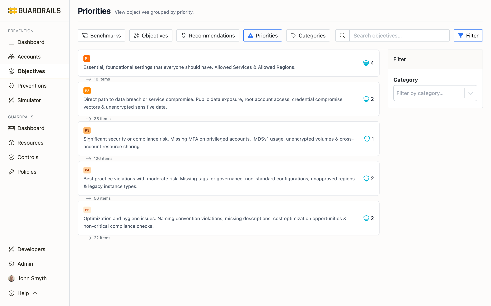

# Priorities

This view groups objectives by their risk level—P1 for critical controls that should be in place everywhere, down to P4 for nice-to-haves. When you're planning security work and need to focus on what matters most, start here.

## Why Priorities Matter

Not all security objectives are equally important. "Restrict AWS resources to allowed regions" (P1) is foundational—it enforces data residency and prevents resources from being created in regions you can't monitor or protect. "Require soft delete for Azure File Shares" (P3) is valuable for recovery but not critical to preventing breaches. Priorities help you allocate limited time and resources to the work that reduces the most risk.

Priority levels reflect the severity of security risk. P1 objectives prevent direct paths to data breaches or service compromise. P2 objectives address significant security or compliance risks. P3 objectives mitigate best practice violations with moderate risk. P4 objectives handle optimization and hygiene issues.

## The Four Priority Levels

### P1 - Critical

P1 objectives are the foundation—controls that should be implemented immediately because they prevent common, severe attacks or are required by virtually every compliance framework. Examples include restricting AWS resources to allowed regions (data residency and compliance), requiring MFA for root user authentication (prevents account takeover), and blocking public access to databases (prevents data breaches).

These are typically the easiest wins relative to their security value. Restricting resources to specific regions is usually a simple SCP. Blocking public database access is an account setting. The implementation effort is low but the risk reduction is massive.

If your P1 objectives have low scores, that's your most urgent work. P1 gaps represent fundamental security weaknesses that attackers actively exploit. Most security incidents involve failures of P1-level controls—public S3 buckets, unencrypted databases, resources in unauthorized regions, missing MFA on privileged accounts.

### P2 - High Priority

P2 objectives provide strong security improvements and are commonly required by compliance frameworks. They protect sensitive data and prevent common attack vectors. Examples include requiring encryption at rest for EBS volumes, enforcing customer-managed encryption keys, blocking public Lambda functions, and enabling secret scanning in GitHub repositories.

P2 controls are worth implementing once your P1 foundation is solid. They provide substantial risk reduction and compliance coverage. The implementation might be more complex than P1—requiring encryption might need key management infrastructure, or may require application changes if legacy systems don't support it.

Most organizations should aim for strong P2 coverage across all accounts within 90 days of establishing P1 baselines. P2 objectives are where you transition from "fundamentally secure" to "well-protected."

### P3 - Medium Priority

P3 objectives enhance your security posture through defense-in-depth and operational resilience. They include controls like soft delete for file shares (recovery from accidental deletion), private endpoints for storage (eliminate public exposure entirely), and diagnostic settings for activity logs (support forensics and compliance).

These controls are valuable but not urgent. They're the difference between "well-protected" and "comprehensively secure." Some organizations implement P3 controls broadly, others focus P3 effort on their most critical workloads and accept the residual risk elsewhere.

P3 is where you start making conscious tradeoffs based on your specific risk appetite, compliance obligations, and operational capabilities. Not every organization needs the same P3 coverage.

### P4 - Lower Priority

P4 objectives are often optimization, hygiene, or industry-specific controls. They provide incremental improvements but aren't critical to preventing breaches. Many organizations never implement all P4 objectives, and that's okay—security is about managing risk to acceptable levels, not achieving perfection.

P4 objectives make sense when you have mature P1-P3 coverage and are looking for additional hardening, or when they align with specific compliance requirements unique to your industry.

## Common Use Cases

- **When planning security work** - Start by filtering to P1 and sorting by score. Any P1 objective with a score below 3 is a critical gap—prioritize those first. Once P1 objectives consistently score 4-5, move to P2. Once P2 is strong, consider P3 selectively based on your environment's needs.

- **To avoid scattered implementation** - This approach prevents the common mistake of implementing scattered P2 and P3 controls while leaving P1 gaps. A comprehensive set of P3 controls doesn't help if attackers can exploit fundamental P1 weaknesses.

- **When executives ask "what should we work on next?"** - This view provides data-driven answers. Show them the P1 objectives with low scores, explain the risks, and the work becomes an obvious priority.

## Balancing Coverage Across Priorities

[Prevention scores](/guardrails/docs/prevention#prevention-scores) weight priorities using a reverse Fibonacci sequence—P1 objectives have significantly more weight than P4 objectives. This means improving a single P1 objective improves your overall score more than improving multiple lower-priority objectives. The scoring reflects security reality: fixing critical gaps matters more than polishing edge cases.

Watch for situations where you have strong P3-P4 coverage but weak P1-P2 coverage. This suggests resources are being spent on less important work while fundamental risks remain unaddressed. Rebalance effort toward higher-priority objectives.

Some organizations set coverage targets: "All P1 objectives must score 4+ across all production accounts. P2 objectives should score 3+. P3-P4 are discretionary." This creates clear expectations and measurable goals.

## Next Steps

- Click into any objective to see which preventions implement it and which accounts need coverage
- Review [Benchmarks](/guardrails/docs/prevention/objectives/benchmarks) to see how priorities map to compliance frameworks
- Check [Categories](/guardrails/docs/prevention/objectives/categories) to ensure high-priority objectives are covered across all security domains
- Visit [Recommendations](/guardrails/docs/prevention/recommendations) to get specific guidance on implementing high-priority objectives
