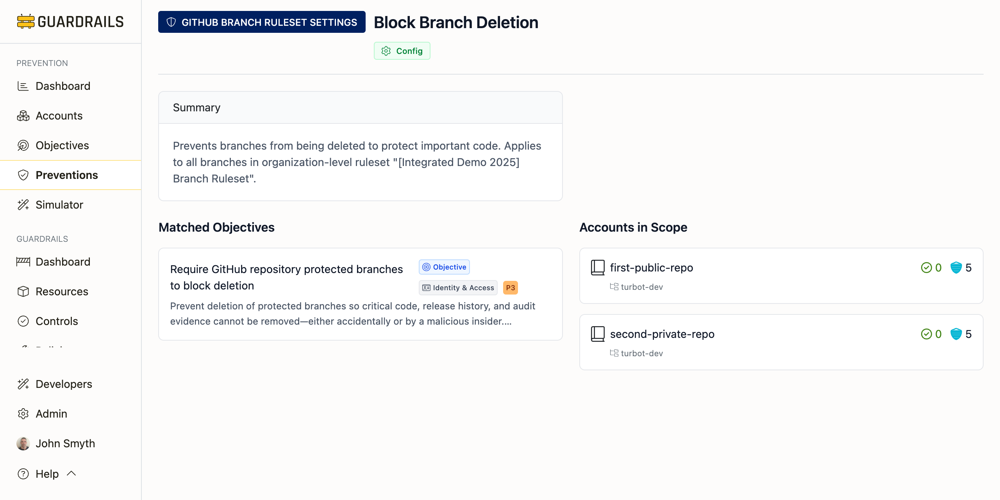

# Prevention Detail

The Prevention Detail page provides comprehensive information about a single prevention control, showing what it does, which objectives it achieves, what accounts it applies to, and the specific configuration details.

## Understanding the Prevention Detail Page

When you click on a prevention from the Preventions list, you see a detailed view that helps you:
- Understand exactly what the prevention does and how it works
- See which prevention objectives this control achieves
- Identify which accounts or resources are protected by this prevention
- View the specific configuration or policy definition
- Understand the implementation mechanism (SCP, Azure Policy, Guardrails control, etc.)

## Page Header

The page header displays:

- **Prevention type**: The technical mechanism (e.g., "GitHub Branch Ruleset Settings", "AWS S3 Account Setting", "Service Control Policy")
- **Prevention title**: Clear description of what the prevention does (e.g., "Block Branch Deletion", "Block Public ACLs on AWS S3 Buckets")
- **Layer badge**: Which enforcement layer this prevention operates at (Build, Access, Config, Runtime)

## Summary Section

The Summary provides a clear explanation of:

**What the prevention does**
A concise description of the technical control being enforced and how it protects your environment.

**Example summary:**
"Prevents branches from being deleted to protect important code. Applies to all branches in organization-level ruleset '[Integrated Demo 2025] Branch Ruleset'."

The summary explains:
- The specific behavior being prevented or enforced
- The scope of where this prevention applies
- The resource or account context

## Matched Objectives

The Matched Objectives section shows which prevention objectives this control achieves.

Each objective card displays:
- **Objective title**: What security goal this prevention helps achieve
- **Objective type badge**: Indicates this is a prevention objective
- **Category**: The security domain (e.g., Identity & Access, Data Governance, Trust & Sharing)
- **Priority level**: P1 (critical), P2 (high), P3 (medium), or P4 (low)
- **Objective description**: Why this objective matters and what risks it mitigates
- **Related guidance**: Additional context about strengthening this control with complementary preventions
- **Compliance mapping**: Which compliance frameworks this objective satisfies (e.g., CIS GitHub Benchmark 1.1.17)

**Why matched objectives matter:**
Understanding which objectives a prevention achieves helps you:
- See the broader security goals this control contributes to
- Identify related preventions that provide defense-in-depth
- Map preventions to compliance requirements
- Prioritize implementation based on objective priority levels

Click on any objective to navigate to its detail page for more information.

## Accounts in Scope

The Accounts in Scope section shows which accounts, subscriptions, or resources are protected by this prevention.

**Information displayed:**
- **Account name**: Friendly name of the protected account
- **Account ID**: Cloud provider account identifier
- **Resource scope**: For resource-specific preventions, the specific resource being protected
- **Organization/Folder**: The organizational unit the account belongs to

**Understanding scope:**

**Organization-wide preventions**
Some preventions apply to all accounts in an AWS Organization, Azure Management Group, or GCP Organization. These appear once in the preventions list and protect all accounts.

**Example:** A Service Control Policy (SCP) attached at the AWS Organization root.

**Account-specific preventions**
Many preventions are implemented per-account and appear multiple times in the preventions list—once for each account they protect.

**Example:** "Block Public ACLs on AWS S3 Buckets" appears separately for each AWS account because it's configured via account-level S3 settings.

**Resource-specific preventions**
Some preventions apply to specific resources like GitHub repositories or Azure resource groups.

**Example:** "Block Branch Deletion" applies to specific GitHub repository branch rulesets.

## Prevention Types and Implementation

Different prevention types use different technical mechanisms:

**Service Control Policies (SCPs)**
AWS Organization-level policies that restrict API actions across accounts. SCPs are preventive controls that stop actions before they occur.

**Azure Policies**
Azure subscription-level policies that enforce compliance requirements. Can audit (detect) or deny (prevent) actions.

**GCP Organization Policies**
Google Cloud organization-level constraints that limit resource configurations across projects.

**Guardrails Controls**
Turbot Guardrails fine-grained policies that provide continuous governance. Can operate in multiple modes: check (detect), enforce (prevent), or approve (gate).

**Branch/Tag Rulesets**
GitHub repository protection rules configured at the organization or repository level.

**Account Settings**
Cloud provider account-level security configurations (e.g., AWS S3 Block Public Access settings, EC2 AMI sharing restrictions).

## Prevention Layers

The layer badge indicates where in the control lifecycle this prevention operates:

**Build Layer**
Preventions enforced during resource creation and infrastructure-as-code deployment. These stop risky configurations before resources are created.

**Access Layer**
Preventions that control who can access resources and what actions they can perform through identity and permission controls.

**Config Layer**
Preventions that enforce required configurations on resources, such as encryption requirements or network settings.

**Runtime Layer**
Preventions that detect and respond to risky behavior during resource operation through monitoring and automated remediation.

## Common Workflows

**Understanding what a prevention does**
1. Review the Summary section for a high-level explanation
2. Check the Matched Objectives to see what security goals it achieves
3. Read the objective descriptions to understand the broader context
4. Note the Layer badge to understand when the prevention is enforced

**Finding which accounts are protected by a prevention**
1. Scroll to the Accounts in Scope section
2. Review the list of accounts
3. For account-specific preventions (like S3 Block Public Access), check if all expected accounts are listed
4. For organization-wide preventions (like SCPs), verify the organizational scope

**Determining if a prevention satisfies compliance requirements**
1. Check the Matched Objectives section
2. Look for compliance framework references (e.g., "CIS GitHub Benchmark 1.1.17")
3. Click through to the objective detail page for full compliance mapping
4. Review related objectives to ensure comprehensive compliance coverage

**Identifying gaps in prevention coverage**
1. Note the accounts listed in Accounts in Scope
2. Compare against your full account inventory
3. If accounts are missing, this prevention is not yet implemented there
4. Return to the Preventions list and filter by the missing account to see what preventions it has
5. Implement the missing prevention following examples and recommendations

**Finding related preventions for defense-in-depth**
1. Review the Matched Objectives section
2. Read the objective descriptions which often reference complementary preventions
3. Note suggestions like "Strengthen this control by pairing it with..."
4. Click through to those related objectives to see additional preventions
5. Implement multiple preventions at different layers for stronger security

**Troubleshooting why a prevention isn't working**
1. Verify the prevention is listed for the affected account in Accounts in Scope
2. Check the prevention type and layer to understand how it's enforced
3. For SCPs, verify they're not being overridden by allow policies
4. For Guardrails controls, check the control state and policy settings
5. Review logs or control results to see if the prevention is being evaluated

## Understanding Prevention Coverage Patterns

**Single prevention, single scope**
Example: A GitHub branch ruleset applying to one organization's repositories.
- Appears once in the preventions list
- Protects all repositories in that scope

**Single prevention type, multiple accounts**
Example: "Block Public ACLs on AWS S3 Buckets" for 20 accounts.
- Appears 20 times in the preventions list (once per account)
- Each prevention entry shows a different account in Accounts in Scope
- Same prevention mechanism, different scope

**Multiple prevention types, same objective**
Example: Preventing public S3 buckets.
- SCP denying public bucket creation (Access layer)
- S3 Block Public Access settings (Config layer)
- Guardrails control checking bucket configurations (Runtime layer)
- All achieve the same objective through different mechanisms

This pattern provides defense-in-depth: if one control fails or is misconfigured, others provide backup protection.

## Next Steps

- Return to [Preventions](./index.md) to browse other prevention controls
- Review [Objectives](../objectives/index.md) to see all security objectives
- Check [Accounts](../accounts/index.md) to see prevention coverage by account
- Use [Recommendations](../recommendations/index.md) to prioritize new implementations
- Try the [Simulator](../simulator/index.md) to test Service Control Policies before deployment
