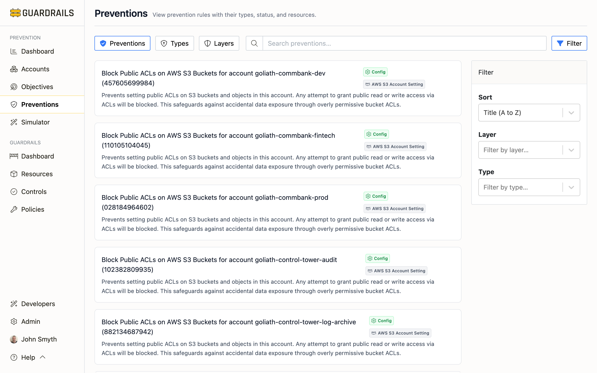

# Preventions

The Preventions page shows all the security controls actively protecting your cloud environment. Think of this as your inventory of preventive measures—every Service Control Policy, Azure Policy, account setting, and other control that's stopping risky configurations before they can cause problems.

## What You're Looking At

Each card represents a prevention that's actually implemented in your environment. For example, you might see "Block Public ACLs on AWS S3 Buckets" or "Require encryption for Azure Storage accounts." These aren't just recommendations or desired states—these are active controls that Guardrails has discovered in your cloud accounts.

The preventions come from different sources depending on your cloud provider and security approach. AWS preventions might include Service Control Policies that deny dangerous API actions organization-wide, or account-level settings like S3 Block Public Access. Azure preventions are typically Azure Policies enforcing compliance rules. You'll also see GitHub branch protection rules, GCP Organization Policies, and Guardrails controls if you're using those platforms.

What makes this view useful is seeing everything in one place. Instead of checking the AWS Organizations console, then Azure Policy, then your Guardrails workspace, you can see all your preventive controls together—filtered, sorted, and mapped to the objectives they achieve.

## Different Ways to View Your Preventions

The Preventions section gives you three different perspectives on the same set of controls, each useful for different tasks:

The **[Preventions tab](/guardrails/docs/prevention/preventions/preventions)** shows the flat list of everything—useful when you're looking for a specific control or want to see all preventions applied to a particular account.

The **[Types tab](/guardrails/docs/prevention/preventions/types)** groups preventions by their technical mechanism (SCPs, Azure Policies, account settings, etc.). This view helps when you're working with a specific technology—maybe you're reviewing all your SCPs or standardizing on Azure Policies for certain use cases.

The **[Layers tab](/guardrails/docs/prevention/preventions/layers)** organizes by enforcement timing—Build, Access, Config, or Runtime. This perspective matters for defense-in-depth: critical objectives should have preventions at multiple layers, so if one fails, others provide backup protection.

## How to Use This Information

The most common task is figuring out "do we have this control in place?" You can search for a service or objective (like "S3" or "encryption"), filter to a specific account, and see what preventions are active. This is much faster than manually checking each cloud provider's console.

The Types and Layers views become important for strategic planning. If you notice you're heavily relying on one type of prevention (maybe 90% of your controls are SCPs), the Types view helps you identify opportunities to diversify. If you have strong Access layer coverage but weak Config layer coverage, the Layers view makes that gap visible.

## Understanding Prevention Layers

Preventions work at different points in time, which we call "layers." Build layer preventions catch problems in your Infrastructure as Code before deployment—like a Terraform policy that rejects templates defining public S3 buckets. Access layer preventions block dangerous API calls at the organization level—like a Service Control Policy that prevents anyone from disabling CloudTrail, even if their IAM permissions would otherwise allow it.

Config layer preventions enforce settings on resources that already exist—like account-level S3 Block Public Access settings that prevent buckets from being made public regardless of individual bucket policies. Runtime layer preventions respond to issues in real-time—like a Guardrails control that automatically remediates a misconfigured security group within seconds of detection.

The layer matters because it affects both when problems are caught and how difficult they are to bypass. Build layer controls catch issues earliest but only apply to IaC-managed resources. Access layer controls are hardest to bypass but can be complex to implement. Config layer controls handle configuration drift. Runtime controls catch everything else but respond after the fact.

## Understanding Prevention Types

The "type" describes how a prevention is technically implemented. Service Control Policies are AWS Organization-level restrictions that deny API actions—they're powerful because they can't be bypassed by account administrators, but they're also blunt instruments that affect entire accounts or OUs. Azure Policies are more flexible, with options to audit, deny, or automatically modify resources, but they require more sophisticated configuration.

Account settings like S3 Block Public Access or EC2 default encryption are the simplest—just toggle a setting in the console or via API, and it applies to all resources in that account. Guardrails controls offer the most flexibility for complex logic and automated remediation but require the Guardrails platform. GitHub branch protection rules are specific to code repositories but essential for preventing direct pushes to production branches or tag manipulation.

Each type has tradeoffs in implementation complexity, flexibility, and operational overhead. Understanding these tradeoffs helps you choose the right tool for each security objective.

## Common Tasks

When you need to verify whether a specific control is in place—say, "do we block public S3 buckets?"—search for "S3" or "public" and you'll see all related preventions. Each prevention shows which accounts it applies to, so you can quickly identify coverage gaps.

If you're auditing a specific account's security posture, filter to that account and review its prevention list. You can compare this against a benchmark like CIS to see what's missing.

Planning layer-specific improvements works best through the Layers tab. If you're adding Access layer preventions (like SCPs), viewing them grouped by layer helps ensure you're covering the right objectives without duplicating Config layer controls.

## Understanding Status and Scope

Preventions show different statuses. "Active" means the control is live and enforcing—resources are actually protected. "Available" typically means the prevention is defined but may be in audit mode rather than enforcement. "Recommended" indicates a gap—the prevention would help but isn't implemented yet.

Scope tells you how broadly a prevention applies. Organization-wide preventions (like SCPs attached to your AWS Organization root) protect everything. Account-specific preventions (like S3 Block Public Access set on one account) protect only that account. Understanding scope matters when you're evaluating coverage—an organization-wide prevention counts for all accounts, while an account-specific prevention might need to be replicated elsewhere.

## Next Steps

- Click into any [prevention detail page](/guardrails/docs/prevention/preventions/preventions#prevention-detail-view) to see configuration details and coverage
- Review [Objectives](/guardrails/docs/prevention/objectives) to understand which objectives each prevention achieves
- Use [Recommendations](/guardrails/docs/prevention/recommendations) to prioritize new prevention implementations
- Check [Accounts](/guardrails/docs/prevention/accounts) to see prevention coverage by account
- Try the [Simulator](/guardrails/docs/prevention/simulator) to test Service Control Policies before deployment
